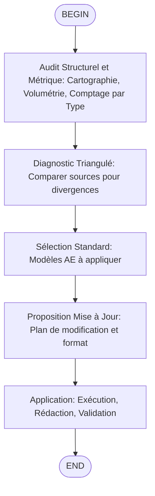

# /flow:docs-updater - Mise à Jour Documentation Métrique



## Objectif

Workflow pour harmoniser la documentation AE via analyse statique (`tree`, `cloc`) et modèles éditoriaux.

## Protocoles Critiques

1. **Outils** : Utiliser l'outil `Shell` pour les commandes d'audit (`tree`, `cloc`, `ls`, `find`)
2. **Contexte** : Lire `activeContext.md` via `fast_read_file`
3. **Source** : Code > Doc existante > Mémoire
4. **Sécurité** : Utiliser fast-filesystem pour memory-bank

## Étape 1 — Audit Structurel et Métrique

### 1.1 Cartographie

```bash
tree -L 2 -I '__pycache__|.git|*.idea|blob_manifest*.json|regenerated_manifests|repomix*|*.shrimp_task_manager'
```

**But** : Architecture AE (JSX, Python, Bridge, C++, docs, CEP)

### 1.2 Volumétrie Python & C++

```bash
cloc PyShiftAE PyShiftBridge AETK-main docs --md --exclude-dir=__pycache__,node_modules,.git
```

**But** : Code Python/C++ sans manifests

### 1.3 Volumétrie CEP

```bash
cloc 'MédiaSolution/MediaSolution-CEP/client' 'MédiaSolution/MediaSolution-CEP/host' 'GridCloner-CEP/client' 'GridCloner-CEP/host' --md --exclude-ext=png,jpg,svg
```

**But** : Interface CEP (client/host)

### 1.4 Fichiers Référence PyShiftAE

```bash
cloc 'PyShiftAE/Python/pyshiftae/ae.py' 'AETK-main/AETK/AEGP/Core/PyFx.hpp' 'AETK-main/AETK/src/AEGP/Core/Suites.cpp' 'AETK-main/AETK/AEGP/Grabba/Grabba.cpp' 'AETK-main/AETK/AEGP/TaskScheduler/TaskScheduler.cpp' --md
```

### 1.5 Scripts JSX Batch

```bash
# Rigs lourds (3D, generative)
cloc 'Scripts_AE/Aescripts-3D Primitives Generator v3' 'Scripts_AE/Aescripts-Crazy Shapes 1.1.1' 'Scripts_AE/Aescripts-Cloners + Effectors v1.2.6' --md

# Toolkits pipeline
cloc 'Scripts_AE/Aescripts-AW Autosaver v2.1' 'Scripts_AE/Aescripts-Automation Toolkit v1.0.3.7' 'Scripts_AE/Aescripts-KBar3 v3.1.1' --md

# Panels CEP/JSX
cloc 'Scripts_AE/Aescripts-AEInfoGraphics v2.0.3' 'Scripts_AE/Aescripts-Coco Color CoWorker v1.2.0' 'Scripts_AE/Aescripts-Infographics toolkit v1.04' --md
```

### 1.6 Comptage par Type

```bash
# Python
find PyShiftAE -name '*.py' | wc -l && find AETK-main -name '*.py' | wc -l

# CEP/Bridge assets
find . -name '*.js' -o -name '*.html' -o -name '*.css' | grep -E '(CEP|Bridge)' | wc -l
```

## Étape 2 — Diagnostic Triangulé

Comparer sources pour divergences :

| Source | Rôle | Outil |
|--------|------|-------|
| Intention | Pourquoi | `fast_read_file` |
| Réalité | Quoi/Comment | `Shell` (cloc, search) |
| Existant | État actuel | `Grep` dans docs |

**Action** : Identifier divergences entre intention et réalité.

## Étape 3 — Sélection Standard

Modèles AE à appliquer :

- **Scripts AE** : Compatibilité, UI, fonctionnalités
- **PyShiftAE** : API, patterns, intégration
- **Bridge** : Communication, config, exemples
- **Architecture** : Diagrammes, flux

## Étape 4 — Proposition Mise à Jour

### Plan de modification

| Cible | Fichier | LOC | Type | Complexité |
|-------|---------|-----|------|------------|
| ... | ... | ... | ... | ... |

### Format de proposition

```markdown
#### docs/[cat]/target.md
- Type : Script AE | PyShiftAE | Bridge | Architecture
- Diagnostic : Obsolète | Incomplet | Manquant
- Correction :
[Contenu proposé]
```

## Étape 5 — Application

1. **Exécution** : `StrReplaceFile` ou `WriteFile` après validation
2. **Rédaction** : Charger `documentation/SKILL.md`, appliquer modèle, checkpoints
3. **Memory Bank** : `edit_file` pour tracer les changements
4. **Validation AE** : Conventions (matchNames, versions)

### Sous-protocole Rédaction

#### Points d'Entrée

- **Mode** : Après plan validé
- **Lecture** : `.agents/skills/documentation/SKILL.md`
- **Modèle** : Spécifié selon le type de documentation

#### Checkpoints

| Phase | Critères |
|-------|----------|
| Avant | TL;DR, Problem-first |
| Pendant | ❌/✅, Trade-offs, Golden Rule, Éviter AI |
| Après | Checklist, Ponctuation |

## Outils à Utiliser

| Action | Outil Kimi Code CLI |
|--------|---------------------|
| Commandes audit | `Shell` |
| Lire fichiers | `fast_read_file` ou `ReadFile` |
| Modifier fichiers | `StrReplaceFile` ou `WriteFile` |
| Rechercher | `Grep` |

## Exemple d'Utilisation

```
/flow:docs-updater
```

L'agent va exécuter l'audit structurel, identifier les écarts documentation/code, et proposer des mises à jour.
