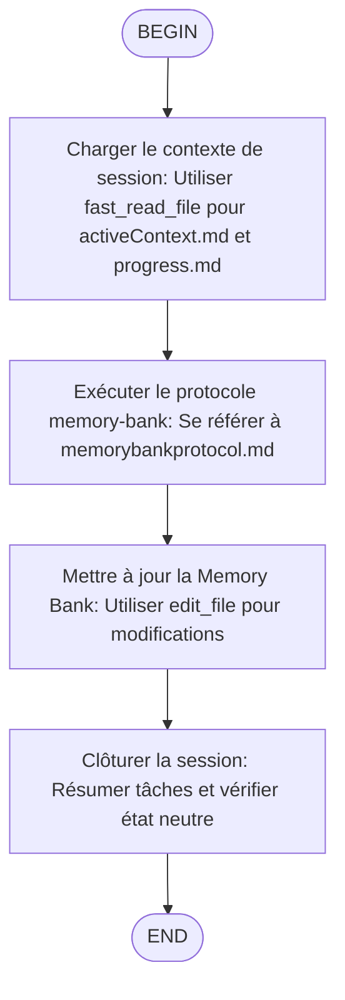

# /flow:end - Terminer la Session et Synchroniser la Memory Bank



## Objectif

Clôturer proprement une session de travail en synchronisant la Memory Bank avec l'état actuel du projet.

## Processus d'Exécution

### 1. Charger le contexte de session

Utiliser l'outil `fast_read_file` du serveur MCP `fast-filesystem` pour lire :

- **Uniquement** `activeContext.md` et `progress.md` pour le résumé de session
- **Ne PAS** lire `productContext.md`, `systemPatterns.md` ou `decisionLog.md` sauf si une décision architecturale majeure a été prise

**Chemin absolu** : `/home/kidpixel/kimi-proxy/memory-bank/activeContext.md`

### 2. Exécuter le protocole memory-bank

Se référer à `.clinerules/memorybankprotocol.md` pour les règles complètes :

1. Suspendre la tâche en cours
2. Résumer la session
3. Utiliser `Grep` pour identifier les fichiers additionnels à consulter (ex: docs liés à la session)

### 3. Mettre à jour la Memory Bank

Utiliser les outils appropriés pour la mise à jour :

- `edit_file` du serveur `filesystem-agent` pour les modifications
- Avant chaque modification, lire la section pertinente avec `fast_read_file` pour minimiser les changements
- Documenter les décisions, progrès et contexte actif selon le protocole

### 4. Clôturer la session

1. Résumer les tâches finalisées dans la réponse utilisateur
2. Vérifier avec `fast_read_file` que :
   - `progress.md` indique "Aucune tâche active"
   - `activeContext.md` est revenu à l'état neutre

## Outils à Utiliser

| Action | Outil Kimi Code CLI |
|--------|---------------------|
| Lire fichiers memory-bank | `fast_read_file` (fast-filesystem MCP) |
| Modifier fichiers | `edit_file` ou `StrReplaceFile` |
| Rechercher contenu | `Grep` |
| Lister répertoires | `fast_list_directory` |

## Règles Critiques

- **Verrouillage** : Utilisez les outils fast-filesystem (`fast_*`) pour accéder aux fichiers memory-bank avec des chemins absolus
- **Minimalisme** : Ne chargez que les fichiers nécessaires au résumé de session
- **Traçabilité** : Documentez toute décision importante dans `decisionLog.md`

## Exemple d'Utilisation

```
/flow:end
```

L'agent va alors :
1. Lire `activeContext.md` et `progress.md`
2. Résumer les accomplissements de la session
3. Mettre à jour la memory-bank
4. Confirmer la clôture propre
