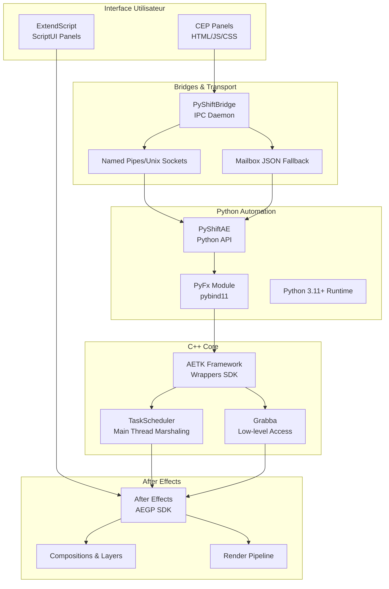
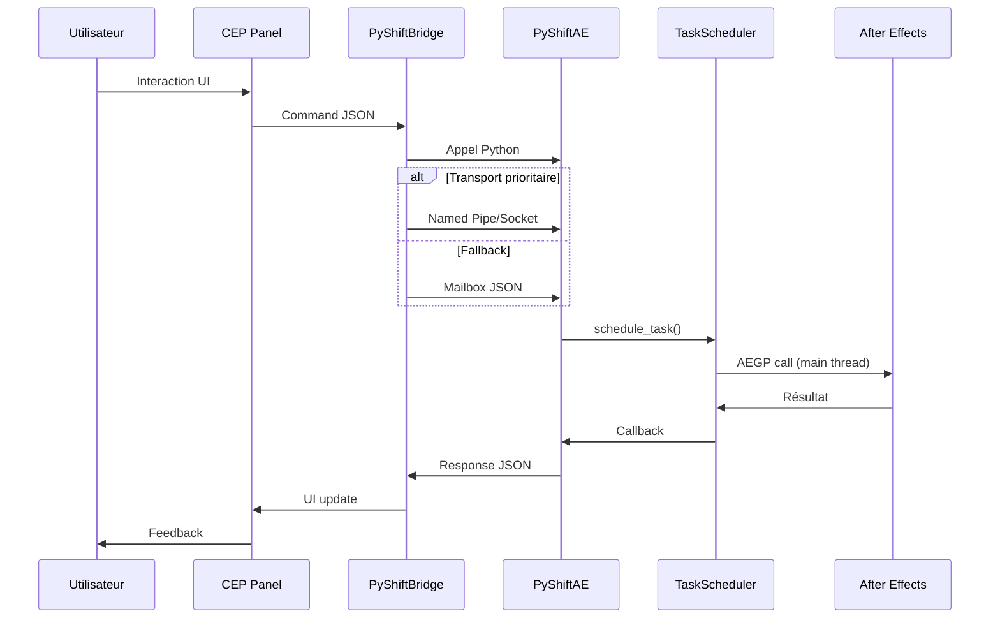

# Architecture After Effects : Le Guide du Développeur

**TL;DR** : **PyShiftAE** vous donne la puissance de Python pour automatiser After Effects ; **PyShiftBridge** connecte vos UI modernes ; **ExtendScript** reste le fallback legacy inévitable.

Vous essayez d'automatiser un pipeline vidéo complexe dans After Effects, mais chaque script gèle l'interface pendant 30 secondes. Vos 500 fichiers JSX deviennent impossibles à maintenir, et l'AEGP SDK vous demande d'écrire du C++ pour la moindre opération. Vous êtes bloqué entre des scripts lents et une complexité C++ démesurée.

Voici comment cet écosystème résolu ce dilemme : Python pour la logique, C++ pour la performance, et un bridge intelligent qui protège votre UI du gel.

## L'écosystème en un coup d'œil

### Les technologies par cas d'usage



### 1.2 Répartition par technologie

| Composant | Technologie | Rôle principal | Complexité |
|---|---|---|---|
| **Scripts_AE/** | ExtendScript/JSX | Scripts legacy & UI natives | 🟡 Moyenne |
| **PyShiftAE/** | Python 3.11+ | Automation moderne | 🔴 Élevée |
| **PyShiftBridge/** | Python/HTML/JS | Communication IPC | 🟡 Moyenne |
| **AETK-main/** | C++ | Wrappers SDK natifs | 🔴 Élevée |

## Le problème de l'asymétrie C++/Python

Notre audit révèle une réalité brutale : **373 831 lignes de code**, dont 73% en C++. Pourquoi cette asymétrie ?

```
Total analysé : 373 831 LOC
├── C++ Headers     : 202 209 LOC (54.1%)
├── C++ Code        : 73 310 LOC  (19.6%)
├── XML             : 55 673 LOC  (14.9%)
├── Markdown        : 28 467 LOC  (7.6%)
├── Python          : 8 635 LOC   (2.3%)
├── JSX             : 2 544 LOC   (0.7%)
└── Autres          : 2 993 LOC   (0.8%)
```

**Ratio C++/Python** : 8:1 en LOC brute. L'avantage : performance native et accès SDK complet. L'inconvénient : complexité de build et dépendances plateforme critiques.

## La communication qui ne gèle pas

### ❌ L'approche qui tue votre UI

```python
# MAUVAIS : bloque le main thread AE
for item in slow_operation():
    result = ae_sdk_call(item)  # Appel SDK lent
    time.sleep(0.1)  # UI gelée pendant 30 secondes
```

### ✅ Le pattern Worker + Scheduler

```python
# Calculs lourds dans worker thread
def heavy_computation():
    return process_data(data)

# Application rapide dans AE main thread
def apply_changes(result):
    comp = ae.Item.active_item()
    comp.layers.add_solid(...)

# Orchestration sans gel
threading.Thread(target=lambda: (
    data = heavy_computation(),
    ae.schedule_task(lambda: apply_changes(data))
)).start()
```

## Le flux Hybrid 2.0 en action



### Protocoles de transport : les vrais chiffres

| Protocole | Latence | Fiabilité | Usage recommandé |
|---|---|---|---|
| **Named Pipes** | <10ms | 🟢 Élevée | Windows/Linux local |
| **Unix Sockets** | <15ms | 🟢 Élevée | macOS/Linux local |
| **Mailbox JSON** | ~300ms | 🟡 Moyenne | Fallback universel |

## Quand utiliser quoi

| Scénario | Technologie recommandée | Raison |
|---|---|---|
| **Automation pipeline** | PyShiftAE + CEP | Performance Python, UI moderne |
| **Scripts legacy** | ExtendScript pur | Compatibilité maximale AE |
| **Prototypage rapide** | PyShiftAE seul | Simplicité, pas d'UI |
| **Outils production** | CEP + Bridge | Interface riche + puissance |
| **Maintenance scripts** | ExtendScript | Déploiement simple |

## Patterns de migration

### ExtendScript → PyShiftAE

1. **Identifier** les opérations coûteuses
2. **Isoler** la logique métier (Python pur)
3. **Wrapper** les appels SDK via `schedule_task()`
4. **Tester** avec données réelles

### CEP → PyShiftBridge

1. **Configurer** transport prioritaire (pipes)
2. **Implémenter** fallback mailbox
3. **Sécuriser** les commandes JSON
4. **Monitorer** les performances

## Les décisions d'architecture

### ✅ Recommandé

- **Séparation claire** Python/C++ via PyFx
- **TaskScheduler obligatoire** pour mutations AE
- **Bridge Hybrid 2.0** pour production
- **Documentation croisée** entre composants

### ❌ À éviter

- **Appels SDK directs** depuis workers Python
- **UI blocking** dans le main thread AE
- **Handles AE long-terme** (risque stale)
- **Mixage des patterns** sans architecture claire

## Performance cible par opération

| Opération | Approche | Latence cible |
|---|---|---|
| **Calculs purs** | Python worker | <100ms |
| **Mutation AE** | TaskScheduler batch | <10ms |
| **Communication IPC** | Named pipes | <5ms |
| **UI response** | CEP async | <16ms (60fps) |

## La roadmap technique

### Phase 1 (Q1 2026)
- **Shape editing** : Compléter bindings béziers
- **Documentation** : Intégrer exemples réels
- **Testing** : Suite de tests E2E

### Phase 2 (Q2 2026)  
- **UI dockable** : Exposer panels C++
- **Events** : Hooks système
- **Monitoring** : Métriques en production

### Phase 3 (Q3 2026)
- **Render pipeline** : Accès pixels complet
- **Performance** : Optimisation batch
- **Deployment** : CI/CD automatisé

## Les liens essentiels

- [Guide PyShiftAE complet](./internal/pyshiftae/pyshiftae_guide.md)
- [Wrappers AETK détaillés](./internal/pyshiftae/aetk_bindings.md)  
- [Scripts ExtendScript référence](./official/general/scripts_reference.md)
- [Bridge PyShiftBridge](./bridge_communication.md)

## Métriques de production

```
Build time estimé : 15-20 min (C++ complet)
Dépendances externes : 12 (pybind11, AE SDK, CMake...)
Tests coverage cible : 70% (C++), 85% (Python)
Documentation coverage : 90% (API), 100% (patterns)
```

## L'équipe de maintenance

- **Lead C++** : Architecture AETK, wrappers SDK
- **Lead Python** : API PyShiftAE, patterns automation  
- **Lead Frontend** : CEP panels, UX/UI
- **QA** : Tests E2E, compatibilité AE

---

## La Règle d'Or : Calculs dans les Workers, Mutations via Scheduler

**Python pur** pour tout ce qui ne touche pas à After Effects ; **TaskScheduler** pour chaque modification du projet AE. C'est ce pattern qui transforme un script qui gèle pendant 30 secondes en une opération instantanée pour l'utilisateur.

*Document basé sur l'audit de 372k LOC – 6 février 2026*
