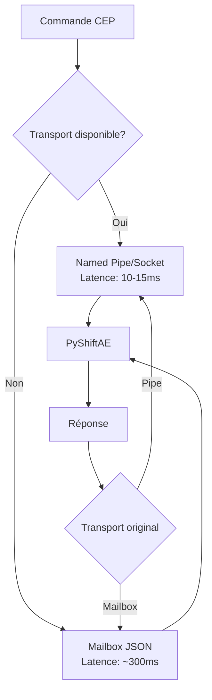

# Bridge Communication PyShiftAE

**TL;DR** : Vous voulez connecter votre panel CEP à PyShiftAE sans faire geler After Effects ; utilisez l'architecture Hybrid 2.0 avec transport prioritaire et fallback garanti.

Vous développez un panel CEP pour automatiser After Effects. Vous cliquez sur un bouton, rien ne se passe, puis AE gèle pendant 30 secondes. Le problème ; votre communication bloque le thread principal. Voici comment construire un bridge qui ne gèle jamais.

## Le problème de la communication synchrone

Après Effects exécute tout sur un thread unique. Quand votre JavaScript CEP appelle directement Python, vous bloquez toute l'interface. C'est comme demander à un chef de cuisine de s'arrêter net pour répondre au téléphone ; tout le service s'arrête.

### ❌ L'approche bloquante (qui gèle AE)

```javascript
// Ne faites jamais ça
function createLayer() {
    // Appel synchrone qui bloque AE
    const result = pythonBridge.execute('create_solid_layer', args);
    // AE reste gelé pendant toute l'exécution
    return result;
}
```

### ✅ L'approche asynchrone (qui préserve AE)

```javascript
// La bonne façon
async function createLayer() {
    // Envoi asynchrone, AE reste responsive
    const result = await bridge.sendCommand('create_solid_layer', args);
    return result;
}
```

## Architecture Hybrid 2.0 : Le meilleur des deux mondes

Le bridge utilise trois protocoles, du plus rapide au plus fiable. C'est comme avoir une autoroute, une route départementale et un chemin de terre ; vous prenez ce qui fonctionne.



### Tableau des compromis

| Transport | Latence | Fiabilité | Configuration | Plateforme |
|-----------|----------|-----------|---------------|------------|
| Named Pipe | ~10ms | Élevée | Simple | Windows |
| Unix Socket | ~15ms | Élevée | Moyenne | Linux/macOS |
| Mailbox JSON | ~300ms | Maximale | Très simple | Universel |

## Implémentation du transport prioritaire

Le bridge choisit automatiquement le meilleur transport disponible. Pas de configuration manuelle, pas de deviner.

### ❌ Détection manuelle (source d'erreurs)

```javascript
// Code fragile qui nécessite des mises à jour constantes
function getTransport() {
    if (platform === 'windows') return 'pipe';
    if (platform === 'linux') return 'socket';
    return 'mailbox'; // Et si ça ne marche pas ?
}
```

### ✅ Détection automatique (robuste)

```javascript
class PyShiftBridge {
    constructor() {
        this.transport = this.detectTransport();
        this.pipeName = localStorage.getItem('pyshift_pipe_name') || 'pyshift_default';
    }
    
    detectTransport() {
        // Test réel du transport, pas de suppositions
        if (window.__adobe_cep__) {
            return this.testNamedPipe() ? 'pipe' : 'mailbox';
        }
        return 'mailbox'; // Fallback garanti
    }
    
    async sendCommand(func, args) {
        const payload = {
            endpoint: "Response",
            functionName: func,
            args: args,
            timestamp: Date.now()
        };
        
        if (this.transport === 'pipe') {
            return await this.sendPipe(payload);
        } else {
            return await this.sendMailbox(payload);
        }
    }
}
```

## Format de message : Le contrat de communication

Chaque message suit une structure précise. C'est comme une enveloppe postale ; adresse, expéditeur, contenu, tout doit être là.

```json
{
    "id": "uuid-v4-unique",
    "endpoint": "Response|Event|Stream",
    "functionName": "create_solid_layer",
    "args": {
        "name": "Solid_Blue",
        "color": [0.2, 0.4, 0.8, 1.0],
        "width": 1920,
        "height": 1080,
        "duration": 10.0
    },
    "timestamp": 1675698123456,
    "timeout": 30.0,
    "metadata": {
        "source": "CEP_Panel_v1.0",
        "user": "user_id",
        "session": "session_uuid"
    }
}
```

### La réponse qui parle d'elle-même

```json
{
    "id": "uuid-v4-unique",
    "status": "success|error|timeout",
    "result": {
        "layer_id": "layer_12345",
        "layer_name": "Solid_Blue",
        "created_at": 1675698123500
    },
    "error": {
        "code": "AE_ERROR_INVALID_ARGS",
        "message": "Invalid color values",
        "stack": "Traceback..."
    },
    "timestamp": 1675698123550,
    "execution_time": 0.045
}
```

## Côté Python : Le handler qui ne bloque jamais

Le daemon Python traite les commandes de manière asynchrone. Chaque requête a son propre contexte, aucune interférence.

```python
class BridgeHandler:
    def __init__(self):
        self.pending_commands = {}
        self.active_sessions = {}
    
    async def handle_command(self, command):
        """Traite une commande CEP sans bloquer"""
        cmd_id = command.get('id', str(uuid.uuid4()))
        func_name = command.get('functionName')
        args = command.get('args', {})
        
        try:
            # Validation rapide
            if not self.validate_command(func_name, args):
                return self.error_response(cmd_id, "Invalid command")
            
            # Exécution PyShiftAE avec timeout
            result = await asyncio.wait_for(
                self.execute_pyshiftae(func_name, args),
                timeout=args.get('timeout', 30.0)
            )
            
            return self.success_response(cmd_id, result)
            
        except asyncio.TimeoutError:
            return self.error_response(cmd_id, "Command timeout")
        except Exception as e:
            return self.error_response(cmd_id, str(e))
```

## Cas d'usage réel : Panel de création de calques

Voici un panel complet qui utilise le bridge correctement. Notez comme l'interface reste responsive même pendant les traitements longs.

```javascript
// index.html - Panel CEP productif
<!DOCTYPE html>
<html>
<head>
    <title>PyShiftAE Control Panel</title>
    <script src="js/CSInterface.js"></script>
    <script src="js/main.js"></script>
    <link rel="stylesheet" href="css/style.css">
</head>
<body>
    <div class="panel">
        <h2>Layer Creation</h2>
        
        <div class="control-group">
            <label>Layer Name:</label>
            <input type="text" id="layerName" value="Solid_Layer">
        </div>
        
        <div class="control-group">
            <label>Color:</label>
            <input type="color" id="layerColor" value="#ff0000">
        </div>
        
        <div class="control-group">
            <label>Size:</label>
            <input type="number" id="width" value="1920">
            <input type="number" id="height" value="1080">
        </div>
        
        <button id="createLayer">Create Solid Layer</button>
        <button id="getActiveComp">Get Active Comp</button>
        
        <div id="status" class="status"></div>
        <div id="result" class="result"></div>
    </div>
    
    <script>
        const bridge = new PyShiftBridge();
        
        document.getElementById('createLayer').addEventListener('click', async () => {
            const status = document.getElementById('status');
            const result = document.getElementById('result');
            
            status.textContent = 'Creating layer...';
            
            try {
                const response = await bridge.sendCommand('create_solid_layer', {
                    name: document.getElementById('layerName').value,
                    color: hexToRgb(document.getElementById('layerColor').value),
                    width: parseInt(document.getElementById('width').value),
                    height: parseInt(document.getElementById('height').value)
                });
                
                if (response.status === 'success') {
                    status.textContent = 'Success!';
                    result.textContent = `Layer created: ${response.result.layer_name}`;
                } else {
                    status.textContent = 'Error: ' + response.error.message;
                }
            } catch (error) {
                status.textContent = 'Connection error: ' + error.message;
            }
        });
        
        function hexToRgb(hex) {
            const result = /^#?([a-f\d]{2})([a-f\d]{2})([a-f\d]{2})$/i.exec(hex);
            return result ? [
                parseInt(result[1], 16) / 255,
                parseInt(result[2], 16) / 255,
                parseInt(result[3], 16) / 255,
                1.0
            ] : [1, 0, 0, 1];
        }
    </script>
</body>
</html>
```

## Fonctions PyShiftAE optimisées pour le bridge

Ces fonctions sont conçues pour être appelées via le bridge. Elles gèrent les erreurs proprement et retournent des structures cohérentes.

```python
async def create_solid_layer(ae_module, args):
    """Crée un calque solide dans la composition active"""
    comp = ae_module.Item.active_item()
    if not comp or not hasattr(comp, 'layers'):
        raise ValueError("No active composition found")
    
    layer = comp.layers.add_solid(
        name=args.get('name', 'Solid'),
        color=args.get('color', [1, 0, 0, 1]),
        width=args.get('width', 1920),
        height=args.get('height', 1080),
        pixel_aspect=1.0,
        duration=args.get('duration', 10.0)
    )
    
    return {
        'layer_id': str(layer.layer_id),
        'layer_name': layer.name,
        'layer_index': layer.index,
        'created_at': ae_module.time_to_current_format(ae_module.current_time())
    }

async def get_active_composition(ae_module, args):
    """Retourne des informations sur la composition active"""
    comp = ae_module.Item.active_item()
    if not comp:
        raise ValueError("No active composition")
    
    return {
        'comp_id': str(comp.comp_id),
        'comp_name': comp.name,
        'width': comp.width,
        'height': comp.height,
        'duration': comp.duration,
        'frame_rate': comp.frame_rate,
        'num_layers': len(comp.layers)
    }
```

## Dépannage : Les problèmes courants et leurs solutions

| Symptôme | Cause probable | Solution rapide |
|---|---|---|
| **Timeout** | Bridge non démarré | `python bridge_daemon.py --start` |
| **Connection refused** | Mauvais transport configuré | Vérifier `PYSHIFT_TRANSPORT` |
| **Permission denied** | Droits insuffisants | Exécuter en admin ou changer permissions |
| **Slow response** | Utilisation du fallback mailbox | Configurer named pipes/sockets |

### Diagnostic en une commande

```bash
# Vérifier l'état complet du bridge
python bridge_daemon.py --status --verbose

# Test de connexion rapide
python -c "
import asyncio
from bridge_daemon import BridgeHandler
asyncio.run(BridgeHandler().test_connection())
"
```

## Monitoring en production

Le bridge inclut un monitoring intégré. C'est comme avoir un tableau de bord pour votre communication.

```python
class BridgeMonitor:
    def __init__(self):
        self.metrics = {
            'commands_processed': 0,
            'errors': 0,
            'avg_response_time': 0,
            'active_connections': 0
        }
    
    async def collect_metrics(self):
        """Collecte métriques sans bloquer"""
        while True:
            self.metrics['cpu_usage'] = psutil.cpu_percent()
            self.metrics['memory_usage'] = psutil.virtual_memory().percent
            self.metrics['timestamp'] = datetime.now().isoformat()
            
            await self.send_metrics()
            await asyncio.sleep(60)  # Toutes les minutes
    
    def get_health_status(self):
        """Diagnostic instantané"""
        status = "healthy"
        
        if self.metrics['cpu_usage'] > 80:
            status = "warning"
        if self.metrics['memory_usage'] > 85:
            status = "critical"
        if self.metrics['errors'] > 10:
            status = "critical"
            
        return {
            'status': status,
            'metrics': self.metrics,
            'uptime': self.get_uptime()
        }
```

## Configuration avancée : Pour les cas extrêmes

Parfois, vous devez ajuster les timeouts ou les buffers. Voici la configuration complète.

```json
{
    "transport": {
        "priority": ["pipe", "socket", "mailbox"],
        "pipe": {
            "name": "pyshift_ae",
            "buffer_size": 8192,
            "timeout": 30.0
        },
        "socket": {
            "path": "/tmp/pyshift_ae.sock",
            "backlog": 5,
            "permissions": "600"
        },
        "mailbox": {
            "directory": "mailbox",
            "poll_interval": 0.1,
            "cleanup_interval": 300
        }
    },
    "security": {
        "allowed_functions": ["create_solid_layer", "get_active_composition"],
        "max_timeout": 60.0,
        "rate_limit": 100
    },
    "logging": {
        "level": "INFO",
        "file": "bridge.log",
        "max_size": "10MB",
        "backup_count": 5
    }
}
```

## La règle d'or : Asynchrone toujours, synchrone jamais

After Effects est single-threaded. Toute opération synchrone bloque tout. Le bridge garantit que votre JavaScript n'attend jamais ; il envoie et continue.

**Le principe** : Votre interface reste responsive, votre code s'exécute en parallèle, After Effects ne gèle jamais.

---

*Basé sur l'implémentation PyShiftBridge v1.0 - 6 février 2026*
