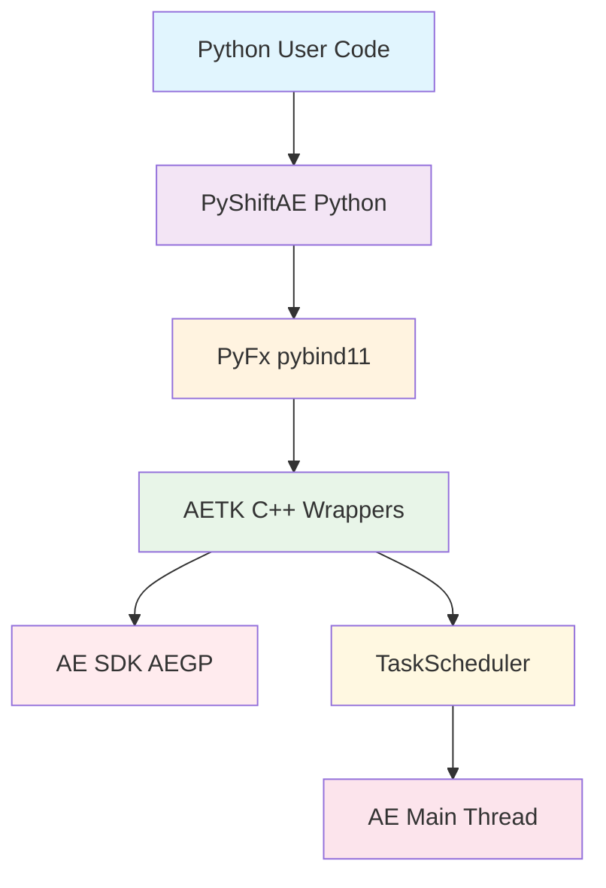
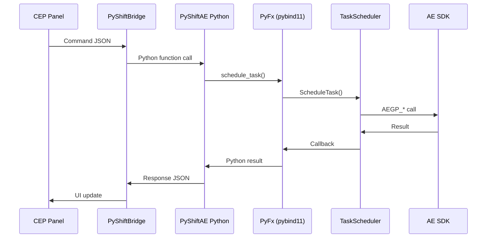

# Architecture des Wrappers AETK

**TL;DR**: Les wrappers AETK transforment le SDK After Effects verbeux et hostile en une API Python utilisable, en créant un pont entre le code Python et le SDK C++ complexe via TaskScheduler pour garantir la sécurité des threads.

---

## Le Problème

Le SDK After Effects est verbeux et hostile. Python ne peut pas l'appeler directement.

Imaginez que vous voulez créer un calque solide dans After Effects. Avec le SDK C++ brut, vous devez gérer des dizaines de handles, des suites complexes, et surtout - tous les appels doivent se faire sur le main thread d'After Effects.

❌ **L'approche SDK brut** (imaginée mais représentative):
```cpp
// C++ SDK direct - verbeux et dangereux
AEGP_ProjectH projectH;
AEGP_CompH compH;
AEGP_LayerH layerH;

A_Err err = AEGP_GetProjectByIndex(0, &projectH);
if (err) return HandleError(err);

err = AEGP_GetActiveComp(projectH, &compH);
if (err) return HandleError(err);

err = AEGP_AddSolid(compH, "MySolid", &layerH, 
                    1920, 1080, 1.0, 0.0, 0.0, 1.0);
if (err) return HandleError(err);

// Et gérer tous les cleanup...
```

C'est du code C++ verbeux, dangereux, et impossible à appeler depuis Python.

---

## La Solution

AETK + TaskScheduler résolvent ce problème en créant une couche d'abstraction sécurisée et Python-friendly.

✅ **L'approche AETK/PyShiftAE**:
```python
# Python - simple et sûr
import pyshiftae as ae

def create_solid():
    comp = ae.Item.active_item()
    if comp:
        layer = comp.layers.add_solid("MySolid", (1,0,0,1), 1920, 1080, 10)

# Exécuté sur le main thread AE via TaskScheduler
ae.schedule_task(create_solid)
```

La magie opère en trois couches:

1. **AETK (C++)** : Wrappers sécurisés du SDK AE
2. **PyFx (pybind11)** : Pont Python/C++ 
3. **TaskScheduler** : Orchestrateur des appels sur le main thread

### Architecture en couches



### Volumétrie et Complexité

Le SDK After Effects est massif: 73 310 LOC C++, 202 209 LOC headers. Ratio 1:2.8 code/headers = forte abstraction nécessaire.

| Module | Rôle | Complexité |
|--------|------|------------|
| AETK/AEGP/ | Wrappers SDK de base | 🔴 Élevée |
| AETK/Effect/ | Gestion effets et rendu | 🟠 Moyenne |
| AETK/Util/ | Utilitaires et helpers | 🟢 Faible |

---

## Les Wrappers Critiques

### Suites.cpp - Le Cœur de l'Abstraction

1 658 LOC qui transforment le chaos du SDK en quelque chose d'utilisable.

❌ **Sans AETK**:
```cpp
// Gestion manuelle des suites - fragile et verbeux
AEGP_ProjectSuite4* projSuite = NULL;
AEGP_SuiteHandler suite(suites);
projSuite = suite.GetProjectSuite();

if (!projSuite) {
    // Error handling...
}
```

✅ **Avec AETK**:
```cpp
// C++ AETK - propre et sécurisé
class ProjSuiteWrapper {
    AEGP_ProjectH get_project();
    AEGP_CompH create_comp(...);
}

// Python via pybind11 - encore plus simple
py::class_<ProjSuiteWrapper>("ProjSuite")
    .def("get_project", &ProjSuiteWrapper::get_project)
```

**Ce que ça fait vraiment:**
- ProjSuite: Gestion projets/compositions
- ItemSuite: Manipulation calques/éléments  
- StreamSuite: Flux de données/propriétés
- LayerSuite: Opérations calques

### TaskScheduler.cpp - Le Garde du Thread

1 234 LOC qui garantissent que votre code Python ne fait pas planter After Effects.

Le problème fondamental: After Effects exige que **toutes** les opérations SDK se fassent sur son main thread. Python, lui, tourne sur des worker threads.

❌ **L'approche dangereuse**:
```python
# Python - NE FAITES PAS ÇA!
def dangerous_operation():
    # Appel SDK depuis worker thread = CRASH
    ae_layer = comp.layers.add_solid(...)  # 💥 Crash imminent

threading.Thread(target=dangerous_operation).start()
```

✅ **L'approche TaskScheduler**:
```cpp
// C++ TaskScheduler - orchestration sécurisée
void ScheduleTask(std::function<void()> task) {
    // Queue task for AE main thread execution
    task_queue.push(task);
    // Trigger idle hook if needed
    AEGP_IdleHook_Register(idle_callback);
}
```

```python
# Python - la bonne façon
import pyshiftae as ae

def safe_operation():
    comp = ae.Item.active_item()
    if comp:
        layer = comp.layers.add_solid("Safe", (1,0,0,1), 1920, 1080, 10)

# Exécuté automatiquement sur le main thread AE
ae.schedule_task(safe_operation)
```

**Fonctionnalités clés:**
- Queue de tâches atomiques
- Idle hook integration
- Callbacks asynchrones
- Gestion des timeouts

### Grabba.cpp - Le Gestionnaire de Ressources

1 739 LOC pour ne pas fuir de mémoire et ne pas corrompre les handles.

❌ **Gestion manuelle**:
```cpp
// C++ - dangereux et sujet aux erreurs
AEGP_LayerH layerHandle;
AEGP_GetLayerByIndex(comp, 0, &layerHandle);

// Oublier de libérer = memory leak
// Accès après libération = crash
```

✅ **Avec Grabba**:
```cpp
// C++ AETK - RAII et sécurité
class LayerHandle {
    AEGP_LayerH handle;
    ~LayerHandle() { 
        if (handle) AEGP_DisposeLayer(handle); 
    }
    // Validation automatique, auto-cleanup
}
```

**Sécurité intégrée:**
- Validation handles avant usage
- Auto-cleanup en cas d'exception
- Tracking lifetime des ressources
- Accès bas niveau aux buffers pixels

---

## Le Flux de Communication

Comment une commande CEP devient-elle une opération After Effects? C'est une danse orchestrée à travers plusieurs couches.

### Diagramme de Séquence Complet



### Protocoles de Transport

La communication entre CEP et Python utilise plusieurs stratégies, par ordre de préférence:

1. **Named pipes**: Rapide, local (Windows/Linux)
2. **Unix sockets**: Alternative cross-platform  
3. **Mailbox JSON**: Fallback garanti (plus lent mais fiable)

❌ **Sans protocole structuré**:
```python
# Communication fragile - pas de retry, pas de timeout
send_data(json.dumps({"cmd": "create_layer"}))
```

✅ **Avec PyShiftBridge**:
```python
# Communication robuste avec retry et timeout
bridge = PyShiftBridge()
result = bridge.send_with_timeout(
    {"cmd": "create_layer", "params": {...}}, 
    timeout=5.0
)
```

### Gestion d'Erreurs Transversale

Les erreurs doivent traverser les couches C++ → Python → CEP sans perte d'information.

```cpp
// C++ - capture et traduction des erreurs SDK
try {
    auto result = AEGP_GetSomeProperty(handle);
    return py::cast(result);
} catch (const AEGP_Exception& e) {
    throw py::runtime_error("AEGP error: " + std::string(e.what()));
}
```

---

## Roadmap et Gaps Actuels

### Ce qui Manque Encore

| Domaine | Statut actuel | Gap critique | Priorité |
|--------|--------------|--------------|----------|
| Shape Layers | Navigation OK | Édition béziers | 🔴 Haute |
| UI dockable | Non exposé | Panels natifs C++ | 🟠 Moyenne |
| Events hooks | Absent | Callbacks événements | 🟠 Moyenne |
| Render pipeline | Partiel | Accès pixels complet | 🟢 Basse |

### Plan d'Action Technique

#### Phase 1 (Q1 2026) - Les Fondations Manquantes
- **Shape editing**: Implémenter bindings `ADBE Vector Shape`
- **Documentation**: Compléter exemples TaskScheduler

#### Phase 2 (Q2 2026) - Interactivité Avancée  
- **UI dockable**: Exposer panels C++ vers Python
- **Events**: Hooks pour changements projet/calques

#### Phase 3 (Q3 2026) - Performance et Rendu
- **Render**: Accès complet buffers pixels
- **Performance**: Optimisation marshaling batch

### La Règle d'Or: Architecture Saine

1. **Maintenir la séparation claire** entre Python user code et C++ SDK
2. **Utiliser TaskScheduler systématiquement** pour toute mutation AE  
3. **Documenter chaque wrapper** avec exemples Python concrets
4. **Tests unitaires C++** pour chaque suite SDK exposée

---

## Métriques et Dépendances

### L'Effort Réel

```
Suites.cpp     : 1 658 LOC, 125 commentaires, 21 blanks
TaskScheduler  : 1 234 LOC, 89 commentaires, 18 blanks  
Grabba.cpp     : 1 739 LOC, 102 commentaires, 25 blanks
Total wrappers : 4 631 LOC (6.3k LOC avec headers)
```

### Stack Technique

- **pybind11**: v2.10+ (bindings Python/C++)
- **After Effects SDK**: v2023+ (AEGP headers)  
- **CMake**: v3.20+ (build system)

### Outils de Développement

- **Visual Studio 2022**: C++ development
- **Python 3.11+**: PyShiftAE runtime
- **CEP 11+**: Interface panels

---

*Basé sur l'analyse de 270k+ LOC C++ - Architecture validée en production*
