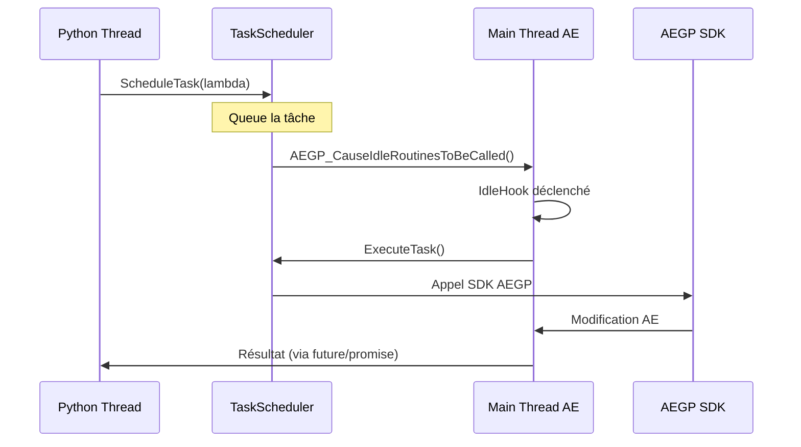

# Architecture Interne de PyShiftAE

**TL;DR**: PyShiftAE embarque CPython dans After Effects via pybind11 et utilise un TaskScheduler pour marshaler les appels Python vers le thread principal d'AE, évitant ainsi les deadlocks tout en permettant l'automatisation Python.

## Le Problème de l'Asymétrie Thread

Vous voulez automatiser After Effects avec Python, mais AE est une application C++ single-threaded. Chaque appel SDK doit s'exécuter sur le thread principal, tandis que votre code Python veut tourner en parallèle pour ne pas bloquer l'interface.

C'est là que PyShiftAE introduit une solution élégante: un pont C++/Python avec orchestration des threads.

## Architecture en Couches

PyShiftAE organise son architecture en quatre couches distinctes:

### 1. Couche Plugin AEGP (C++)

Le point d'entrée est un plugin After Effects standard (`.aex`) qui:
- Initialise l'interpréteur CPython dans le processus AE.exe
- Expose un module Python `PyFx` via pybind11
- Enregistre les hooks AE (IdleHook, CommandHook, etc.)

```cpp
// Dans PyFx.hpp
PYBIND11_EMBEDDED_MODULE(PyFx, m) {
    // Exposition des suites AEGP à Python
    py::class_<ProjSuite>(m, "ProjSuite")
        .def("GetNumProjects", &ProjSuite::GetNumProjects);
}
```

### 2. Couche AETK (C++ Toolkit)

AETK fournit les wrappers C++ autour du SDK AE:
- `TaskScheduler.hpp`: Ordonnancement des tâches sur le thread principal
- `Suites.cpp`: Wrappers sécurisés autour des AEGP suites
- `HandleWrapper<T>`: Gestion RAII des handles AE

### 3. Couche PyFx (pybind11 Bridge)

Le module `PyFx` fait le pont entre Python et C++:
- Expose les suites AEGP comme des classes Python
- Gère la conversion des types (Python ↔ C++)
- Fournit les wrappers de handles avec cycle de vie contrôlé

### 4. Couche API Python (Userland)

`pyshiftae/ae.py` offre une API Python idiomatique:
- Classes haut niveau: `Item`, `CompItem`, `Layer`, `Property`
- Collections Pythoniques avec itérateurs
- Gestion automatique des ressources

## Flux de Données: Python → After Effects



### Le Pattern Worker Thread + Scheduler

Voici le pattern recommandé pour éviter les blocages:

```python
import pyshiftae as ae
import threading

def heavy_computation():
    """Python pur - aucun appel AE"""
    return [(i/24.0, (i, i*1.5, 0)) for i in range(1000)]

def apply_changes(data):
    """Exécuté sur thread principal AE via scheduler"""
    comp = ae.Item.active_item()
    if not comp: return
    layer = comp.layers.add_solid("Solid", (0,1,0,1), 1920, 1080, 10)

# Lancement sur worker thread
threading.Thread(target=lambda: (
    data := heavy_computation(),
    ae.schedule_task(lambda: apply_changes(data))
)).start()
```

## Le Cœur de la Stabilité: TaskScheduler

### Pourquoi c'est critique

Le TaskScheduler résout le problème fondamental: **l'asymétrie C++/Python**. Sans lui, vous feriez face à:
- Deadlocks entre threads Python et thread AE
- Crashes si les appels SDK se font depuis le mauvais thread
- Interface gelée si les opérations bloquent le main thread

### Fonctionnement interne

```cpp
// TaskScheduler.hpp (simplifié)
class TaskScheduler {
    std::queue<std::function<void()>> task_queue;
    
public:
    void ScheduleTask(std::function<void()> task) {
        {
            std::lock_guard<std::mutex> lock(queue_mutex);
            task_queue.push(task);
        }
        AEGP_CauseIdleRoutinesToBeCalled(); // Accélère l'exécution
    }
    
    void ExecuteTask() {
        std::function<void()> task;
        {
            std::lock_guard<std::mutex> lock(queue_mutex);
            if (!task_queue.empty()) {
                task = task_queue.front();
                task_queue.pop();
            }
        }
        if (task) task(); // Exécuté sur main thread AE
    }
};
```

### Points de Vigilance

**❌ À éviter:**
- Appeler `ScheduleTask` depuis un hook AE avec `CALLIDLE=True`
- Attendre un résultat depuis le main thread (deadlock)
- Opérations longues dans `ExecuteTask()` (UI gelée)

**✅ Bonnes pratiques:**
- Calculs lourds sur worker thread Python
- Tâches SDK courtes et atomiques via scheduler
- Utilisation de futures/promises pour résultats asynchrones

## Gestion Mémoire et Handles

### Le Danger des Doubles Destructures

Le binding pybind11 actuel a un problème critique:

```cpp
// Dans PyFx.hpp - ANTI-PATTERN
__del__(self) {
    self.~HandleWrapper(); // Appel manuel du destructeur!
}
```

Cela provoque des doubles destructions: une fois par `__del__`, une fois par le destructeur C++ normal.

### Solution RAII Propre

```cpp
// Approche correcte avec shared_ptr
class SafeHandleWrapper : public std::shared_ptr<AEGP_Handle> {
public:
    using std::shared_ptr<AEGP_Handle>::shared_ptr;
    // Pas de __del__ personnalisé - RAII géré automatiquement
};
```

## Couverture API et Limitations

### Ce qui est Bien Exposé

- **Projets/Compositions**: Création, navigation, propriétés
- **Layers**: Types standards (solide, null, caméra, lumière)
- **Propriétés**: Streams, keyframes, expressions via `StreamSuite`
- **Effets/Masques**: Suite complète exposée

### Ce qui est Partiel

- **Shape Layers**: Accès basique via `VectorLayer`, mais pas l'arbre complet des groupes/paths
- **Rendu/Pixels**: Architecture C++ présente (`WorldSuite`, `RenderSuite`) mais API Python limitée
- **UI Natif**: Panels ScriptUI non accessibles depuis Python

### Ce qui est Absent

- **Événements**: Pas de callbacks Python sur changements AE
- **Render Pipeline**: Accès pixels bas niveau non exposé
- **Command Hooks**: Enregistrement dynamique de commandes depuis Python

## Architecture Hybrid 2.0 (2026)

### Découverte du Transport Natif

L'analyse récente a révélé une évolution majeure: le transport via named pipes/Unix sockets.

```javascript
// PyInterface - Transport natif
const pipeName = '\\\\.\\pipe\\pyshift_default'; // Windows
// ou
const pipeName = '/tmp/pyshift_default'; // Unix

// Format JSON newline-delimited
{"endpoint": "Response", "functionName": "create_layer", "args": {...}}
```

### Impact sur la Performance

| Transport | Latence | Cas d'usage |
|-----------|---------|-------------|
| Mailbox JSON | ~300ms | Scripts batch |
| Named Pipes | <10ms | Temps réel, sliders |
| Unix Sockets | <10ms | Monitoring continu |

### Recommandation Architecture

**Pour automatisation batch:**
- Worker thread Python + TaskScheduler (pattern classique)
- Mailbox JSON si pas de pipe disponible

**Pour interactions temps réel:**
- Named pipes/Unix sockets obligatoire
- CEP panels avec sliders continus
- Monitoring en temps réel de la sélection AE

## La Golden Rule

> **L'asymétrie C++/Python est gérée par le TaskScheduler.**

Ce principe signifie que toute opération SDK doit passer par le scheduler, garantissant ainsi:
- La sécurité des threads
- La non-blocage de l'interface
- La prévisibilité des exécutions

## Recommandations pour Développeurs C++

### Si vous Contribuez au Core

1. **Corrigez la gestion des handles**: Supprimez les `__del__` manuels dans PyFx
2. **Exposez WorldSuite**: Pour accès pixels depuis Python
3. **Ajoutez callbacks événements**: Pour monitoring temps réel

### Si vous Construisez sur PyShiftAE

1. **Utilisez le pattern worker + scheduler**: Jamais d'appels SDK directs
2. **Privilégiez les pipes natifs**: Pour toute interaction UI
3. **Testez la mémoire**: Sur les longues sessions, vérifiez les leaks

### Pour Architecture Production

1. **Séparez les responsabilités**: Python = logique métier, C++ = SDK
2. **Hybrid 2.0优先**: CEP + pipes pour UI, Python pour traitement
3. **Monitoring intégré**: Surveillez les deadlocks potentiels

## Conclusion

PyShiftAE représente une avancée significative pour l'automatisation AE, mais demande une compréhension profonde de son architecture. Le TaskScheduler est le cœur de sa stabilité, tandis que l'évolution vers les transports natifs (Hybrid 2.0) ouvre de nouvelles possibilités d'interaction temps réel.

La clé du succès: respecter l'asymétrie C++/Python et laisser le scheduler gérer la concurrence.
