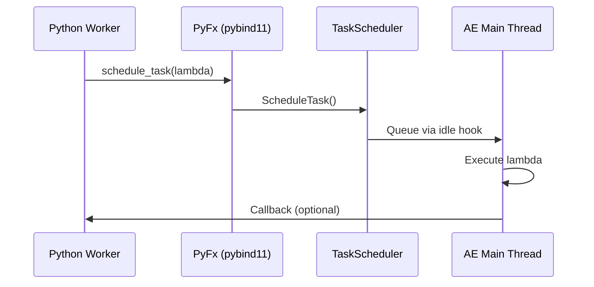

# Manuel de Développement PyShiftAE

Title: Manuel de Développement PyShiftAE  
Status: Stable  
Audience: Développeurs Python/C++ travaillant avec After Effects via PyShiftAE/AETK  
Sources: Basé sur AETK, API Python PyShiftAE, et sources externes (CEPy-Resources, PyFxCore, PyShift-Utils via Repomix)  

TL;DR: PyShiftAE permet de piloter After Effects avec Python 3.11+. Utilisez-le pour les calculs lourds et l'I/O, mais déléguez les mutations UI à CEP.

---

## Table des matières

1. [Architecture](#1-architecture)  
2. [Core Concepts](#2-core-concepts)  
3. [Workflow](#3-workflow)  
4. [Safe patterns & opérations critiques](#4-safe-patterns-opérations-critiques)  
5. [Installation & maintenance](#5-installation-maintenance)  
6. [Annexes](#6-annexes)

---

## 1. Architecture

### 1.1 Paradigme PyShiftAE

PyShiftAE est un **plugin AEGP qui embarque un runtime CPython** dans After Effects et expose un module Python `PyFx` via `pybind11`. Le pipeline est à trois étages :

- **Python user API** (`pyshiftae/ae.py`) : classes haut niveau (Items, Layers, Properties)  
- **Module PyFx** (pybind11) : wrappers des suites SDK (ProjSuite, ItemSuite, StreamSuite…)  
- **Wrappers AETK → SDK** : appels AEGP natifs marshaled vers le main thread AE

### 1.2 Embedded Python vs ExtendScript

Contrairement à ExtendScript qui s'exécute dans un moteur JavaScript intégré, PyShiftAE utilise **CPython embarqué**. Cette approche offre :

- **Performance native** pour les calculs lourds et l'I/O
- **Accès à l'écosystème Python** (librairies scientifiques, ML, traitement de données)
- **Threading réel** pour les tâches en arrière-plan
- **Contrainte** : toutes les mutations du projet AE doivent passer par le main thread

### 1.3 Couverture API

| Domaine | Couverture | Notes |
|---|---|---|
| Projet/Items/Comps | ✅ Complète | Création, rename, sélection, folders |
| Layers (base) | ✅ Complète | Types, propriétés, keyframes |
| Shape Layers (arbre) | 🟠 Partielle | Navigation MatchName OK, édition vertices/tangentes 🔴 |
| Masks/Effects | ✅ Bonne | Suites exposées, API haut niveau à vérifier |
| Rendu/Pixels | 🟠 Limitée | C++ sait faire, binding Python partiel |
| UI dockable | 🔴 Très limitée | Pas de ScriptUI natif, panels C++ non exposés |

### 1.4 La Golden Rule

**Python calcule (Worker Threads), After Effects applique (Main Thread).**

---

## 2. Core Concepts

### 2.1 Le TaskScheduler - Le concept clé

Le TaskScheduler est le mécanisme fondamental qui évite les crashs d'After Effects. Il garantit que toutes les mutations du projet AE s'exécutent sur le main thread.

#### 2.1.1 Pourquoi c'est crucial

- **AE main thread only** pour les appels SDK
- **Marshaling obligatoire** via `ae::TaskScheduler::ScheduleTask()`
- **Threading safe** : workers Python calculent, AE applique

#### 2.1.2 Séquence d'exécution



### 2.2 Patterns de communication

#### 2.2.1 Worker Thread Pattern
```python
import pyshiftae as ae
import threading

def calculs_lourds():
    """Pure Python - aucun appel AE"""
    return [(i/24.0, (i, i*1.5, 0)) for i in range(1000)]

def appliquer(donnees):
    """Exécuté dans AE main thread via scheduler - RAPIDE"""
    comp = ae.Item.active_item()
    if not comp: return
    layer = comp.layers.add_solid("Solid_IA", (0,1,0,1), 1920, 1080, 10)

# Lancement
threading.Thread(target=lambda: (
    data := calculs_lourds(),
    ae.schedule_task(lambda: appliquer(data))
)).start()
```

#### 2.2.2 À éviter
```python
# MAUVAIS : calcul lent + appels AE mélangés
for i in range(1000):
    time.sleep(0.01)  # Calcul sur main thread
    layer.position.set_value((i, i, 0))  # Ping-pong C++ constant
```

---

## 3. Workflow

### 3.1 CEP → Python → AE

Le workflow recommandé suit l'architecture Hybrid 2.0 :

```
CEP Panel → [Pipe/Socket] → PyShiftAE (natif) → réponse directe
     → fallback JSON files → bridge_daemon.py → PyShiftAE
```

#### 3.1.1 Composants
- **CEP** : UI + events + JSX runtime  
- **Python** : logique outillée + opérations natives  
- **IPC** : PyInterface (prioritaire) ou mailbox JSON

#### 3.1.2 Format JSON (pipe)
```json
{ "endpoint": "Response", "functionName": "<func>", "args": {"param1": "..."} }
```

### 3.2 Cas d'usage idéaux

- **Automation pipeline** (batch rename, ingest footage, render queue)  
- **Interop IA/ML** (analyse metadata, génération, orchestration)  
- **Outils assistés** déclenchés par menu (pas UI riche)

### 3.3 Limitations techniques

- **Shape Paths (bézier)** : non exposé en Python (nécessite ARB + parsing)  
- **UI dockable** : pas de ScriptUI, panels natifs C++ non accessibles depuis Python  
- **Hooks événements** : pas de binding Python natif, nécessite modifs C++ mineures ou workaround CEP  
- **Risque crash** : plus élevé qu'ExtendScript (C++ lifetime, threading)

---

## 4. Safe patterns & opérations critiques

### 4.1 Règle d'or threading

AE main thread only pour les appels SDK. Utiliser TaskScheduler pour marshaler les appels depuis les workers Python.

### 4.2 Patterns recommandés

#### ✅ Pattern worker + scheduler
```python
import pyshiftae as ae
import threading

def calculs_lourds():
    """Pure Python - aucun appel AE"""
    return [(i/24.0, (i, i*1.5, 0)) for i in range(1000)]

def appliquer(donnees):
    """Exécuté dans AE main thread via scheduler - RAPIDE"""
    comp = ae.Item.active_item()
    if not comp: return
    layer = comp.layers.add_solid("Solid_IA", (0,1,0,1), 1920, 1080, 10)
    # ... application rapide ...

# Lancement
threading.Thread(target=lambda: (
    data := calculs_lourds(),
    ae.schedule_task(lambda: appliquer(data))
)).start()
```

#### ❌ Pattern à éviter
```python
# MAUVAIS : calcul lent + appels AE mélangés
for i in range(1000):
    time.sleep(0.01)  # Calcul sur main thread
    layer.position.set_value((i, i, 0))  # Ping-pong C++ constant
```

### 4.3 GIL & mémoire

- **GIL acquisition minimale** : `py::gil_scoped_acquire` uniquement autour du code Python  
- **Handles AE courte durée** : ne pas stocker long-terme, re-valider avant usage  
- **Pas de références circulaires** Python ↔ PyFx  

### 4.4 Architecture Hybrid 2.0 (CEP ↔ Python)

| Élément | Mode natif | Fallback |
|---|---|---|
| Transport | Named pipes/Unix sockets | Mailbox JSON |
| Latence | <10ms | ~300ms |
| Temps réel | ✅ Sliders, interactions | ❌ Polling only |
| Configuration | `localStorage.setItem('pyshift_pipe_name', '...')` | Automatique |

---

## 5. Installation & maintenance

### 5.1 Installation Windows

> Voir [Annexe B – Installation Windows](./pyshiftae_installation_windows.md) pour le guide complet.

**Points clés** :
- Python 3.11 recommandé (builder officiel)  
- Méthode portable : copie locale de `Lib`, `DLLs`, `python311.dll` près d'AE  
- Gestion multi-disques (C: Python, F: AE)  

### 5.2 Maintenance

- **Version alignement** : vérifier correspondance Python ↔ `.aex`  
- **Rescan plugins** : démarrer AE avec Shift après plantage  
- **Mise à jour package** : recopier `site-packages` après `pip install --upgrade`  

---

## 6. Annexes

### Annexe A – Faisabilité avancée
*Document en préparation*
- Étude détaillée Shape Layers & Hooks  
- Verdicts techniques et modifications C++ requises  

### [Annexe B – Installation Windows](./pyshiftae_installation_windows.md)
- Guide pas-à-pas complet + troubleshooting  
- Cas multi-disques, DLL hell, diagnostics  

### [Annexe C – Recettes & snippets](./pyshiftae_implementation_shape_navigator_cep_bridge.md)
- Script Shape Navigator complet  
- Architecture CEP Bridge détaillée (mailbox + pipe)  

### [Annexe D – Safe patterns checklist](./pyshiftae_safe_patterns_checklist.md)
- Checklist opérationnelle complète  
- DO/DON'T résumés, références techniques  

---

## Changelog

- **v1.0 (2026-02-07)** : Refactorisation en Manuel de Développement selon standards documentation
- **Prochaine revue** : Trimestrielle ou sur mise à jour majeure de PyShiftAE/AETK  

---

> **Contributeurs** : Basé sur les documents techniques internes et l'expertise PyShiftAE  
> **Contact** : Pour questions ou mises à jour, référez-vous aux annexes détaillées ou ouvrez une issue dans le repo.
