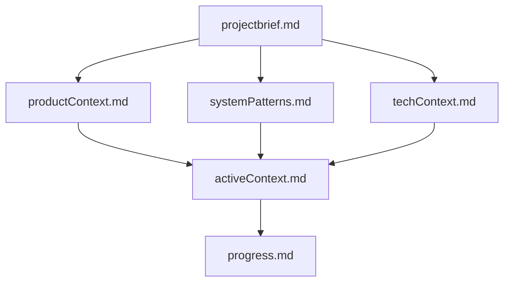
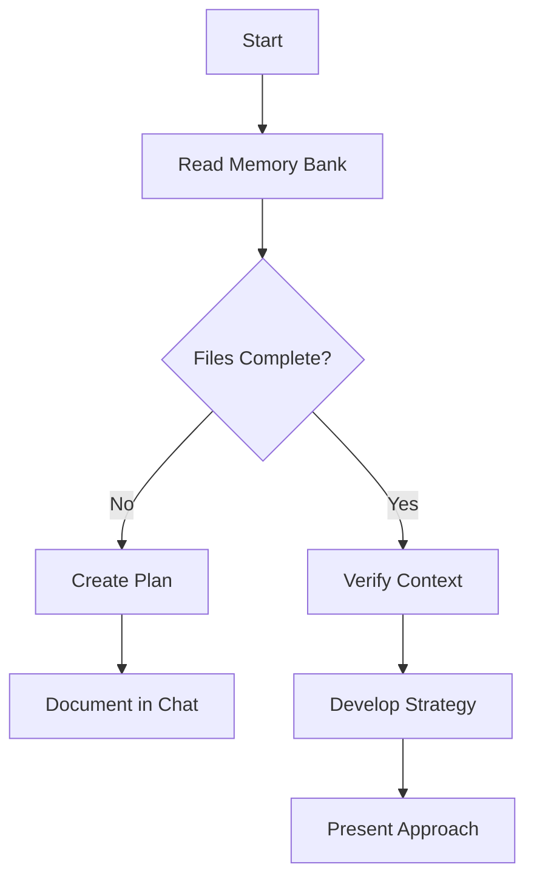
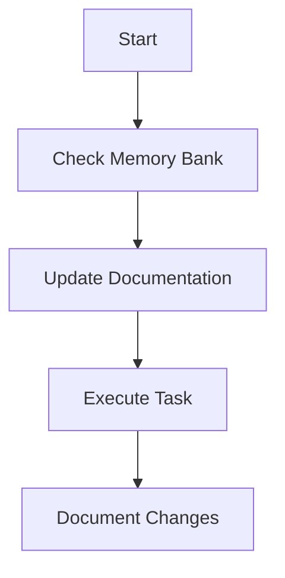
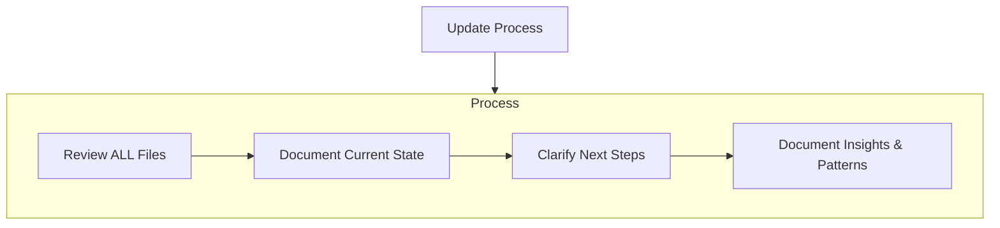
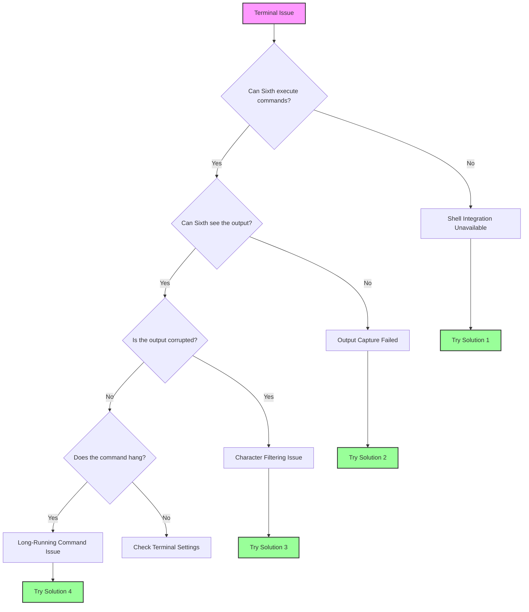

This file is a merged representation of the entire codebase, combined into a single document by Repomix.
The content has been processed where security check has been disabled.

# File Summary

## Purpose
This file contains a packed representation of the entire repository's contents.
It is designed to be easily consumable by AI systems for analysis, code review,
or other automated processes.

## File Format
The content is organized as follows:
1. This summary section
2. Repository information
3. Directory structure
4. Repository files (if enabled)
5. Multiple file entries, each consisting of:
  a. A header with the file path (## File: path/to/file)
  b. The full contents of the file in a code block

## Usage Guidelines
- This file should be treated as read-only. Any changes should be made to the
  original repository files, not this packed version.
- When processing this file, use the file path to distinguish
  between different files in the repository.
- Be aware that this file may contain sensitive information. Handle it with
  the same level of security as you would the original repository.

## Notes
- Some files may have been excluded based on .gitignore rules and Repomix's configuration
- Binary files are not included in this packed representation. Please refer to the Repository Structure section for a complete list of file paths, including binary files
- Files matching patterns in .gitignore are excluded
- Files matching default ignore patterns are excluded
- Security check has been disabled - content may contain sensitive information
- Files are sorted by Git change count (files with more changes are at the bottom)

# Directory Structure
```
enterprise-solutions/
  cloud-provider-integration.md/
    cloud-provider-integration.md
  custom-instructions.md/
    custom-instructions.md
  mcp-servers.md/
    mcp-servers.md
  security-concerns.md/
    security-concerns.md
features/
  at-mentions/
    file-mentions.md/
      file-mentions.md
    git-mentions.md/
      git-mentions.md
    overview.md/
      overview.md
    problem-mentions.md/
      problem-mentions.md
    terminal-mentions.md/
      terminal-mentions.md
    url-mentions.md/
      url-mentions.md
  auto-approve.md/
    auto-approve.md
  checkpoints.md/
    checkpoints.md
  commands-and-shortcuts/
    code-commands.md/
      code-commands.md
    git-integration.md/
      git-integration.md
    keyboard-shortcuts.md/
      keyboard-shortcuts.md
    overview.md/
      overview.md
    terminal-integration.md/
      terminal-integration.md
  drag-and-drop.md/
    drag-and-drop.md
  editing-messages.md/
    editing-messages.md
  plan-and-act.md/
    plan-and-act.md
  sixth-rules.md/
    sixth-rules.md
  slash-commands/
    new-rule.md/
      new-rule.md
    new-task.md/
      new-task.md
    report-bug.md/
      report-bug.md
    smol.md/
      smol.md
    workflows.md/
      workflows.md
getting-started/
  for-new-coders.md/
    for-new-coders.md
  installing-dev-essentials.md/
    installing-dev-essentials.md
  installing-sixth.md/
    installing-sixth.md
  model-selection-guide.md/
    model-selection-guide.md
  task-management.md/
    task-management.md
  understanding-context-management.md/
    understanding-context-management.md
  what-is-sixth.md/
    what-is-sixth.md
mcp/
  adding-mcp-servers-from-github.md/
    adding-mcp-servers-from-github.md
  configuring-mcp-servers.md/
    configuring-mcp-servers.md
  connecting-to-a-remote-server.md/
    connecting-to-a-remote-server.md
  mcp-marketplace.md/
    mcp-marketplace.md
  mcp-overview.md/
    mcp-overview.md
  mcp-server-development-protocol.md/
    mcp-server-development-protocol.md
  mcp-transport-mechanisms.md/
    mcp-transport-mechanisms.md
more-info/
  telemetry.md/
    telemetry.md
prompting/
  prompt-engineering-guide.md/
    prompt-engineering-guide.md
  sixth-memory-bank.md/
    sixth-memory-bank.md
provider-config/
  anthropic.md/
    anthropic.md
  aws-bedrock-with-apikey-authentication.md/
    aws-bedrock-with-apikey-authentication.md
  aws-bedrock-with-credentials-authentication.md/
    aws-bedrock-with-credentials-authentication.md
  aws-bedrock-with-profile-authentication.md/
    aws-bedrock-with-profile-authentication.md
  claude-code.md/
    claude-code.md
  deepseek.md/
    deepseek.md
  gcp-vertex-ai.md/
    gcp-vertex-ai.md
  mistral-ai.md/
    mistral-ai.md
  ollama.md/
    ollama.md
  openai-compatible.md/
    openai-compatible.md
  openai.md/
    openai.md
  openrouter.md/
    openrouter.md
  requesty.md/
    requesty.md
  sap-aicore.md/
    sap-aicore.md
  vscode-language-model-api.md/
    vscode-language-model-api.md
  xai-grok.md/
    xai-grok.md
running-models-locally/
  lm-studio.md/
    lm-studio.md
  ollama.md/
    ollama.md
  read-me-first.md/
    read-me-first.md
troubleshooting/
  terminal-integration-guide.md/
    terminal-integration-guide.md
  terminal-quick-fixes.md/
    terminal-quick-fixes.md
```

# Files

## File: enterprise-solutions/cloud-provider-integration.md/cloud-provider-integration.md
`````markdown
> ## Documentation Index
> Fetch the complete documentation index at: https://docs.trysixth.com/llms.txt
> Use this file to discover all available pages before exploring further.

# Cloud Provider Integration

Sixth supports major cloud providers like AWS Bedrock and Google's Cloud Vertex; whichever your team currently uses is appropriate, and there's no need to change providers to utilize Sixth's features.

For the purpose of this document, we assume your organization will use cloud-based frontier models. Cloud inference providers offer cutting-edge capabilities and the flexibility to select models which best suit your needs.

Certain scenarios may warrant using local models, including handling highly sensitive data, applications requiring consistent low-latency responses, or compliance with strict data sovereignty requirements. If your team needs to utilize local models, see [Running Local Models ](/running-models-locally/read-me-first.mdx)with Sixth.

***

## AWS Bedrock Setup Guides

#### [IAM Security Best Practices](https://docs.aws.amazon.com/IAM/latest/UserGuide/best-practices.html) (For administrators)

#### [AWS Bedrock setup for API Keys](/provider-config/aws-bedrock-with-apikey-authentication)

#### [AWS Bedrock setup for Legacy IAM (AWS Credentials)](/provider-config/aws-bedrock-with-credentials-authentication)

#### [AWS Bedrock setup for SSO token (AWS Profile)](/provider-config/aws-bedrock-with-profile-authentication)

#### VPC Endpoint Setup

To protect your team's data, Sixth supports VPC (Virtual Private Cloud) endpoints, which create private connections between your data and AWS Bedrock. AWS VPCs enhance security by eliminating the need for public IP addresses, network gateways, or complex firewall rules—essentially creating a private highway for data that bypasses the public internet entirely. By keeping traffic within AWS's private network, teams also benefit from lower latency and more predictable performance when accessing services like AWS Bedrock or custom APIs. For those working with confidential information or operating in highly regulated industries like healthcare or finance, VPCs offers the perfect balance between the accessibility of cloud services and the security of private infrastructure.

***

1. Consult the [AWS guide](https://docs.aws.amazon.com/bedrock/latest/userguide/vpc-interface-endpoints.html) to creating VPC endpoints. This document specifies pre-requisites and describes the syntax used for creating VPC endpoints.
2. Follow the directions for [creating a VPC endpoint](https://docs.aws.amazon.com/vpc/latest/privatelink/create-interface-endpoint.html#create-interface-endpoint-aws) in the AWS console. The image below pertains to steps 4 and 5 of the AWS guide linked above.

<Frame>
  
</Frame>

3. Note the IP address of your VPC endpoint, open Sixth's settings menu, and select `AWS Bedrock`from the API Provider dropdown.
4. Click the `Use Custom VPC endpoint`checkbox and enter the IP address of your VPC endpoint

<Frame>
  
</Frame>
`````

## File: enterprise-solutions/custom-instructions.md/custom-instructions.md
`````markdown
> ## Documentation Index
> Fetch the complete documentation index at: https://docs.trysixth.com/llms.txt
> Use this file to discover all available pages before exploring further.

# Custom Instructions

## Building Custom Instructions for Teams

**Creating standardized project instructions ensures that all team members work within consistent guidelines. Start by documenting your project's technical foundation, then identify which information needs to be included in the instructions. The exact scope will vary depending on your team's needs, but generally it's best to provide as much information as possible. By creating comprehensive instructions that all team members follow, you establish a shared understanding of how code should be written, tested, and deployed across your project, resulting in more maintainable and consistent software.**

***

Here are a few topics and examples to consider for your team's custom instructions:

1. **Testing framework and specific commands**
   * "All components must include Jest tests with at least 85% coverage. Run tests using `npm run test:coverage` before submitting any pull request."
2. **Explicit library preferences**
   * "Use React Query for data fetching and state management. Avoid Redux unless specifically required for complex global state. For styling, use Tailwind CSS with our custom theme configuration found in `src/styles/theme.js.`"
3. **Where to find documentation**
   * "All API documentation is available in our internal Notion workspace under 'Engineering > API Reference'. For component usage examples, refer to our Storybook instance at `https://storybook.internal.company.com`"
4. **Which MCP servers to use, and for which purposes**
   * "For database operations, use the Postgres MCP server with credentials stored in 1Password under 'Development > Database'. For deployments, use the AWS MCP server which requires the deployment role from IAM. Refer to `docs/mcp-setup.md` for configuration instructions."
5. **Coding conventions specific to your project**
   * "Name all React components using PascalCase and all helper functions using camelCase. Place components in the `src/components` directory organized by feature, not by type. Always use TypeScript interfaces for prop definitions."
`````

## File: enterprise-solutions/mcp-servers.md/mcp-servers.md
`````markdown
> ## Documentation Index
> Fetch the complete documentation index at: https://docs.trysixth.com/llms.txt
> Use this file to discover all available pages before exploring further.

# MCP Servers

**Model Context Protocol (MCP) servers expand Sixth's capabilities by providing standardized access to external data sources and executable functions. By implementing MCP servers, LLM tools can dynamically retrieve and incorporate relevant information from both local and remote data sources. This capability ensures that the models operate with the most current and contextually appropriate data, improving the accuracy and relevance of their outputs.**

***

### Secure Architecture Fundamentals

MCP servers follow a client-server architecture where hosts (LLM applications like Sixth) initiate connections through a transport layer to MCP servers. This architecture inherently provides security benefits as it maintains clear separation between components. Enterprise deployments should focus on the proper implementation of this architecture to ensure secure operations, particularly regarding the message exchange patterns and connection lifecycle management. For MCP architecture details, see [MCP Architecture](https://modelcontextprotocol.io/docs/concepts/architecture), and for latest specifications, see [MCP Specifications](https://spec.modelcontextprotocol.io/specification/2024-11-05/).

### Transport Layer Security

For enterprise environments, selecting the appropriate transport mechanism is crucial. While stdio transport works efficiently for local processes, HTTP with Server-Sent Events (SSE) transport requires additional security measures. TLS should be used for all remote connections whenever possible. This is especially important when MCP servers are deployed across different network segments within corporate infrastructure.

### Message Validation and Access Control

The MCP architecture defines standard error codes and message types (Requests, Results, Errors, and Notifications), providing a structured framework for secure communication. Security teams should consider message validation, sanitizing inputs, checking message size limits, and verifying JSON-RPC format. Additionally, implementing resource protection through access controls, path validation, and request rate limiting helps prevent potential abuse of MCP server capabilities.

### Monitoring and Compliance

For enterprise compliance requirements, implementing comprehensive logging of protocol events, message flows, and errors is essential. The MCP architecture supports diagnostic capabilities including health checks, connection state monitoring, and resource usage tracking. Organizations should extend these capabilities to meet their specific compliance needs, particularly for audit trails of all MCP server interactions and resource access patterns.

By leveraging the client-server design of the MCP architecture and implementing appropriate security controls at each layer, enterprises can safely integrate MCP servers into their environments while maintaining their security posture and meeting regulatory requirements.
`````

## File: enterprise-solutions/security-concerns.md/security-concerns.md
`````markdown
> ## Documentation Index
> Fetch the complete documentation index at: https://docs.trysixth.com/llms.txt
> Use this file to discover all available pages before exploring further.

# Security Concerns

## Enterprise Security with Sixth

#### Sixth addresses enterprise security concerns through its unique client-side architecture that prioritizes data privacy, secure cloud integration, and transparent operations. Below is a comprehensive overview of how Sixth maintains robust security measures for enterprise environments.

***

### Client-Side Architecture

Sixth operates exclusively as a client-side VSCode extension with zero server-side components. This fundamental design choice ensures that your code and data remain within your secure environment at all times. Unlike traditional AI assistants that send data to external servers for processing, Sixth connects directly to your chosen cloud provider's AI endpoints, keeping all sensitive information within your infrastructure boundaries.

<Frame>
  
</Frame>

### Data Privacy Commitment

Sixth implements a strict zero data retention policy, meaning your intellectual property never leaves your secure environment. The extension does not collect, store, or transmit your code to any central servers. This approach significantly reduces potential attack vectors that might otherwise be introduced through data transmission to third-party systems. Telemetry collection is optional and requires explicit consent.

### Cloud Provider Integration

Enterprise teams can access cutting-edge AI models through their existing cloud deployments. Sixth supports seamless integration with:

* AWS Bedrock
* Google Cloud Vertex AI
* Microsoft Azure

These integrations utilize your organization's existing security credentials, including native IAM role assumption for AWS. This ensures that all AI processing occurs within your corporate cloud environment, maintaining compliance with your established security protocols.

### Open-Source Transparency

Sixth's codebase is completely open-source, allowing for comprehensive security auditing by your internal teams. This transparency enables security professionals to verify exactly how the extension functions and confirm that it adheres to your organization's security requirements. Organizations can review the code to ensure it aligns with their security policies before deployment.

### Controlled Modifications

The extension implements safeguards against unauthorized changes to your codebase. Sixth requires explicit user approval for all file modifications and terminal commands, preventing accidental or unwanted alterations. This approval-based workflow maintains the integrity of your projects while still providing AI assistance.

### Enterprise Deployment Support

For organizations with strict security review processes, Sixth provides comprehensive documentation including detailed deployment diagrams, sequence diagrams illustrating all data flows, and complete security posture documentation. These materials facilitate thorough security reviews and help demonstrate compliance with enterprise data handling standards and regulations.

### Access Control

Enterprise editions of Sixth (planned for Q2 2025) will include centralized administration features that allow organizations to:

* Manage user access with customizable permission levels
* Provision accounts with corporate credentials
* Immediately revoke access when needed
* Control which AI providers and LLM endpoints can be used
* Deploy standardized settings across the organization
* Prevent unauthorized use of personal API keys

### Compliance and Governance

Sixth's architecture supports compliance with data sovereignty requirements and enterprise data handling regulations. The planned Enterprise Complete edition will further enhance governance with detailed audit logging, compliance reporting, and automated policy enforcement mechanisms.

By combining client-side processing, direct cloud provider integration, and transparent operations, Sixth offers enterprise teams a secure way to leverage AI assistance while maintaining strict control over their sensitive code and data.
`````

## File: features/at-mentions/file-mentions.md/file-mentions.md
`````markdown
> ## Documentation Index
> Fetch the complete documentation index at: https://docs.trysixth.com/llms.txt
> Use this file to discover all available pages before exploring further.

# File Mentions

File mentions let you pull any file from your workspace directly into your conversation with Sixth. No more copying and pasting code snippets - just type `@/` and point to the file you need help with.

When you type `@/` in the chat, Sixth shows your workspace files. Navigate through folders, select the file you want, and it's instantly available to Sixth - complete with all imports, related functions, and surrounding context.

I use file mentions constantly when debugging. Instead of trying to figure out which parts of my code to copy over, I just reference the file directly:

```
I'm getting this error when my form submits: @terminal

Here's my component: @/src/components/ContactForm.jsx

And the API endpoint: @/src/api/contact.js

What am I missing?
```

This gives Sixth everything it needs - the error message, the component code, and the API endpoint - all without me having to copy anything. Sixth can see imports, dependencies, and all the surrounding context that might be causing the issue.

File mentions shine when you're dealing with complex bugs that span multiple files. Before, I'd have to carefully copy each relevant file, making sure I didn't miss anything important. Now I just reference each file with `@/` and Sixth gets the complete picture.

Next time you're stuck on a problem, try using file mentions instead of copying code. You'll save time and get better answers because Sixth has all the context it needs.

## How It Works Under the Hood

When you use a file mention in your message, here's what happens behind the scenes:

1. When you send your message, Sixth detects the `@/path/to/file` pattern in your text
2. The extension resolves the file path relative to your workspace root
3. It checks if the file is binary (like an image) or text-based
4. For text files, it reads the complete file content
5. The file content is appended to your message in a structured format:
   ```
   <file_content path="path/to/file">
   [Complete file content]
   </file_content>
   ```
6. This enhanced message with the embedded file content is sent to the AI
7. The AI can now "see" the complete file content as if you had copied and pasted it

This seamless process happens automatically whenever you use a file mention, giving the AI full context without you having to manually copy anything.
`````

## File: features/at-mentions/git-mentions.md/git-mentions.md
`````markdown
> ## Documentation Index
> Fetch the complete documentation index at: https://docs.trysixth.com/llms.txt
> Use this file to discover all available pages before exploring further.

# Git Mentions

Git mentions let you bring your repository's history and changes directly into your conversation with Sixth. You can reference uncommitted changes with `@git-changes` or specific commits with `@[commit-hash]`.

When you type `@` in chat, you can select "Git Changes" from the menu or type `@git-changes` directly. For specific commits, type `@` followed by the commit hash (at least 7 characters). Sixth will immediately see the git status, diffs, commit messages, and other relevant information.

I use git mentions constantly when I'm trying to understand code changes or troubleshoot issues introduced by recent commits. Instead of trying to copy and paste diffs or commit logs, I just ask:

```
I think this commit broke our authentication flow: @a1b2c3d

Can you explain what changed and why it might be causing the issue?
```

This gives Sixth the complete commit information, including the commit message, author, date, and the full diff. Sixth can then analyze exactly what changed and how it might affect other parts of the codebase.

The `@git-changes` mention is perfect when you're working on changes and want feedback before committing:

```
Here are my current changes: @git-changes

I'm trying to implement a new feature for user profiles. Does my approach make sense?
Are there any potential issues or improvements you'd suggest?
```

This shows Sixth all your uncommitted changes, including new files, modified files, and their diffs. Sixth can then review your changes and provide feedback on your implementation.

Git mentions are especially powerful when combined with file mentions. When I'm investigating a bug, I'll often reference both:

```
I think this commit introduced a bug: @a1b2c3d

Here's the current implementation: @/src/components/Auth.jsx

How can I fix the issue while preserving the intended functionality?
```

Next time you're working with code changes or investigating issues, try using git mentions instead of manually describing or copying changes. You'll get more accurate help because Sixth can see exactly what changed and in what context.

## How It Works Under the Hood

When you use git mentions in your message, here's what happens behind the scenes:

### For Git Changes (`@git-changes`)

1. When you send your message, Sixth detects the `@git-changes` pattern in your text
2. The extension runs git commands to get the current working state of your repository
3. It captures the output of `git status` and `git diff` to see all uncommitted changes
4. This information is appended to your message in a structured format:

   ```
   <git_working_state>
   On branch main
   Changes not staged for commit:
     modified: src/components/Button.jsx
     modified: src/styles/main.css

   [Complete diff output with all changes]
   </git_working_state>
   ```

### For Specific Commits (`@[commit-hash]`)

1. When you send your message, Sixth detects the `@` followed by a commit hash pattern
2. The extension runs `git show` and related commands to get information about that commit
3. It retrieves the commit message, author, date, and the complete diff
4. This information is appended to your message in a structured format:

   ```
   <git_commit hash="a1b2c3d">
   commit a1b2c3d4e5f6g7h8i9j0k1l2m3n4o5p6q7r8s9t
   Author: Developer Name <dev@example.com>
   Date: Mon May 20 14:30:45 2025 -0700

   Fix authentication bug in login form

   [Complete diff output showing all changes in the commit]
   </git_commit>
   ```

This process happens automatically whenever you use git mentions, giving the AI complete visibility into your code changes without you having to copy and paste diffs or commit logs.
`````

## File: features/at-mentions/overview.md/overview.md
`````markdown
> ## Documentation Index
> Fetch the complete documentation index at: https://docs.trysixth.com/llms.txt
> Use this file to discover all available pages before exploring further.

# @ Mentions Overview

@ mentions are one of Sixth's most powerful features, letting you seamlessly bring external context into your conversations. Instead of copying and pasting code, error messages, or documentation, you can simply reference them with an @ symbol.

<Frame>
  
</Frame>

When you type `@` in the chat input, Sixth shows a menu of available mention types. These mentions let you reference files, folders, problems, terminal output, git changes, and even web content directly in your conversations.

## Available @ Mentions

Sixth supports several types of @ mentions, each designed to bring different kinds of context into your conversations:

<Columns cols={2}>
  <Card title="File Mentions" icon="file" href="/features/at-mentions/file-mentions">
    Reference any file in your workspace with `@/path/to/file`. Sixth sees the complete file content, including imports, related
    functions, and surrounding context.
  </Card>

  {" "}

  <Card title="Folder Mentions" icon="folder" href="/features/at-mentions/folder-mentions">
    Reference entire directories with `@/path/to/folder/`. Sixth sees the folder structure and all file contents, perfect for
    understanding complex interactions between multiple files.
  </Card>

  {" "}

  <Card title="Problem Mentions" icon="triangle-exclamation" href="/features/at-mentions/problem-mentions">
    Use `@problems` to show Sixth all the errors and warnings in your workspace. Sixth sees the complete list with file locations
    and error messages.
  </Card>

  {" "}

  <Card title="Terminal Mentions" icon="terminal" href="/features/at-mentions/terminal-mentions">
    Use `@terminal` to share your recent terminal output. Sixth sees the complete output with formatting preserved, perfect for
    debugging build errors or test failures.
  </Card>

  {" "}

  <Card title="Git Mentions" icon="code-branch" href="/features/at-mentions/git-mentions">
    Reference uncommitted changes with `@git-changes` or specific commits with `@[commit-hash]`. Sixth sees the complete diff,
    commit message, and other relevant information.
  </Card>

  <Card title="URL Mentions" icon="globe" href="/features/at-mentions/url-mentions">
    Reference web content with `@https://example.com`. Sixth fetches and sees the complete webpage content, perfect for
    referencing documentation or GitHub issues.
  </Card>
</Columns>

## Why @ Mentions Matter

@ mentions transform how you interact with Sixth by:

1. **Eliminating copy-paste**: No more copying and pasting code, error messages, or terminal output. Just reference them directly.

2. **Preserving context**: Sixth sees the complete context, including imports, related functions, and surrounding code that might be relevant.

3. **Maintaining formatting**: Terminal output, error messages, and web content keep their formatting, making them easier to understand.

4. **Enabling complex workflows**: Combine multiple @ mentions to give Sixth a complete picture of your problem:

   ```
   I'm getting these errors: @problems

   Here's my component: @/src/components/Form.jsx
   And the API endpoint: @/src/api/users.js

   The error happens when I submit: @terminal

   I think this commit might have caused it: @a1b2c3d
   ```

## Getting Started

To use @ mentions:

1. Type `@` in the chat input
2. Select the type of mention from the menu or continue typing
3. For files and folders, navigate through your workspace structure
4. Send your message as usual

Sixth will automatically process the mentions and include the referenced content in the context sent to the AI.

Try using @ mentions in your next conversation with Sixth - you'll be amazed at how much more efficient and effective your interactions become when you can seamlessly bring in external context.

## How It Works Under the Hood

When you use @ mentions in your messages, there's a sophisticated process happening behind the scenes:

1. **Detection**: When you send a message, Sixth scans the text for @ mention patterns using regular expressions

2. **Processing**: For each detected mention, Sixth:
   * Determines the mention type (file, folder, problems, terminal, git, URL)
   * Fetches the relevant content (file contents, terminal output, etc.)
   * Formats the content appropriately

3. **Enhancement**: The original message is enhanced with structured data:

   ```
   Your original message with @/path/to/file

   <file_content path="/path/to/file">
   [Complete file content]
   </file_content>
   ```

4. **Context Inclusion**: This enhanced message with all the embedded content is sent to the AI model

5. **Seamless Response**: The AI can now "see" all the referenced content as if you had manually copied and pasted it

This entire process happens automatically and seamlessly whenever you use @ mentions, giving the AI complete context without you having to manually copy anything.

Each type of @ mention has its own specific implementation details, which you can find in their respective documentation pages.
`````

## File: features/at-mentions/problem-mentions.md/problem-mentions.md
`````markdown
> ## Documentation Index
> Fetch the complete documentation index at: https://docs.trysixth.com/llms.txt
> Use this file to discover all available pages before exploring further.

# Problem Mentions

The problems mention gives Sixth instant access to all the errors and warnings in your workspace. Just type `@problems` and Sixth can see every diagnostic issue VSCode has detected.

When you type `@` in chat, select "Problems" from the menu or just type `@problems` directly. Sixth will immediately see all the errors and warnings from your workspace, complete with file locations and error messages.

I use the problems mention constantly when I'm stuck on build errors or TypeScript issues. Instead of trying to describe the errors or copy them one by one, I just ask:

```
I'm getting these TypeScript errors and I'm not sure how to fix them: @problems

Can you help me understand what's wrong and how to fix it?
```

This gives Sixth the complete list of errors with their exact locations and messages. Sixth can then analyze the patterns across multiple errors and suggest comprehensive solutions.

The problems mention is especially powerful when combined with file mentions. When I'm dealing with complex type errors, I'll reference both:

```
I'm getting these type errors: @problems

Here's my component: @/src/components/DataTable.tsx
And the types file: @/src/types/api.ts

How can I fix these issues?
```

This approach gives Sixth everything it needs - the exact errors, the component code, and the type definitions - all without me having to copy anything manually.

Next time you're stuck on errors, try using `@problems` instead of copying error messages. You'll get more accurate help because Sixth can see the complete error context and locations.

## How It Works Under the Hood

When you use the problems mention in your message, here's what happens behind the scenes:

1. When you send your message, Sixth detects the `@problems` pattern in your text
2. The extension calls VSCode's built-in `vscode.languages.getDiagnostics()` API to get all errors and warnings
3. It formats these diagnostics into a structured text representation with file paths, line numbers, and error messages
4. The formatted problems list is appended to your message in a structured format:
   ```
   <workspace_diagnostics>
   /path/to/file.js:10:5 - error TS2322: Type 'string' is not assignable to type 'number'.
   /path/to/file.js:15:3 - warning: This variable is never used.
   </workspace_diagnostics>
   ```
5. This enhanced message with the embedded diagnostics is sent to the AI
6. The AI can now "see" all the errors and warnings in your workspace, complete with their locations and messages

This process happens automatically whenever you use the problems mention, giving the AI a comprehensive view of all the issues in your workspace without you having to copy them manually.
`````

## File: features/at-mentions/terminal-mentions.md/terminal-mentions.md
`````markdown
> ## Documentation Index
> Fetch the complete documentation index at: https://docs.trysixth.com/llms.txt
> Use this file to discover all available pages before exploring further.

# Terminal Mentions

The terminal mention lets you bring your terminal output directly into your conversation with Sixth. Just type `@terminal` and Sixth can see the recent output from your terminal.

When you type `@` in chat, select "Terminal" from the menu or just type `@terminal` directly. Sixth will immediately see the recent output from your active terminal, including error messages, build logs, or command results.

I use the terminal mention all the time when I'm dealing with build errors, test failures, or debugging output. Instead of trying to copy and paste terminal output (which often loses formatting), I just ask:

```
I'm getting this error when running my tests: @terminal

What's causing this and how can I fix it?
```

This gives Sixth the complete terminal output with all its formatting intact. Sixth can then analyze the error messages, stack traces, and surrounding context to provide more accurate help.

The terminal mention is especially powerful when combined with file mentions. When I'm debugging a failed API call, I'll reference both:

```
I'm getting this error when calling my API: @terminal

Here's my API client code: @/src/api/client.js
And the endpoint implementation: @/src/server/routes/users.js

What am I doing wrong?
```

This approach gives Sixth everything it needs - the exact error output, the client code, and the server implementation - all without me having to copy anything manually.

Next time you're running into issues with command output or build errors, try using `@terminal` instead of copying the output. You'll get more accurate help because Sixth can see the complete terminal context with proper formatting.

## How It Works Under the Hood

When you use the terminal mention in your message, here's what happens behind the scenes:

1. When you send your message, Sixth detects the `@terminal` pattern in your text

2. The extension calls `getLatestTerminalOutput()` which accesses VSCode's terminal API

3. It captures the recent output buffer from your active terminal

4. The terminal output is appended to your message in a structured format:

   ```
   <terminal_output>
   $ npm run test
   > project@1.0.0 test
   > jest

   FAIL src/components/__tests__/Button.test.js
   ● Button component › renders correctly

   [Complete terminal output with formatting preserved]
   </terminal_output>
   ```

5. This enhanced message with the embedded terminal output is sent to the AI

6. The AI can now "see" the complete terminal output with all formatting preserved

This process happens automatically whenever you use the terminal mention, giving the AI access to your command results, error messages, and other terminal output without you having to copy it manually.

## Troubleshooting Terminal Issues

If you're experiencing issues with terminal mentions or terminal integration in general (such as "Shell Integration Unavailable" or commands not showing output), please refer to our comprehensive [Terminal Integration Troubleshooting Guide](/troubleshooting/terminal-integration-guide).

Common issues include:

* Terminal mentions not capturing output
* "Shell Integration Unavailable" messages in Sixth chat
* Commands executing but output not visible to Sixth
* Terminal integration working inconsistently

The troubleshooting guide provides platform-specific solutions and detailed configuration steps to resolve these issues.
`````

## File: features/at-mentions/url-mentions.md/url-mentions.md
`````markdown
> ## Documentation Index
> Fetch the complete documentation index at: https://docs.trysixth.com/llms.txt
> Use this file to discover all available pages before exploring further.

# URL Mentions

URL mentions let you bring web content directly into your conversation with Sixth. Just type `@` followed by any URL, and Sixth can see the content of that webpage without you having to copy and paste anything.

When you type `@` in chat followed by a URL (like `@https://example.com`), Sixth will fetch the content of that webpage and include it in the context. This works for documentation pages, GitHub issues, Stack Overflow questions, or any other web content you want to reference.

I use URL mentions constantly when I'm working with external APIs or libraries. Instead of trying to explain how an API works or copying documentation snippets, I just reference the docs directly:

```
I'm trying to implement authentication with this API: @https://api.example.com/docs/auth

Can you help me write the code to get an access token based on these docs?
```

This gives Sixth the complete documentation page, so it can see all the authentication requirements, endpoints, parameters, and examples. Sixth can then provide more accurate and comprehensive help based on the official documentation.

URL mentions are especially useful for referencing GitHub issues or discussions:

```
I'm trying to fix this issue in our project: @https://github.com/our-org/our-repo/issues/123

Here's my current implementation: @/src/components/Feature.jsx

What changes do I need to make to address the issue?
```

This shows Sixth the complete GitHub issue, including the description, comments, and any code snippets or screenshots. Sixth can then help you implement a solution that directly addresses the reported issue.

Next time you're working with external documentation or online resources, try using URL mentions instead of copying and pasting content. You'll get more accurate help because Sixth can see the complete context of the webpage, including formatting, code examples, and surrounding information.

## How It Works Under the Hood

When you use a URL mention in your message, here's what happens behind the scenes:

1. When you send your message, Sixth detects the `@http://...` or `@https://...` pattern in your text

2. The extension launches a headless browser (Puppeteer) in the background

3. It navigates to the URL and waits for the page to load completely

4. The browser captures the page content, including text, formatting, and code examples

5. The content is converted to a Markdown format that preserves the structure

6. This content is appended to your message in a structured format:

   ```
   <url_content url="https://example.com/docs">
   # Example API Documentation

   ## Authentication

   To authenticate with the API, you need to...

   const token = await api.authenticate({
     username: 'user',
     password: 'pass'
   });

   [Complete webpage content in Markdown format]
   </url_content>
   ```

7. The browser is then closed to free up resources

8. This enhanced message with the embedded webpage content is sent to the AI

This process happens automatically whenever you use a URL mention, giving the AI access to the complete content of the webpage without you having to copy and paste anything.
`````

## File: features/auto-approve.md/auto-approve.md
`````markdown
> ## Documentation Index
> Fetch the complete documentation index at: https://docs.trysixth.com/llms.txt
> Use this file to discover all available pages before exploring further.

# null

The Auto Approve menu lets you set fine-grained permissions on what you allow Sixth to do in an automated way.

<Frame>
  
</Frame>

## How it works

By default, Sixth will ask for your permission before calling any tool, including reading or writing files.

If you want to allow Sixth to do something without asking, you can set the Auto Approve permission for that tool.

## Permission Options

* **Read project files**

  * Allows Sixth to read files within your current workspace without asking
  * **Read all files**
    * Extends read permission to files outside your workspace (system files, config files, etc.)

* **Edit project files**

  * Allows Sixth to modify files within your current workspace without confirmation
  * **Edit all files**
    * Extends modification permission to files outside your workspace

* **Execute safe commands**

  * Allows execution of terminal commands that the model deems non-destructive
  * **Execute all commands**
    * Permits execution of any terminal command without asking

* **Use the browser**

  * Allows Sixth to use the browser tool to fetch web content

* **Use MCP servers**

  * Permits connection to and usage of MCP servers for extended functionality

* **Maximum requests**
  * Sets the number of consecutive automated actions Sixth can take before requiring your input

## Best Practices

Personally, I like to keep auto-editing disabled because it gives me a chance to review changes every step of the way.

For most serious development workflows, I recommend starting with:

* Auto-approving read access to project files
* Setting a reasonable maximum request limit (10-20)

This gives Sixth enough freedom to explore your codebase without constant interruptions, while still requiring permission for edits or potentially destructive actions.

As you build more trust in Sixth's capabilities with your specific projects, you can gradually increase the permissions to match your comfort level.

Remember that you can always adjust these settings as your needs change - tighten permissions for critical production work, or loosen them when prototyping and exploring.

You can even use the quick "star" actions to quickly toggle your auto-approved selections on and off as you go.
`````

## File: features/checkpoints.md/checkpoints.md
`````markdown
> ## Documentation Index
> Fetch the complete documentation index at: https://docs.trysixth.com/llms.txt
> Use this file to discover all available pages before exploring further.

# Checkpoints

Checkpoints automatically save snapshots of your workspace after each step in a task. This feature lets you track changes, roll back when needed, and experiment confidently with your code.

## How Checkpoints Work

Sixth creates a checkpoint after each tool use (file edits, commands, etc.). These checkpoints:

* Work alongside your Git workflow without interference
* Maintain context between restores
* Use a shadow Git repository to track changes

For example, if you're working on a feature and Sixth makes multiple file changes, each change creates a checkpoint. This means you can review each modification and, if needed, roll back to any point without affecting your main Git repository.

## Viewing Changes & Restoring

After each tool use, you can:

1. Click the "Compare" button to see modified files
2. Click the "Restore" button to open restore options

<Frame>
  
</Frame>

## Restore Options

To restore to a previous point:

1. Click the "Restore" button next to any step
2. Choose from three options:
   * **Restore Task and Workspace**: Reset both codebase and task to that point
   * **Restore Task Only**: Keep codebase changes but revert task context
   * **Restore Workspace Only**: Reset codebase while preserving task context

Example: If Sixth makes changes you don't like while styling a component, you can use "Restore Workspace Only" to revert the code changes while keeping the conversation context, allowing you to try a different approach.

<Frame caption="Reverting both codebase and task to before any changes were made to start fresh">
  
</Frame>

## Use Cases

Checkpoints let you be more experimental with Sixth. While human coding is often methodical and iterative, AI can make substantial changes quickly. Checkpoints help you track these changes and revert if needed.

### Using Auto-Approve Mode

* Provides safety net for rapid iterations
* Makes it easy to undo unexpected results

### Testing Different Approaches

* Try multiple solutions confidently
* Compare different implementations
* Quickly revert to working states
* Ideal for exploring different design patterns or architectural approaches

## Best Practices

1. Use checkpoints as safety nets when experimenting
2. Leverage auto-approve mode more confidently, knowing you can always roll back
3. Restore selectively based on needs:
   * Use "Restore Task and Workspace" for a fresh start
   * Use "Restore Task Only" to try different prompts, but keep file changes
   * Use "Restore Workspace Only" to attempt different implementations while preserving conversation context

## Relationship with Message Editing

The [message editing feature](/features/editing-messages) uses checkpoints under the hood when you select the "Restore All" option. This allows you to not only edit and resubmit your message but also restore your workspace to the state it was in at that point in the conversation.

## Deleting Checkpoints

You can delete all checkpoints by using the **"Delete All History"** button in the task history menu. Note that this will also delete all tasks. Checkpoints are stored in VS Code's globalStorage.
`````

## File: features/commands-and-shortcuts/code-commands.md/code-commands.md
`````markdown
> ## Documentation Index
> Fetch the complete documentation index at: https://docs.trysixth.com/llms.txt
> Use this file to discover all available pages before exploring further.

# Code Commands

Sixth's code commands bring AI assistance directly into your editor, letting you interact with your code without leaving your workflow. With a simple right-click, you can add code to Sixth, and through the lightbulb menu, you can fix errors, get explanations, or improve your code.

## Available Code Commands

When you interact with code in your editor, you can access Sixth commands in two ways:

### Right-Click Context Menu

When you right-click on selected code, you'll see:

<Frame>
  
</Frame>

#### Add to Sixth

The "Add to Sixth" command sends your selected code to the Sixth chat panel. This is perfect for:

* Asking questions about specific code snippets
* Requesting improvements or optimizations
* Getting explanations of complex logic

When you use this command, Sixth automatically includes:

* The file path (as a file mention)
* The selected code with proper formatting
* The programming language for accurate syntax highlighting

### Lightbulb Menu (Code Actions)

When you see a lightbulb icon in your editor, click it to access these Sixth commands:

<Frame>
  
</Frame>

#### Fix with Sixth

The "Fix with Sixth" command appears in the lightbulb menu when your code has errors or warnings. This command:

1. Captures the selected code
2. Identifies the errors or warnings from VSCode's diagnostics
3. Sends both to Sixth with a request to fix the issues
4. Provides a solution that addresses the specific problems

This is incredibly useful for quickly resolving syntax errors, linter warnings, or type issues without having to manually describe the problem.

#### Explain with Sixth

The "Explain with Sixth" command helps you understand complex code. When you select code and use this command from the lightbulb menu, Sixth:

1. Analyzes the selected code
2. Provides a clear explanation of what the code does
3. Breaks down complex logic into understandable parts
4. Highlights important patterns or techniques used

#### Improve with Sixth

The "Improve with Sixth" command helps you enhance your code. When you select code and use this command from the lightbulb menu, Sixth:

1. Analyzes the selected code for potential improvements
2. Suggests optimizations, refactorings, or better practices
3. Explains the reasoning behind the suggested changes
4. Provides improved code that maintains the original functionality

## How to Use Code Commands

Using Sixth's code commands is simple:

### For Right-Click Commands:

1. Select the code you want to work with
2. Right-click to open the context menu
3. Choose "Add to Sixth"
4. View the result in the Sixth chat panel

### For Lightbulb Menu Commands:

1. Select the code you want to work with
2. Look for the lightbulb icon that appears in the editor gutter
3. Click the lightbulb to see available actions
4. Choose the appropriate Sixth command (Fix, Explain, or Improve)
5. View the result in the Sixth chat panel

After using any command, you can:

* Ask follow-up questions
* Request modifications to the solution
* Apply the changes back to your code

## How It Works Under the Hood

When you use a code command, here's what happens behind the scenes:

1. **Code Selection**: The extension captures your selected code and its context

2. **Metadata Collection**: Sixth gathers important metadata:

   * File path and name
   * Programming language
   * Any associated diagnostics (errors/warnings)
   * Surrounding code context when relevant

3. **Command Processing**:

   * For "Add to Sixth," the code is formatted and sent to the chat panel
   * For "Fix with Sixth," the code and diagnostics are analyzed and a fix is generated
   * For "Explain with Sixth," the code is analyzed to provide a clear explanation
   * For "Improve with Sixth," the code is analyzed for potential optimizations and improvements

4. **Integration with Chat**: The results appear in the Sixth chat panel, where you can:
   * See the AI's response
   * Ask follow-up questions
   * Apply suggested changes

This seamless integration between your editor and Sixth's AI capabilities makes it easy to get assistance without disrupting your coding flow.

## Tips for Effective Use

* **Select complete logical units**: When possible, select entire functions, classes, or modules to give Sixth complete context
* **Include imports**: For language-specific help, include relevant imports so Sixth understands dependencies
* **Combine with @ mentions**: For complex issues, use code commands along with file or problem mentions for more context
* **Use keyboard shortcuts**: Speed up your workflow by [assigning keyboard shortcuts](/features/commands-and-shortcuts/keyboard-shortcuts) to common code commands

Next time you're struggling with a piece of code, try using Sixth's code commands instead of switching to a separate chat interface. You'll be amazed at how much more efficient your workflow becomes when AI assistance is integrated directly into your editor.
`````

## File: features/commands-and-shortcuts/git-integration.md/git-integration.md
`````markdown
> ## Documentation Index
> Fetch the complete documentation index at: https://docs.trysixth.com/llms.txt
> Use this file to discover all available pages before exploring further.

# Generate Commit Message

Sixth's Git integration brings AI assistance directly to your version control workflow. Generate commit messages without leaving your editor.

## Generate Commit Message

One of the most useful Git integrations is the ability to automatically generate meaningful commit messages:

<Frame>
  
</Frame>

1. Make your changes and stage them in Git
2. Click the robot icon in the Source Control view or run the "Generate Commit Message with Sixth" command
3. Sixth analyzes your changes and generates a descriptive commit message
4. The message is automatically inserted into the commit message input box

The generated commit messages:

* Start with a concise summary (50-72 characters)
* Use imperative mood (e.g., "Add feature" not "Added feature")
* Describe what was changed and why
* Follow Git best practices

This feature saves time and ensures your commit history is consistent and informative.

<Tip>
  For information about using `@git-changes` and `@[commit-hash]` mentions in your chat messages, see the [Git
  Mentions](/features/at-mentions/git-mentions) documentation.
</Tip>

## How It Works

When you use Sixth's commit message generation feature, here's what happens behind the scenes:

1. Sixth retrieves the current Git diff using `getWorkingState()`
2. It formats this diff into a specialized prompt for the AI
3. The AI analyzes the changes and generates an appropriate commit message
4. The message is extracted and inserted into the Git commit message input box

This process uses your current Sixth API configuration, so the quality of the generated messages matches your chosen AI model.

## Tips for Effective Use

* **Generate commit messages for complex changes**: The AI excels at summarizing multiple related changes into a coherent message.

* **Review and edit generated messages**: While the AI generates high-quality messages, it's always good practice to review and adjust them if needed.

* **Stage related changes together**: For the best results, stage related changes together so the AI can generate a cohesive message.

* **Use for consistent commit history**: Using the generate commit message feature helps maintain a consistent style across your commit history.

## How It Works Under the Hood

The commit message generation leverages VSCode's Git extension API to access repository information:

1. When you trigger the command:
   * Sixth gets the current diff
   * It sends this to the AI with specific instructions for commit message formatting
   * It parses the AI's response
   * It accesses the Git extension API to set the commit message

This integration with Git makes it easy to generate high-quality commit messages without disrupting your workflow.

Next time you're struggling to write a good commit message, try using Sixth's commit message generation. You'll save time and improve your version control workflow with AI assistance right where you need it.
`````

## File: features/commands-and-shortcuts/keyboard-shortcuts.md/keyboard-shortcuts.md
`````markdown
> ## Documentation Index
> Fetch the complete documentation index at: https://docs.trysixth.com/llms.txt
> Use this file to discover all available pages before exploring further.

# Keyboard Shortcuts

Sixth's keyboard shortcuts let you access AI assistance without taking your hands off the keyboard. Speed up your workflow by using hotkeys for common Sixth actions.

## Default Keyboard Shortcuts

Sixth comes with the following built-in keyboard shortcuts to streamline your workflow:

| Action                  | Windows/Linux | macOS   | Condition                    | Description                               |
| ----------------------- | ------------- | ------- | ---------------------------- | ----------------------------------------- |
| Add to Sixth            | `Ctrl+'`      | `Cmd+'` | When text is selected        | Adds selected code to Sixth chat          |
| Focus Chat Input        | `Ctrl+'`      | `Cmd+'` | When no text is selected     | Focuses the Sixth chat input field        |
| Generate Commit Message | (unset)       | (unset) | When Git is the SCM provider | Available through the Source Control view |

## Available Commands for Custom Shortcuts

While Sixth has only a few default keyboard shortcuts, you can assign your own shortcuts to any of these commands:

| Command ID                                                                               | Description                                   |
| ---------------------------------------------------------------------------------------- | --------------------------------------------- |
| [`sixth.openInNewTab`](/features/commands-and-shortcuts/overview)                        | Opens Sixth in a new editor tab               |
| [`sixth.addToChat`](/features/commands-and-shortcuts/code-commands)                      | Adds selected code to Sixth chat              |
| [`sixth.addTerminalOutputToChat`](/features/commands-and-shortcuts/terminal-integration) | Adds terminal output to Sixth                 |
| `sixth.focusChatInput`                                                                   | Focuses the Sixth chat input field            |
| [`sixth.generateGitCommitMessage`](/features/commands-and-shortcuts/git-integration)     | Generates a commit message for staged changes |
| [`sixth.explainCode`](/features/commands-and-shortcuts/code-commands)                    | Explains selected code                        |
| [`sixth.improveCode`](/features/commands-and-shortcuts/code-commands)                    | Suggests improvements for selected code       |
| [`sixth.fixWithSixth`](/features/commands-and-shortcuts/code-commands)                   | Fixes code with errors                        |
| `claude-dev.SidebarProvider.focus`                                                       | Opens and focuses the Sixth sidebar           |

## Customizing Keyboard Shortcuts

You can customize Sixth's keyboard shortcuts to match your preferences:

1. Open the Keyboard Shortcuts editor in VSCode:

   * Press `Ctrl+K Ctrl+S` (Windows/Linux) or `Cmd+K Cmd+S` (macOS)
   * Or go to File > Preferences > Keyboard Shortcuts

2. Search for "Sixth" to see all available commands

3. Click on the pencil icon next to any command to change its shortcut

4. Press the keys you want to assign to that command

5. Press Enter to save the new shortcut

## Suggested Custom Shortcuts

Here are some suggested shortcuts you might find useful:

| Action                | Suggested Shortcut             | Command ID                                | Description                   |
| --------------------- | ------------------------------ | ----------------------------------------- | ----------------------------- |
| Open Sixth Sidebar    | `Ctrl+Shift+C` / `Cmd+Shift+C` | `claude-dev.SidebarProvider.focus`        | Opens the Sixth sidebar panel |
| New Task              | `Alt+N`                        | `sixth.plusButtonClicked`                 | Starts a new Sixth task       |
| Add Terminal to Sixth | `Alt+T`                        | `sixth.addTerminalOutputToChat`           | Adds terminal output to Sixth |
| Clear Current Task    | `Alt+C`                        | (Requires custom keybinding to UI action) | Clears the current task       |

## Keyboard-Only Workflow

With the right shortcuts, you can use Sixth without ever touching the mouse:

1. Select code with keyboard navigation (`Shift+Arrow` keys)
2. Send to Sixth with `Ctrl+'` / `Cmd+'`
3. Type your question and press Enter
4. Review the response and apply suggestions

## Editor Integration Shortcuts

Sixth's keyboard shortcuts integrate seamlessly with VSCode's built-in shortcuts:

* Use VSCode's selection shortcuts (`Ctrl+L` / `Cmd+L` to select line, etc.) before sending code to Sixth
* Combine with VSCode's split editor shortcuts to view code and Sixth side by side
* Use VSCode's terminal focus shortcut (`` Ctrl+` `` / `` Cmd+` ``) before capturing terminal output

## Tips for Effective Use

* **Learn the default shortcut first**: The `Ctrl+'` / `Cmd+'` shortcut is versatile - it adds selected code to chat when text is selected, or focuses the chat input when nothing is selected
* **Create muscle memory**: Use keyboard shortcuts consistently to build habits
* **Customize for your workflow**: Assign shortcuts to commands you use frequently
* **Consider ergonomics**: Choose shortcuts that are comfortable for your keyboard layout

Keyboard shortcuts may seem like a small optimization, but they can significantly speed up your workflow when using Sixth regularly. By keeping your hands on the keyboard, you maintain your coding flow while still getting AI assistance exactly when you need it.

## How to Find All Available Commands

To see all Sixth commands that can be assigned shortcuts:

1. Open the Command Palette (`Ctrl+Shift+P` / `Cmd+Shift+P`)
2. Type "Sixth" to filter the list
3. Browse the available commands

<Frame>
  
</Frame>

This helps you discover features you might not have known about and assign shortcuts to the ones you use most frequently.
`````

## File: features/commands-and-shortcuts/overview.md/overview.md
`````markdown
> ## Documentation Index
> Fetch the complete documentation index at: https://docs.trysixth.com/llms.txt
> Use this file to discover all available pages before exploring further.

# Commands & Shortcuts Overview

Sixth integrates directly into VSCode's interface, letting you access AI assistance without disrupting your workflow. These integrations appear as commands in context menus, keyboard shortcuts, and quick fixes throughout the editor.

<Frame>
  
</Frame>

### What are Editor Integrations?

Editor integrations are commands and shortcuts that let you use Sixth right where you're working. Instead of switching to the Sixth panel first, you can select code, right-click, and immediately send it to Sixth for help.
These integrations appear in different places throughout VSCode:

* In the editor context menu (right-click menu) - "Add to Sixth"
* In the terminal context menu - "Add to Sixth"
* In the Source Control view - "Generate Commit Message"
* As keyboard shortcuts - Various Sixth commands
* As Quick Fix options (lightbulb menu) - "Fix with Sixth", "Explain with Sixth", "Improve with Sixth"

### Available Editor Integrations

Sixth offers several editor integrations, each designed to enhance different aspects of your development workflow:

<Columns cols={2}>
  <Card title="Code Commands" icon="code" href="/features/commands-and-shortcuts/code-commands">
    Right-click on code to add it to Sixth, or use the lightbulb menu to fix errors, explain code, or improve it. Sixth sees the complete code context, including imports and surrounding functions.
  </Card>

  {" "}

  <Card title="Terminal Integration" icon="terminal" href="/features/commands-and-shortcuts/terminal-integration">
    Add terminal output to Sixth with a right-click or use `@terminal` mentions. Perfect for debugging build errors, test
    failures, or runtime issues.
  </Card>

  {" "}

  <Card title="Git Integration" icon="code-branch" href="/features/commands-and-shortcuts/git-integration">
    Generate commit messages, explain diffs, or analyze changes with Sixth's Git integration. Sixth understands your version
    control context.
  </Card>

  {" "}

  <Card title="Keyboard Shortcuts" icon="keyboard" href="/features/commands-and-shortcuts/keyboard-shortcuts">
    Speed up your workflow with keyboard shortcuts for common Sixth actions. Quickly add code to chat, fix errors, or improve your code.
  </Card>
</Columns>

### How They Work

When you use these commands, Sixth:

* Captures the relevant context (selected code, file path, terminal output, etc.)
* Focuses the Sixth interface
* Creates a conversation with the captured context
* In some cases, automatically generates a suggested prompt

Behind the scenes, these commands use VSCode's extension API to register commands, access editor state, and control VSCode's interface.
`````

## File: features/commands-and-shortcuts/terminal-integration.md/terminal-integration.md
`````markdown
> ## Documentation Index
> Fetch the complete documentation index at: https://docs.trysixth.com/llms.txt
> Use this file to discover all available pages before exploring further.

# Terminal Integration

Sixth's terminal integration lets you bring your terminal output directly into your conversations with Sixth. Instead of copying and pasting error messages or command results, you can send them to Sixth with a simple right-click in the terminal.

<Frame>
  
</Frame>

## Right-Click Terminal Integration

When you're working in the VSCode terminal and see output you want to discuss with Sixth:

1. Right-click in the terminal
2. Select "Add to Sixth" from the context menu
3. The terminal output is immediately sent to the Sixth chat panel

This is perfect for:

* Debugging build errors
* Understanding test failures
* Analyzing command output
* Getting help with error messages

The right-click terminal integration is especially useful when you're already working in the terminal and encounter an issue.

Instead of switching context to the Sixth chat panel and typing a description of the problem, you can send the terminal output directly to Sixth with just a couple of clicks.

Alternatively, you can use the [`@terminal`](/features/at-mentions/terminal-mentions) mention to send the full terminal output to Sixth.

<Tip>
  For information about using `@terminal` mentions in your chat messages, see the [Terminal
  Mentions](/features/at-mentions/terminal-mentions) documentation.
</Tip>

## How Terminal Integration Works

When you use the right-click terminal integration, Sixth:

1. Captures the terminal output with all formatting preserved
2. Includes the complete context, including command history and results
3. Formats it appropriately for the AI to understand
4. Enables the AI to see exactly what you're seeing

This gives Sixth the full context it needs to provide accurate help with terminal-related issues.

## Behind the Scenes

The terminal integration uses a clever technique to capture terminal output:

1. When you trigger the integration, Sixth:

   * Temporarily saves your current clipboard content
   * Selects all terminal content (or uses your existing selection)
   * Copies it to the clipboard
   * Reads the clipboard to get the terminal content
   * Restores your original clipboard content

2. The terminal content is then:
   * Formatted with proper syntax highlighting
   * Added to your message or sent as a new message
   * Enhanced with additional context when needed

This approach ensures that all terminal output, including colors and formatting, is accurately captured without affecting your clipboard.

## Tips for Effective Use

* **Use terminal integration for error messages**: When you encounter an error in the terminal, sending it to Sixth often results in faster resolution than trying to describe the error.

* **Select specific output when needed**: By default, the integration captures all terminal content, but you can also select specific lines before right-clicking to focus on just the relevant output.

* **Combine terminal outputs with file mentions**: After sending terminal output to Sixth, you can enhance your question by mentioning relevant files using the @ mentions feature.

* **Contextualize build & test outputs with the terminal**: Terminal integration is particularly useful for understanding complex build errors or test failures that span multiple lines.

Next time you're staring at a cryptic error message in your terminal, try using Sixth's terminal integration instead of copying and pasting. You'll get more accurate help because Sixth can see the complete terminal context with proper formatting.

## Troubleshooting Terminal Issues

If you're experiencing issues with terminal integration, such as "Shell Integration Unavailable" or commands not showing output, please refer to our comprehensive [Terminal Integration Troubleshooting Guide](/troubleshooting/terminal-integration-guide).

The troubleshooting guide covers:

* Common terminal integration issues and quick fixes
* Platform-specific solutions for Windows, macOS, and Linux
* Shell-specific configurations for zsh, bash, PowerShell, and more
* Advanced debugging techniques
* Terminal settings optimization

<Tip>
  **Quick Fix**: Most terminal issues can be resolved by switching to bash in the Sixth settings and increasing the shell
  integration timeout to 10 seconds.
</Tip>
`````

## File: features/drag-and-drop.md/drag-and-drop.md
`````markdown
> ## Documentation Index
> Fetch the complete documentation index at: https://docs.trysixth.com/llms.txt
> Use this file to discover all available pages before exploring further.

# Drag & Drop

Dragging and dropping files into Sixth is a quick way to add images, code, and other files to your conversations.

<Note>Due to VS Code quirks, to drag and drop files into the Sixth chat input, you need to hold `Shift` while dragging.</Note>

Dragging and dropping workspace files into Sixth will automatically create a [file mention](/features/at-mentions/file-mentions). This allows you to reference the file in your conversation without needing to type out the path.

### Supported File Types

Sixth supports dragging external images from your file system, as well as files from your workspace.
`````

## File: features/editing-messages.md/editing-messages.md
`````markdown
> ## Documentation Index
> Fetch the complete documentation index at: https://docs.trysixth.com/llms.txt
> Use this file to discover all available pages before exploring further.

# Editing Messages

Sixth allows you to edit chat messages in a task after they've been submitted. This feature lets you refine your requests without starting a new task, helping you get better results with minimal disruption to your workflow.

## When to Edit Messages

You might want to edit a message when:

* You didn't get the results you wanted
* You thought of a better way to phrase your request
* You need to add more information or context
* You made a typo or error in your original message

## How to Edit Messages

1. Click on any message in the conversation (except the initial task message)
2. Edit the text as needed
3. Use the restore options to resubmit your request

<Frame>
  
</Frame>

## Restore Options

When you edit a message, you have two options for restoring:

### Restore Chat

The "Restore Chat" option:

* Restores just the task state
* Re-submits an API request with your edited message
* Preserves all file changes made up to that point
* Is useful when you want to keep the current state of your workspace

### Restore All

The "Restore All" option:

* Restores both the task state and workspace state
* Re-submits an API request with your edited message
* Reverts your workspace to how it was at that point in the conversation
* Uses [checkpoints](/features/checkpoints) under the hood to restore your workspace
* Is useful when you want to try a completely different approach

## Keyboard Shortcuts

When editing a message, you can use these keyboard shortcuts:

* **Escape**: Exit edit mode without making changes
* **Enter**: Restore just the task (equivalent to "Restore Chat")
* **Cmd/Ctrl + Enter**: Restore the task and workspace (equivalent to "Restore All")
* **Shift + Enter**: Insert a new line / line break in your message

## Best Practices

* Use message editing for minor adjustments to your requests
* For major changes in direction, consider starting a new task
* When using "Restore All," be aware that any file changes made after that message will be reverted
* Edit messages closer to the beginning of a conversation to avoid losing significant progress
`````

## File: features/plan-and-act.md/plan-and-act.md
`````markdown
> ## Documentation Index
> Fetch the complete documentation index at: https://docs.trysixth.com/llms.txt
> Use this file to discover all available pages before exploring further.

# Plan & Act

Plan & Act modes represent Sixth's approach to structured AI development, emphasizing thoughtful planning before implementation. This dual-mode system helps developers create more maintainable, accurate code while reducing iteration time.

<Frame>
  <iframe style={{ width: "100%", aspectRatio: "16/9" }} src="https://www.youtube.com/embed/b7o6URFPp64" title="YouTube video player" frameBorder="0" allow="accelerometer; autoplay; clipboard-write; encrypted-media; gyroscope; picture-in-picture; web-share" allowFullScreen />
</Frame>

#### Plan Mode: Think First

Plan mode is where you and Sixth figure out what you're trying to build and how you'll build it. In this mode, Sixth:

* Can read your entire codebase to understand the context
* Won't make any changes to your files
* Focuses on understanding requirements and creating a strategy
* Helps identify potential issues before you write a single line of code

#### Act Mode: Build It

Once you've got a plan, you switch to Act mode. Now Sixth:

* Has all the building capabilities at its disposal
* Can make changes to your codebase
* Still remembers everything from your planning session
* Executes the strategy you worked out together

<Frame>
  
</Frame>

### Workflow Guide

When I'm working on a new feature or fixing a complex bug, here's what works for me:

1. I start in Plan mode and tell Sixth what I want to build
2. Sixth helps me explore the codebase, looking at relevant files
3. Together we figure out the best approach, considering edge cases and potential issues
4. When I'm confident in our plan, I switch to Act mode
5. Sixth implements the solution based on our planning

#### 1. Start with Plan Mode

Begin every significant development task in Plan mode:

In this mode:

<Frame>
  
</Frame>

* Share your requirements
* Let Sixth analyze relevant files
* Engage in dialogue to clarify objectives
* Develop implementation strategy

<Frame>
  
</Frame>

#### 2. Switch to Act Mode

Once you have a clear plan, switch to Act mode:

<Frame>
  
</Frame>

Act mode allows Sixth to:

* Execute against the agreed plan
* Make changes to your codebase
* Maintain context from planning phase

#### 3. Iterate as Needed

Complex projects often require multiple plan-act cycles:

* Return to Plan mode when encountering unexpected complexity
* Use Act mode for implementing solutions
* Maintain development momentum while ensuring quality

### Best Practices

#### Planning Phase

1. Be comprehensive with requirements
2. Share relevant context upfront
3. Point Sixth to relevant files if he hasn't read them
4. Validate approach before implementation

#### Implementation Phase

1. Follow the established plan
2. Monitor progress against objectives
3. Track changes and their impact
4. Document significant decisions

<Frame>
  
</Frame>

### Power User Tips

#### Enhancing Planning

* Use Plan mode to explore edge cases before implementation
* Switch back to Plan when encountering unexpected complexity
* Leverage [file reading](/features/at-mentions/file-mentions) to validate assumptions early
* Have Sixth write markdown files of the plan for future reference

### Common Patterns

#### When to Use Each Mode

I've found Plan mode works best when:

* Starting something new where the approach isn't obvious
* Debugging a tricky issue where I'm not sure what's wrong
* Making architectural decisions that will affect multiple parts of the codebase
* Trying to understand a complex workflow or feature

And Act mode is perfect for:

* Implementing a solution we've already planned out
* Making routine changes where the approach is clear
* Following established patterns in the codebase
* Running tests and making minor adjustments

<Frame>
  
</Frame>

### Contributing

Share your experiences and improvements:

* Join our [Discord community](https://discord.gg/sixth)
* Participate in discussions
* Submit feature requests
* Report issues

***

Remember: The time invested in planning pays dividends in implementation quality and maintenance efficiency.
`````

## File: features/sixth-rules.md/sixth-rules.md
`````markdown
> ## Documentation Index
> Fetch the complete documentation index at: https://docs.trysixth.com/llms.txt
> Use this file to discover all available pages before exploring further.

# null

Sixth Rules allow you to provide Sixth with system-level guidance. Think of them as a persistent way to include context and preferences for your projects or globally for every conversation.

## Creating a Rule

You can create a rule by clicking the `+` button in the Rules tab. This will open a new file in your IDE which you can use to write your rule.

<Frame>
  
</Frame>

Once you save the file:

* Your rule will be stored in the `.sixthrules/` directory in your project (if it's a Workspace Rule)
* Or in the Global Rules directory (if it's a Global Rule):

### Global Rules Directory Location

The location of your Global Rules directory depends on your operating system:

| Operating System | Default Location          | Notes                                            |
| ---------------- | ------------------------- | ------------------------------------------------ |
| **Windows**      | `Documents\Sixth\Rules`   | Uses system Documents folder                     |
| **macOS**        | `~/Documents/Sixth/Rules` | Uses user Documents folder                       |
| **Linux/WSL**    | `~/Documents/Sixth/Rules` | May fall back to `~/Sixth/Rules` on some systems |

> **Note for Linux/WSL users**: If you don't find your global rules in `~/Documents/Sixth/Rules`, check `~/Sixth/Rules` as the location may vary depending on your system configuration and whether the Documents directory exists.

You can also have Sixth create a rule for you by using the [`/newrule` slash command](/features/slash-commands/new-rule) in the chat.

```markdown Example Sixth Rule Structure [expandable] theme={"system"}
# Project Guidelines

## Documentation Requirements

-   Update relevant documentation in /docs when modifying features
-   Keep README.md in sync with new capabilities
-   Maintain changelog entries in CHANGELOG.md

## Architecture Decision Records

Create ADRs in /docs/adr for:

-   Major dependency changes
-   Architectural pattern changes
-   New integration patterns
-   Database schema changes
    Follow template in /docs/adr/template.md

## Code Style & Patterns

-   Generate API clients using OpenAPI Generator
-   Use TypeScript axios template
-   Place generated code in /src/generated
-   Prefer composition over inheritance
-   Use repository pattern for data access
-   Follow error handling pattern in /src/utils/errors.ts

## Testing Standards

-   Unit tests required for business logic
-   Integration tests for API endpoints
-   E2E tests for critical user flows
```

### Key Benefits

1. **Version Controlled**: The `.sixthrules` file becomes part of your project's source code
2. **Team Consistency**: Ensures consistent behavior across all team members
3. **Project-Specific**: Rules and standards tailored to each project's needs
4. **Institutional Knowledge**: Maintains project standards and practices in code

Place the `.sixthrules` file in your project's root directory:

```
your-project/
├── .sixthrules
├── src/
├── docs/
└── ...
```

Sixth's system prompt, on the other hand, is not user-editable ([here's where you can find it](https://github.com/sixth/sixth/blob/main/src/core/prompts/system.ts)). For a broader look at prompt engineering best practices, check out [this resource](https://docs.anthropic.com/en/docs/build-with-claude/prompt-engineering/overview).

### Tips for Writing Effective Sixth Rules

* Be Clear and Concise: Use simple language and avoid ambiguity.
* Focus on Desired Outcomes: Describe the results you want, not the specific steps.
* Test and Iterate: Experiment to find what works best for your workflow.

### .sixthrules/ Folder System

```
your-project/
├── .sixthrules/              # Folder containing active rules
│   ├── 01-coding.md          # Core coding standards
│   ├── 02-documentation.md   # Documentation requirements
│   └── current-sprint.md     # Rules specific to current work
├── src/
└── ...
```

Sixth automatically processes **all Markdown files** inside the `.sixthrules/` directory, combining them into a unified set of rules. The numeric prefixes (optional) help organize files in a logical sequence.

#### Using a Rules Bank

For projects with multiple contexts or teams, maintain a rules bank directory:

```
your-project/
├── .sixthrules/              # Active rules - automatically applied
│   ├── 01-coding.md
│   └── client-a.md
│
├── sixthrules-bank/          # Repository of available but inactive rules
│   ├── clients/              # Client-specific rule sets
│   │   ├── client-a.md
│   │   └── client-b.md
│   ├── frameworks/           # Framework-specific rules
│   │   ├── react.md
│   │   └── vue.md
│   └── project-types/        # Project type standards
│       ├── api-service.md
│       └── frontend-app.md
└── ...
```

#### Benefits of the Folder Approach

1. **Contextual Activation**: Copy only relevant rules from the bank to the active folder
2. **Easier Maintenance**: Update individual rule files without affecting others
3. **Team Flexibility**: Different team members can activate rules specific to their current task
4. **Reduced Noise**: Keep the active ruleset focused and relevant

#### Usage Examples

Switch between client projects:

```bash  theme={"system"}
# Switch to Client B project
rm .sixthrules/client-a.md
cp sixthrules-bank/clients/client-b.md .sixthrules/
```

Adapt to different tech stacks:

```bash  theme={"system"}
# Frontend React project
cp sixthrules-bank/frameworks/react.md .sixthrules/
```

#### Implementation Tips

* Keep individual rule files focused on specific concerns
* Use descriptive filenames that clearly indicate the rule's purpose
* Consider git-ignoring the active `.sixthrules/` folder while tracking the `sixthrules-bank/`
* Create team scripts to quickly activate common rule combinations

The folder system transforms your Sixth rules from a static document into a dynamic knowledge system that adapts to your team's changing contexts and requirements.

### Managing Rules with the Toggleable Popover

To make managing both single `.sixthrules` files and the folder system even easier, Sixth v3.13 introduces a dedicated popover UI directly accessible from the chat interface.

Located conveniently under the chat input field, this popover allows you to:

* **Instantly See Active Rules:** View which global rules (from your user settings) and workspace rules (`.sixthrules` file or folder contents) are currently active.
* **Quickly Toggle Rules:** Enable or disable specific rule files within your workspace `.sixthrules/` folder with a single click. This is perfect for activating context-specific rules (like `react-rules.md` or `memory-bank.md`) only when needed.
* **Easily Add/Manage Rules:** Quickly create a workspace `.sixthrules` file or folder if one doesn't exist, or add new rule files to an existing folder.

This UI significantly simplifies switching contexts and managing different sets of instructions without needing to manually edit files or configurations during a conversation.

<Frame>
  
</Frame>
`````

## File: features/slash-commands/new-rule.md/new-rule.md
`````markdown
> ## Documentation Index
> Fetch the complete documentation index at: https://docs.trysixth.com/llms.txt
> Use this file to discover all available pages before exploring further.

# New Rule Command

`/newrule` is a slash command that lets you teach Sixth your preferred way of working. It creates a markdown file in your `.sixthrules` directory that acts like persistent instructions for how Sixth should behave when helping with your projects.

Think of it as setting up house rules that Sixth will always follow, so you don't have to repeat your preferences in every conversation.

#### Using the `/newrule` Slash Command

When you want Sixth to consistently follow certain guidelines:

* Type `/newrule` in the chat
* Sixth will help you create a structured rule file by asking about your preferences for:
  * Communication style (verbose vs. concise)
  * Development workflows
  * Coding standards
  * Project context
  * Any other specific guidelines
* You'll review the rule file before it's created
* Once approved, Sixth creates a markdown file in your `.sixthrules` directory that will automatically be loaded for future conversations

#### Example

I used `/newrule` when I was fed up with repeating the same instructions on every new task. I had specific preferences for how I wanted my React components structured, which testing library to use, and even my preferred variable naming style.

Instead of typing these preferences each time, I just used `/newrule` and worked with Sixth to create a detailed rule file. We built a markdown file that covered everything from code organization to my preference for functional components over class components.

Now whenever I chat with Sixth about my React project, it automatically follows these guidelines without me having to remind it. The best part is that I can create different rule files for different projects, so Sixth adapts to whatever codebase I'm working on.

#### Inspiration

Here's how I use `/newrule` to make my development smoother:

* I created a rule file for each major project with specific architectural patterns and library preferences, so Sixth always generates code that matches our existing codebase.

* For my team's shared projects, we have a common rule file that ensures consistent code style and documentation practices regardless of who's using Sixth.

* When working with legacy code, I made a rule file that reminds Sixth about the quirks and constraints of the old system, so it never suggests modern approaches that won't integrate well.

* I even have a personal rule file for my side projects with all my opinionated preferences - two-space indentation, arrow functions everywhere, and my exact folder structure requirements.
`````

## File: features/slash-commands/new-task.md/new-task.md
`````markdown
> ## Documentation Index
> Fetch the complete documentation index at: https://docs.trysixth.com/llms.txt
> Use this file to discover all available pages before exploring further.

# New Task Command

`/newtask` is a slash command that works like a perfect developer handoff. It intelligently packages what matters - the overall plan, work accomplished, relevant files, and next steps - into a fresh task with a clean context window. All while leaving behind the noise of tool calls, documentation searches, and implementation details.

It's exactly what you'd do when bringing a new developer onto your project: provide the essential context they need to continue the work without overwhelming them with every keystroke that came before.

#### Using the `/newtask` Slash Command

When your context window is filling up but you're not done with your project:

<Frame>
  
</Frame>

* Type `/newtask` in the chat input field
* Sixth will analyze your conversation and propose a distilled version of the context to carry forward
* You can refine this proposed context through conversation before committing
* Once satisfied, a button appears to create the new task with your refined context

#### Example

I regularly use `/newtask` when working through complex implementations with multiple steps. For instance, if I've completed 3 steps of a 10-step process and my context is already 75% full with documentation snippets, file contents, and detailed discussions.

Rather than losing those insights or starting from scratch, I use `/newtask` to have Sixth extract what matters - the key decisions, file changes, and progress so far - without all the noise of individual tool calls and research steps.

I like to think of `/newtask` as a new developer joining the project. I need to give them the full understanding of the work that has been done, awareness of the relevant files, any other context that would be helpful, and where to go next.

#### Inspiration

Here are some popular ways to use `/newtask`:

* I research complex APIs using the Context7 MCP server, filling my context with documentation. Once I understand the concepts, I use `/newtask` to start fresh with just the essential knowledge needed for implementation.
* After identifying the root cause of a tough bug through multiple debugging attempts and file explorations, I use `/newtask` to continue with a clean slate that includes the solution but discards all the failed attempts.
* When a client discussion explores multiple approaches and finally settles on one direction, I use `/newtask` to focus solely on implementing the chosen solution.
* For complex projects spanning multiple days, I use `/newtask` at logical stopping points to maintain a clean workspace while carrying forward my progress.
`````

## File: features/slash-commands/report-bug.md/report-bug.md
`````markdown
> ## Documentation Index
> Fetch the complete documentation index at: https://docs.trysixth.com/llms.txt
> Use this file to discover all available pages before exploring further.

# Report Bug Command

`/reportbug` is an absolute lifesaver when you hit a weird issue with Sixth. Instead of having to remember all the details GitHub wants for a bug report, this command turns Sixth into your personal bug reporting assistant.

It walks you through collecting all the info needed for a proper bug report and then shoots it straight to our GitHub issues page with all the right formatting and system details included.

#### Using the `/reportbug` Slash Command

When you run into something funky that doesn't seem right:

* Just type `/reportbug` in the chat
* Sixth will guide you through all the details we need:
  * A quick title describing the issue
  * What actually happened vs. what you expected
  * Steps to reproduce the bug
  * Any relevant output or errors you saw
  * Additional context that might help us fix it
* You'll get to review everything before it's submitted
* Once you approve, it opens a perfectly formatted GitHub issue with all your info plus automatic system details

#### Example

Last week I hit a weird bug where Sixth kept timing out when reading large files. Instead of trying to remember all the GitHub template fields, I just typed `/reportbug` and Sixth guided me through the whole process.

It asked me about what I was trying to do, what happened instead, and the exact steps that led to the issue. The best part was that it automatically included my OS version, Sixth version, and all the technical details our devs would need.

A few seconds later, I had a properly formatted GitHub issue created without having to hunt down any of that info myself.
`````

## File: features/slash-commands/smol.md/smol.md
`````markdown
> ## Documentation Index
> Fetch the complete documentation index at: https://docs.trysixth.com/llms.txt
> Use this file to discover all available pages before exploring further.

# Smol Command

`/smol` (or its alias, `/compact`) is a slash command that compresses your conversation history while preserving essential context.

Unlike `/newtask` which creates a new task, `/smol` condenses your current conversation into a comprehensive summary, freeing up context window space while allowing you to continue working in the same task.

Think of it like summarizing the relevant parts of a conversation while discarding the rest.

#### Using the `/smol` Slash Command

When your context window is getting full but you want to continue in the same task:

<Frame>
  
</Frame>

* Type `/smol` (or its alias `/compact`) in the chat input field
* Sixth will analyze your conversation and create a detailed summary that preserves essential information
* You'll have a chance to review this summary and provide feedback if needed
* Once accepted, the detailed conversation history is replaced with this condensed version

#### Example

I use `/smol` when I'm deep into a complex debugging session and need to continue in the same task. After exploring multiple approaches and examining several files, my context window gets crowded with all the back-and-forth.

By using `/smol`, I can condense all that exploration into a concise summary that captures what we've learned, which files we've examined, and what approaches we've tried. This frees up space to continue the debugging without losing the insights we've gained.

The key difference from `/newtask` is that I'm staying in the same conversation flow rather than creating a separate task. This is particularly useful when I'm in the middle of something and don't want to context switch.

#### Inspiration

Here are powerful ways I use `/smol` in my workflow:

* During lengthy brainstorming sessions, I use `/smol` to condense our exploration before implementing the chosen solution, all within the same task.
* When debugging complex issues that involve multiple file checks and test runs, I use `/smol` to summarize what we've learned while continuing the debugging process.
* For iterative development, I use `/smol` after completing each feature to compress the implementation details while keeping the key decisions and approaches accessible.
* When gathering requirements from multiple sources, I use `/smol` to distill the essential needs into a concise summary before moving to the design phase.

#### Smol vs Newtask

People often ask me when to use `/smol` vs `/newtask`. Frankly, it's a matter of personal preference and what you're trying to achieve. Here are some guidelines:

* Use `/smol` when you're in the middle of something and want to keep going in the same task. It's perfect when you're deep in a debugging flow or brainstorming session and don't want to break your momentum. The downside? Once you compress your history, you can't get those detailed conversations back.
* Use `/newtask` when you're at a logical transition point and want to start fresh. It's great for moving from planning to implementation, or when you want to preserve your full conversation history (since it creates a new task rather than overwriting your current one).
`````

## File: features/slash-commands/workflows.md/workflows.md
`````markdown
> ## Documentation Index
> Fetch the complete documentation index at: https://docs.trysixth.com/llms.txt
> Use this file to discover all available pages before exploring further.

# Workflows

Workflows allow you to define a series of steps to guide Sixth through a repetitive set of tasks, such as deploying a service or submitting a PR.

To invoke a workflow, type `/[workflow-name.md]` in the chat.

## How to Create and Use Workflows

Workflows live alongside [Sixth Rules](/features/sixth-rules). Creating one is straightforward:

<Frame>
  
</Frame>

1. Create a markdown file with clear instructions for the steps Sixth should take
2. Save it with a `.md` extension in your workflows directory
3. To trigger a workflow, just type `/` followed by the workflow filename
4. Provide any required parameters when prompted

The real power comes from how you structure your workflow files. You can:

* Leverage Sixth's [built-in tools](/exploring-sixths-tools/sixth-tools-guide) like `ask_followup_question`, `read_file`, `search_files`, and `new_task`
* Use command-line tools you already have installed like `gh` or `docker`
* Reference external [MCP tool calls](/mcp/mcp-overview) like Slack or Whatsapp
* Chain multiple actions together in a specific sequence

## Real-world Example

I created a PR Review workflow that's already saving me tons of time.

````md pr-review.md [expandable] theme={"system"}
You have access to the `gh` terminal command. I already authenticated it for you. Please review it to use the PR that I asked you to review. You're already in the `sixth` repo.

<detailed_sequence_of_steps>

# GitHub PR Review Process - Detailed Sequence of Steps

## 1. Gather PR Information

1. Get the PR title, description, and comments:

    ```bash
    gh pr view <PR-number> --json title,body,comments
    ```

2. Get the full diff of the PR:
    ```bash
    gh pr diff <PR-number>
    ```

## 2. Understand the Context

1. Identify which files were modified in the PR:

    ```bash
    gh pr view <PR-number> --json files
    ```

2. Examine the original files in the main branch to understand the context:

    ```xml
    <read_file>
    <path>path/to/file</path>
    </read_file>
    ```

3. For specific sections of a file, you can use search_files:
    ```xml
    <search_files>
    <path>path/to/directory</path>
    <regex>search term</regex>
    <file_pattern>*.ts</file_pattern>
    </search_files>
    ```

## 3. Analyze the Changes

1. For each modified file, understand:

    - What was changed
    - Why it was changed (based on PR description)
    - How it affects the codebase
    - Potential side effects

2. Look for:
    - Code quality issues
    - Potential bugs
    - Performance implications
    - Security concerns
    - Test coverage

## 4. Ask for User Confirmation

1. Before making a decision, ask the user if you should approve the PR, providing your assessment and justification:

    ```xml
    <ask_followup_question>
    <question>Based on my review of PR #<PR-number>, I recommend [approving/requesting changes]. Here's my justification:

    [Detailed justification with key points about the PR quality, implementation, and any concerns]

    Would you like me to proceed with this recommendation?</question>
    <options>["Yes, approve the PR", "Yes, request changes", "No, I'd like to discuss further"]</options>
    </ask_followup_question>
    ```

## 5. Ask if User Wants a Comment Drafted

1. After the user decides on approval/rejection, ask if they would like a comment drafted:

    ```xml
    <ask_followup_question>
    <question>Would you like me to draft a comment for this PR that you can copy and paste?</question>
    <options>["Yes, please draft a comment", "No, I'll handle the comment myself"]</options>
    </ask_followup_question>
    ```

2. If the user wants a comment drafted, provide a well-structured comment they can copy:

    ```
    Thank you for this PR! Here's my assessment:

    [Detailed assessment with key points about the PR quality, implementation, and any suggestions]

    [Include specific feedback on code quality, functionality, and testing]
    ```

## 6. Make a Decision

1. Approve the PR if it meets quality standards:

    ```bash
    # For single-line comments:
    gh pr review <PR-number> --approve --body "Your approval message"

    # For multi-line comments with proper whitespace formatting:
    cat << EOF | gh pr review <PR-number> --approve --body-file -
    Thanks @username for this PR! The implementation looks good.

    I particularly like how you've handled X and Y.

    Great work!
    EOF
    ```

2. Request changes if improvements are needed:

    ```bash
    # For single-line comments:
    gh pr review <PR-number> --request-changes --body "Your feedback message"

    # For multi-line comments with proper whitespace formatting:
    cat << EOF | gh pr review <PR-number> --request-changes --body-file -
    Thanks @username for this PR!

    The implementation looks promising, but there are a few things to address:

    1. Issue one
    2. Issue two

    Please make these changes and we can merge this.
    EOF
    ```

    Note: The `cat << EOF | ... --body-file -` approach preserves all whitespace and formatting without requiring temporary files. The `-` parameter tells the command to read from standard input.
    </detailed_sequence_of_steps>

<example_review_process>

# Example PR Review Process

Let's walk through a real example of reviewing PR #3627 which fixes the thinking mode calculation for Claude 3.7 models.

## Step 1: Gather PR Information

```bash
# Get PR details
gh pr view 3627 --json title,body,comments

# Get the full diff
gh pr diff 3627
```

## Step 2: Understand the Context

```xml
# Examine the original files to understand what's being changed
<read_file>
<path>src/shared/api.ts</path>
</read_file>

# Look at the ThinkingBudgetSlider component implementation
<read_file>
<path>webview-ui/src/components/settings/ThinkingBudgetSlider.tsx</path>
</read_file>

# Check how thinking mode is currently handled in API providers
<search_files>
<path>src/api/providers</path>
<regex>reasoningOn</regex>
<file_pattern>*.ts</file_pattern>
</search_files>
```

## Step 3: Analyze the Changes

From the PR information and code examination, we can see that:

1. The PR fixes an issue with the thinking mode budget calculation for Claude 3.7 models
2. Currently, the thinking budget is incorrectly calculated as 80% of maxTokens (8192), resulting in 6553 tokens
3. Claude 3.7 actually supports a much larger thinking budget (up to 64000 tokens)
4. The PR adds a `thinkingConfig` property with `maxBudget: 64000` to model definitions
5. It updates API handlers to use this value when reasoning mode is enabled
6. It enhances the slider component to calculate max values based on model-specific percentages
7. Comprehensive tests were added to verify the calculations

## Step 4: Ask for User Confirmation

```xml
<ask_followup_question>
<question>Based on my review of PR #3627, I recommend approving this PR. Here's my justification:

1. The PR correctly fixes the thinking mode budget calculation for Claude 3.7 models
2. It properly implements the thinkingConfig.maxBudget property (64000) for Claude 3.7 models
3. It applies the appropriate percentage (50%) for the slider calculation
4. The changes are well-tested with comprehensive unit tests
5. The implementation is clean and follows the project's coding standards
6. The PR includes helpful screenshots demonstrating the fix

Would you like me to proceed with approving this PR?</question>
<options>["Yes, approve the PR", "No, I'd like to discuss further", "Let me review it myself first"]</options>
</ask_followup_question>
```

## Step 5: Ask if User Wants a Comment Drafted

```xml
<ask_followup_question>
<question>Would you like me to draft a comment for this PR that you can copy and paste?</question>
<options>["Yes, please draft a comment", "No, I'll handle the comment myself"]</options>
</ask_followup_question>
```

## Step 6: Make a Decision

```bash
# Option 1: Simple one-line comment
gh pr review 3627 --approve --body "This PR looks good! It correctly fixes the thinking mode budget calculation for Claude 3.7 models."

# Option 2: Multi-line comment with proper whitespace formatting
cat << EOF | gh pr review 3627 --approve --body-file -
This PR looks good! It correctly fixes the thinking mode budget calculation for Claude 3.7 models.

I particularly like:
1. The proper implementation of thinkingConfig.maxBudget property (64000)
2. The appropriate percentage (50%) for the slider calculation
3. The comprehensive unit tests
4. The clean implementation that follows project coding standards

Great work!
EOF
```

</example_review_process>

<common_gh_commands>

# Common GitHub CLI Commands for PR Review

## Basic PR Commands

```bash
# List open PRs
gh pr list

# View a specific PR
gh pr view <PR-number>

# View PR with specific fields
gh pr view <PR-number> --json title,body,comments,files,commits

# Check PR status
gh pr status
```

## Diff and File Commands

```bash
# Get the full diff of a PR
gh pr diff <PR-number>

# List files changed in a PR
gh pr view <PR-number> --json files

# Check out a PR locally
gh pr checkout <PR-number>
```

## Review Commands

```bash
# Approve a PR (single-line comment)
gh pr review <PR-number> --approve --body "Your approval message"

# Approve a PR (multi-line comment with proper whitespace)
cat << EOF | gh pr review <PR-number> --approve --body-file -
Your multi-line
approval message with

proper whitespace formatting
EOF

# Request changes on a PR (single-line comment)
gh pr review <PR-number> --request-changes --body "Your feedback message"

# Request changes on a PR (multi-line comment with proper whitespace)
cat << EOF | gh pr review <PR-number> --request-changes --body-file -
Your multi-line
change request with

proper whitespace formatting
EOF

# Add a comment review (without approval/rejection)
gh pr review <PR-number> --comment --body "Your comment message"

# Add a comment review with proper whitespace
cat << EOF | gh pr review <PR-number> --comment --body-file -
Your multi-line
comment with

proper whitespace formatting
EOF
```

## Additional Commands

```bash
# View PR checks status
gh pr checks <PR-number>

# View PR commits
gh pr view <PR-number> --json commits

# Merge a PR (if you have permission)
gh pr merge <PR-number> --merge
```

</common_gh_commands>

<general_guidelines_for_commenting>
When reviewing a PR, please talk normally and like a friendly reviwer. You should keep it short, and start out by thanking the author of the pr and @ mentioning them.

Whether or not you approve the PR, you should then give a quick summary of the changes without being too verbose or definitive, staying humble like that this is your understanding of the changes. Kind of how I'm talking to you right now.

If you have any suggestions, or things that need to be changed, request changes instead of approving the PR.

Leaving inline comments in code is good, but only do so if you have something specific to say about the code. And make sure you leave those comments first, and then request changes in the PR with a short comment explaining the overall theme of what you're asking them to change.
</general_guidelines_for_commenting>

<example_comments_that_i_have_written_before>
<brief_approve_comment>
Looks good, though we should make this generic for all providers & models at some point
</brief_approve_comment>
<brief_approve_comment>
Will this work for models that may not match across OR/Gemini? Like the thinking models?
</brief_approve_comment>
<approve_comment>
This looks great! I like how you've handled the global endpoint support - adding it to the ModelInfo interface makes total sense since it's just another capability flag, similar to how we handle other model features.

The filtered model list approach is clean and will be easier to maintain than hardcoding which models work with global endpoints. And bumping the genai library was obviously needed for this to work.

Thanks for adding the docs about the limitations too - good for users to know they can't use context caches with global endpoints but might get fewer 429 errors.
</approve_comment>
<requesst_changes_comment>
This is awesome. Thanks @scottsus.

My main concern though - does this work for all the possible VS Code themes? We struggled with this initially which is why it's not super styled currently. Please test and share screenshots with the different themes to make sure before we can merge
</request_changes_comment>
<request_changes_comment>
Hey, the PR looks good overall but I'm concerned about removing those timeouts. Those were probably there for a reason - VSCode's UI can be finicky with timing.

Could you add back the timeouts after focusing the sidebar? Something like:

```typescript
await vscode.commands.executeCommand("claude-dev.SidebarProvider.focus")
await setTimeoutPromise(100) // Give UI time to update
visibleWebview = WebviewProvider.getSidebarInstance()
```

</request_changes_comment>
<request_changes_comment>
Heya @alejandropta thanks for working on this!

A few notes:
1 - Adding additional info to the environment variables is fairly problematic because env variables get appended to **every single message**. I don't think this is justifiable for a somewhat niche use case.
2 - Adding this option to settings to include that could be an option, but we want our options to be simple and straightforward for new users
3 - We're working on revisualizing the way our settings page is displayed/organized, and this could potentially be reconciled once that is in and our settings page is more clearly delineated.

So until the settings page is update, and this is added to settings in a way that's clean and doesn't confuse new users, I don't think we can merge this. Please bear with us.
</request_changes_comment>
<request_changes_comment>
Also, don't forget to add a changeset since this fixes a user-facing bug.

The architectural change is solid - moving the focus logic to the command handlers makes sense. Just don't want to introduce subtle timing issues by removing those timeouts.
</request_changes_comment>
</example_comments_that_i_have_written_before>
````

When I get a new PR to review, I used to manually gather context: checking the PR description, examining the diff, looking at surrounding files, and finally forming an opinion. Now I just:

1. Type `/pr-review.md` in chat
2. Paste in the PR number
3. Let Sixth handle everything else

My workflow uses the `gh` command-line tool and Sixth's built in `ask_followup_question` to:

* Pull the PR description and comments
* Examine the diff
* Check surrounding files for context
* Analyze potential issues
* Asks me if it's cool approve it if everything looks good, with justification for why it should be approved
* If I say "yes," Sixth automatically approves the PR with the `gh` command

This has taken my PR review process from a manual, multi-step operation to a single command that gives me everything I need to make an informed decision.

> This is just one example of a workflow file. You can find more in our [prompts repository](https://github.com/sixth/prompts) for inspiration.

## Building Your Own Workflows

The beauty of workflows is they're completely customizable to your needs. You might create workflows for all kinds of repetitive tasks:

* For releases, you could have a workflow that grabs all merged PRs, builds a changelog, and handles version bumps.
* Setting up new projects is perfect for workflows. Just run one command to create your folder structure, install dependencies, and set up configs.
* Need to create a report? Create a workflow that grabs stats from different sources and formats them exactly how you like. You can even visualize them with a charting library and then make a presentation out of it with a library like [slidev](https://sli.dev/).
* You can even use workflows to draft messages to your team using an MCP server like Slack or Whatsapp after you submit a PR.

With Workflows, your imagination is the limit. The true potential comes from spotting those annoying repetitive tasks you do all the time.

If you can describe something as "first I do X, then Y, then Z" - that's a perfect workflow candidate.

Start with something small that bugs you, turn it into a workflow, and keep refining it. You'll be shocked how much of your day can be automated this way.
`````

## File: getting-started/for-new-coders.md/for-new-coders.md
`````markdown
> ## Documentation Index
> Fetch the complete documentation index at: https://docs.trysixth.com/llms.txt
> Use this file to discover all available pages before exploring further.

# For New Coders

> Welcome to Sixth, your AI-powered coding companion! This guide will help you quickly set up your development environment and begin your coding journey with ease.

> 💡 **Tip:** If you're completely new to coding, take your time with each step. There's no rush — Sixth is here to guide you!

### 🚀 Getting Started

Before you jump into coding, make sure you have these essentials ready:

#### 1. **VS Code**

A popular, free, and powerful code editor.

* [<u>Download VS Code</u>](https://code.visualstudio.com/)

📺 **Recommended YouTube Tutorial:** [<u>How to Install VS Code</u>](https://www.youtube.com/watch?v=MlIzFUI1QGA)

> ✅ **Pro Tip:** Install VS Code in your Applications folder (macOS) or Program Files (Windows) for easy access from your dock or start menu.

#### 2. **Organize Your Projects**

Create a dedicated folder named `Sixth` in your Documents folder for all your coding projects:

* **macOS:** `/Users/[your-username]/Documents/Sixth`
* **Windows:** `C:\Users\[your-username]\Documents\Sixth`

Inside your `Sixth` folder, structure projects clearly:

* `Documents/Sixth/workout-app` *(e.g., for a fitness tracking app)*
* `Documents/Sixth/portfolio-website` *(e.g., to showcase your work)*

> 💡 **Tip:** Keeping your projects organized from the start will save you time and confusion later!

#### 3. **Install the Sixth VS Code Extension**

Enhance your coding workflow by installing the Sixth extension directly within VS Code:

* Get Started with Sixth Extension Tutorial

📺 **Recommended YouTube Tutorial:** [<u>How To Install Extensions in VS Code</u>](https://www.youtube.com/watch?v=E7trgwZa-mk)

> ✅ **Pro Tip:** After installing, reload VS Code to ensure the extension is activated properly.

#### 4. **Essential Development Tools**

Basic software required for coding efficiently:

* Homebrew (macOS)
* Node.js
* Git

👉 [<u>Follow our detailed guide on Installing Essential Development Tools with step-by-step help from Sixth.</u>](https://docs.sixth.bot/getting-started/installing-dev-essentials#installing-dev-essentials)

📺 **Recommended YouTube Tutorials for Manual Installation:**

* **For macOS:**
  * [<u>Install Homebrew on Mac</u>](https://www.youtube.com/watch?v=hwGNgVbqasc)
  * [<u>Install Git on macOS 2024</u>](https://www.youtube.com/watch?v=B4qsvQ5IqWk)
  * [<u>Install Node.js on Mac (M1 | M2 | M3)</u>](https://www.youtube.com/watch?v=I8H4wolRFBk)
* **For Windows:**
  * [<u>Install Git on Windows 10/11 (2024)</u>](https://www.youtube.com/watch?v=yjxv1HuRQy0)
  * [<u>Install Node.js in Windows 10/11</u>](https://www.youtube.com/watch?v=uCgAuOYpJd0)

> ⚠️ **Note:** If you run into permission issues during installation, try running your terminal or command prompt as an administrator.

🎉 You're all set! Dive in and start coding smarter and faster with **Sixth**.
`````

## File: getting-started/installing-dev-essentials.md/installing-dev-essentials.md
`````markdown
> ## Documentation Index
> Fetch the complete documentation index at: https://docs.trysixth.com/llms.txt
> Use this file to discover all available pages before exploring further.

# Installing Dev Essentials

> When you start coding, you'll need some essential development tools installed on your computer. Sixth can help you install everything you need in a safe, guided way.

### 🧰 The Essential Tools

Here are the core tools you'll need for development:

* **Node.js & npm:** Required for JavaScript and web development
* **Git:** For tracking changes in your code and collaborating with others
* **Package Managers:** Tools that make it easy to install other development tools
  * Homebrew for macOS
  * Chocolatey for Windows
  * apt/yum for Linux

> 💡 **Tip:** These tools are the foundation of your developer toolkit. Installing them properly will set you up for success!

### 🚀 Let Sixth Install Everything

Copy one of these prompts based on your operating system and paste it into **Sixth**:

#### For macOS

```
Hello Sixth! I need help setting up my Mac for software development. Could you please help me install the essential development tools like Homebrew, Node.js, Git, and any other core utilities that are commonly needed for coding? I'd like you to guide me through the process step-by-step.
```

#### For Windows

```
Hello Sixth! I need help setting up my Windows PC for software development. Could you please help me install the essential development tools like Node.js, Git, and any other core utilities that are commonly needed for coding? I'd like you to guide me through the process step-by-step.
```

#### For Linux

```
Hello Sixth! I need help setting up my Linux system for software development. Could you please help me install the essential development tools like Node.js, Git, and any other core utilities that are commonly needed for coding? I'd like you to guide me through the process step-by-step.
```

> ✅ **Pro Tip:** Sixth will show you each command before running it. You stay in control the entire time!

### 🔍 What Will Happen

Sixth will guide you through the following steps:

1. Installing the appropriate package manager for your system
2. Using the package manager to install Node.js and Git
3. Showing you the exact command before it runs (you approve each step!)
4. Verifying each installation is successful

> ⚠️ **Note:** You might need to enter your computer's password for some installations. This is normal!

### 💡 Why These Tools Are Important

* **Node.js & npm:**
  * Build websites with frameworks like React or Next.js
  * Run JavaScript code
  * Install JavaScript packages
* **Git:**
  * Save different versions of your code
  * Collaborate with other developers
  * Back up your work
* **Package Managers:**
  * Quickly install and update development tools
  * Keep your environment organized and up to date

### 🧩 Notes

> 💡 **Tip:** The installation process is interactive — Sixth will guide you step by step!

* All commands are shown to you for approval before they run.
* If you run into any issues, Sixth will help troubleshoot them.
* You may need to enter your computer's password for certain steps.

### 🧑‍💻 Additional Tips for New Coders

#### Understanding the Terminal

The Terminal is an application where you can type commands to interact with your computer.

* **macOS:** Open it by searching for "Terminal" in Spotlight.
* **Example:**

```
$ open -a Terminal
```

#### Understanding VS Code Features

* **Terminal in VS Code:** Run commands directly from within VS Code!
  * Go to **View > Terminal** or press \`Ctrl + \`\`.
  * Example:

```
$ node -v
v16.14.0
```

* **Document View:** Where you edit your code files.
  * Open files from the Explorer panel on the left.
* **Problems Section:** View errors or warnings in your code.
  * Access it by clicking the lightbulb icon or **View > Problems**.

#### Common Features

* **Command Line Interface (CLI):** A powerful tool for running commands.
* **Permissions:** You might need to grant permissions to certain commands — this keeps your system secure.
`````

## File: getting-started/installing-sixth.md/installing-sixth.md
`````markdown
> ## Documentation Index
> Fetch the complete documentation index at: https://docs.trysixth.com/llms.txt
> Use this file to discover all available pages before exploring further.

# Installing Sixth

> Sixth is a VS Code extension that brings AI-powered coding assistance directly to your editor. Install using one of these methods:

### Installation Options

* **VS Code Marketplace (Recommended):** Fastest method for standard VS Code and Cursor users.
* **Open VSX Registry:** For VS Code-compatible editors like VSCodium.

### 🛠️ VS Code Marketplace: Step-by-Step Setup

Follow these steps to get Sixth up and running:

1. **Open VS Code:** Launch the VS Code application.

   > ⚠️ **Note:** If VS Code shows "Running extensions might...", click "Allow".

2. **Open Your Sixth Folder:** In VS Code, open the Sixth folder you created in Documents.

3. **Navigate to Extensions:** Click on the Extensions icon in the Activity Bar on the side of VS Code (`Ctrl + Shift + X` or `Cmd + Shift + X`).

4. **Search for 'Sixth':** In the Extensions search bar, type `Sixth`.

<Frame caption="VS Code marketplace with Sixth extension ready to install">
  
</Frame>

1. **Install the Extension:** Click the "Install" button next to the Sixth extension.
2. **Open Sixth:**
   * Click the Sixth icon in the Activity Bar.
   * Or, use the command palette (`Ctrl/Cmd + Shift + P`) and type "Sixth: Open In New Tab" for a better view.
3. **Troubleshooting:** If you don't see the Sixth icon, try restarting VS Code.

> ✅ **Pro Tip:** You should see the Sixth chat window appear in your VS Code editor!

### 🌐 Open VSX Registry

For VS Code-compatible editors without Marketplace access (like VSCodium and Windsurf):

1. Open your editor.
2. Access the Extensions view.
3. Search for "Sixth".
4. Select "Sixth" by saoudrizwan and click **Install**.
5. Reload if prompted.

### 👤 Creating Your Sixth Account

Now that you have Sixth installed, let's get you set up with your account:

1. **Sign In to Sixth:**
   * Click the **Get Started Free** button in the Sixth extension.
   * You'll be taken to [app.trysixth.com](https://app.trysixth.com) to create your account.
2. **Start with Free Credits:**
   * No credit card needed!
3. **Available AI Models:**
   * Anthropic Claude (recommended for coding)
   * DeepSeek Chat (cost-effective alternative)
   * Google Gemini
   * And more — all through your Sixth account.

### 💻 Your First Interaction with Sixth

You're ready to start building! Copy and paste this prompt into the Sixth chat window:

```
Hey Sixth! Could you help me create a new project folder called "hello-world" in my Sixth directory and make a simple webpage that says "Hello World" in big blue text?
```

> ✅ **Pro Tip:** Sixth will help you create the project folder and set up your first webpage!

### 🧩 Tips for Working with Sixth

* **Ask Questions:** If you're unsure about something, ask Sixth!
* **Use Screenshots:** Sixth can understand images — show him what you're working on.
* **Copy and Paste Errors:** Share error messages in the chat for solutions.
* **Speak Plainly:** Use your own words — Sixth will translate them into code.

### 🫂 Still Struggling?

Join our Discord community and engage with our team and other Sixth users directly.
`````

## File: getting-started/model-selection-guide.md/model-selection-guide.md
`````markdown
> ## Documentation Index
> Fetch the complete documentation index at: https://docs.trysixth.com/llms.txt
> Use this file to discover all available pages before exploring further.

# Model Selection Guide

> Last updated: Feb 5, 2025.

## Understanding Context Windows

Think of a context window as your AI assistant's working memory - similar to RAM in a computer. It determines how much information the model can "remember" and process at once during your conversation. This includes:

* Your code files and conversations
* The assistant's responses
* Any documentation or additional context provided

Context windows are measured in tokens (roughly 3/4 of a word in English). Different models have different context window sizes:

* Claude 3.5 Sonnet: 200K tokens
* DeepSeek Models: 128K tokens
* Gemini Flash 2.0: 1M tokens
* Gemini 1.5 Pro: 2M tokens

When you reach the limit of your context window, older information needs to be removed to make room for new information - just like clearing RAM to run new programs. This is why sometimes AI assistants might seem to "forget" earlier parts of your conversation.

Sixth helps you manage this limitation with its Context Window Progress Bar, which shows:

* Input tokens (what you've sent to the model)
* Output tokens (what the model has generated)
* A visual representation of how much of your context window you've used
* The total capacity for your chosen model

<Frame caption="Visual representation of the context window usage in Sixth">
  
</Frame>

This visibility helps you work more effectively with Sixth by letting you know when you might need to start fresh or break tasks into smaller chunks.

### Model Comparison

## LLM Model Comparison for Sixth (Feb 2025)

| Model             | Input Cost\* | Output Cost\* | Context Window | Best For                            |
| ----------------- | ------------ | ------------- | -------------- | ----------------------------------- |
| Claude 3.5 Sonnet | \$3.00       | \$15.00       | 200K           | Best code implementation & tool use |
| DeepSeek R1       | \$0.55       | \$2.19        | 128K           | Planning & reasoning champion       |
| DeepSeek V3       | \$0.14       | \$0.28        | 128K           | Value code implementation           |
| o3-mini           | \$1.10       | \$4.40        | 200K           | Flexible use, strong planning       |
| Gemini Flash 2.0  | \$0.00       | \$0.00        | 1M             | Strong all-rounder                  |
| Gemini 1.5 Pro    | \$0.00       | \$0.00        | 2M             | Large context processing            |

\*Costs per million tokens

### Top Picks for 2025

1. **Claude 3.5 Sonnet**
   * Best overall code implementation
   * Most reliable tool usage
   * Expensive but worth it for critical code
2. **DeepSeek R1**
   * Exceptional planning & reasoning
   * Great value pricing
3. **o3-mini**
   * Strong for planning with adjustable reasoning
   * Three reasoning modes for different needs
   * Requires OpenAI Tier 3 API access
   * 200K context window
4. **DeepSeek V3**
   * Reliable code implementation
   * Great for daily coding
   * Cost-effective for implementation
5. **Gemini Flash 2.0**
   * Massive 1M context window
   * Improved speed and performance
   * Good all-around capabilities

### Best Models by Mode (Plan or Act)

#### Planning

1. **DeepSeek R1**
   * Best reasoning capabilities in class
   * Excellent at breaking down complex tasks
   * Strong math/algorithm planning
   * MoE architecture helps with reasoning
2. **o3-mini (high reasoning)**
   * Three reasoning levels:
     * High: Complex planning
     * Medium: Daily tasks
     * Low: Quick ideas
   * 200K context helps with large projects
3. **Gemini Flash 2.0**
   * Massive context window for complex planning
   * Strong reasoning capabilities
   * Good with multi-step tasks

#### Acting (coding)

1. **Claude 3.5 Sonnet**
   * Best code quality
   * Most reliable with Sixth tools
   * Worth the premium for critical code
2. **DeepSeek V3**
   * Nearly Sonnet-level code quality
   * Better API stability than R1
   * Great for daily coding
   * Strong tool usage
3. **Gemini 1.5 Pro**
   * 2M context window
   * Good with complex codebases
   * Reliable API
   * Strong multi-file understanding

### A Note on Local Models

While running models locally might seem appealing for cost savings, we currently don't recommend any local models for use with Sixth. [Local models are significantly less reliable](https://docs.sixth.bot/running-models-locally/read-me-first) at using Sixth's essential tools and typically retain only 1-26% of the original model's capabilities. The full cloud version of DeepSeek-R1, for example, is 671B parameters - local versions are drastically simplified copies that struggle with complex tasks and tool usage. Even with high-end hardware (RTX 3070+, 32GB+ RAM), you'll experience slower responses, less reliable tool execution, and reduced capabilities. For the best development experience, we recommend sticking with the cloud models listed above.

### Key Takeaways

1. **Plan vs Act Matters**: Choose models based on task type
2. **Real Performance > Benchmarks**: Focus on actual Sixth performance
3. **Mix & Match**: Use different models for planning and implementation
4. **Cost vs Quality**: Premium models worth it for critical code
5. **Keep Backups**: Have alternatives ready for API issues

*\*Note: Based on real usage patterns and community feedback rather than just benchmarks. Your experience may vary. This is not an exhaustive list of all the models available for use within Sixth.*
`````

## File: getting-started/task-management.md/task-management.md
`````markdown
> ## Documentation Index
> Fetch the complete documentation index at: https://docs.trysixth.com/llms.txt
> Use this file to discover all available pages before exploring further.

# Task Management in Sixth

> Learn how to effectively manage your task history, use favorites, and organize your work in Sixth.

# Task Management

As you use Sixth, you'll accumulate many tasks over time. The task management system helps you organize, filter, search, and clean up your task history to keep your workspace efficient.

## Accessing Task History

You can access your task history by:

1. Clicking on the "History" button in the Sixth sidebar
2. Using the command palette to search for "Sixth: Show Task History"

## Task History Features

The task history view provides several powerful features:

### Searching and Filtering

* **Search Bar**: Use the fuzzy search at the top to quickly find tasks by content
* **Sort Options**: Sort tasks by:
  * Newest (default)
  * Oldest
  * Most Expensive (highest API cost)
  * Most Tokens (highest token usage)
  * Most Relevant (when searching)
* **Favorites Filter**: Toggle to show only favorited tasks

### Task Actions

Each task in the history view has several actions available:

* **Open**: Click on a task to reopen it in the Sixth chat
* **Favorite**: Click the star icon to mark a task as a favorite
* **Delete**: Remove individual tasks (favorites are protected from deletion)
* **Export**: Export a task's conversation to markdown

## ⭐ Task Favorites

The favorites feature allows you to mark important tasks that you want to preserve and find quickly.

### How Favorites Work

* **Marking Favorites**: Click the star icon next to any task to toggle its favorite status
* **Protection**: Favorited tasks are protected from individual and bulk deletion operations (can be overridden)
* **Filtering**: Use the favorites filter to quickly access your important tasks

## Batch Operations

The task history view supports several batch operations:

* **Select Multiple**: Use the checkboxes to select multiple tasks
* **Select All/None**: Quickly select or deselect all tasks
* **Delete Selected**: Remove all selected tasks
* **Delete All**: Remove all tasks from history (favorites are preserved unless you choose to include them)

## Best Practices

1. **Favorite Important Tasks**: Mark reference tasks or frequently accessed conversations as favorites
2. **Regular Cleanup**: Periodically remove old or unused tasks to improve performance
3. **Use Search**: Leverage the fuzzy search to quickly find specific conversations
4. **Export Valuable Tasks**: Export important tasks to markdown for external reference

Task management helps you maintain an organized workflow when using Sixth, allowing you to quickly find past conversations, preserve important work, and keep your history clean and efficient.
`````

## File: getting-started/understanding-context-management.md/understanding-context-management.md
`````markdown
> ## Documentation Index
> Fetch the complete documentation index at: https://docs.trysixth.com/llms.txt
> Use this file to discover all available pages before exploring further.

# Context Management

> Context is key to getting the most out of Sixth

> 💡 **Quick Reference**
>
> * Context = The information Sixth knows about your project
> * Context Window = How much information Sixth can hold at once
> * Use context files to maintain project knowledge
> * Reset when the context window gets full

## Understanding Context & Context Windows

<Frame caption="In a world of infinite context, the context window is what Sixth currently has available">
  
</Frame>

Think of working with Sixth like collaborating with a thorough, proactive teammate:

### How Context is Built

Sixth actively builds context in two ways:

1. **Automatic Context Gathering (i.e. Sixth-driven)**
   * Proactively reads related files
   * Explores project structure
   * Analyzes patterns and relationships
   * Maps dependencies and imports
   * Asks clarifying questions
2. **User-Guided Context**
   * Share specific files
   * Provide documentation
   * Answer Sixth's questions
   * Guide focus areas
   * Share design thoughts and requirements

💡 **Key Point**: Sixth isn't passive - it actively seeks to understand your project. You can either let it explore or guide its focus, especially in [Plan](https://docs.sixth.bot/features/plan-and-act) mode.

### Context & Context Windows

Think of context like a whiteboard you and Sixth share:

* **Context** is all the information available:
  * What Sixth has discovered
  * What you've shared
  * Your conversation history
  * Project requirements
  * Previous decisions
* **Context Window** is the size of the whiteboard itself:
  * Measured in tokens (1 token ≈ 3/4 of an English word)
  * Each model has a fixed size:
    * Claude 3.5 Sonnet: 200,000 tokens
    * DeepSeek: 64,000 tokens
  * When the whiteboard is full, you need to erase (clear context) to write more
    * [How Sixth manages context under the hood](https://sixth.bot/blog/understanding-the-new-context-window-progress-bar-in-sixth)

⚠️ **Important**: Having a large context window (like Claude's 200k tokens) doesn't mean you should fill it completely. Just like a cluttered whiteboard, too much information can make it harder to focus on what's important.

## Understanding the Context Window Progress Bar

Sixth provides a visual way to monitor your context window usage through a progress bar:

<Frame caption="Visual representation of the context window usage">
  
</Frame>

### Reading the Bar

* ↑ shows input tokens (what you've sent to the LLM)
* ↓ shows output tokens (what the LLM has generated)
* The progress bar visualizes how much of your context window you've used
* The total shows your model's maximum capacity (e.g., 200k for Claude 3.5-Sonnet)

### When to Watch the Bar

* During long coding sessions
* When working with multiple files
* Before starting complex tasks
* When Sixth seems to lose context

💡 **Tip**: Consider starting a fresh session when usage reaches 70-80% to maintain optimal performance.

## Working with Context Files

Context files help maintain understanding across sessions. They serve as documentation specifically designed to help AI assistants understand your project.

#### Approaches to Context Files

1. **Evergreen Project Context (i.e.** [**Memory Bank**](https://docs.sixth.bot/prompting/sixth-memory-bank)**)**
   * Living documentation that evolves with your project
   * Updated as architecture and patterns emerge
   * Example: The Memory Bank pattern maintains files like `techContext.md` and `systemPatterns.md`
   * Useful for long-running projects and teams

2. **Task-Specific Context (i.e.** [**Structured Approach**](https://sixth.bot/blog/building-advanced-software-with-sixth-a-structured-approach)**)**

   * Created for specific implementation tasks
   * Document requirements, constraints, and decisions
   * Example:

     ```markdown  theme={"system"}
     # auth-system-implementation.md

     ## Requirements

     -   OAuth2 implementation
     -   Support for Google and GitHub
     -   Rate limiting on auth endpoints

     ## Technical Decisions

     -   Using Passport.js for provider integration
     -   JWT for session management
     -   Redis for rate limiting
     ```

3. **Knowledge Transfer Docs**
   * Switch to plan mode and ask Sixth to document everything you've accomplished so far, along with the remaining steps, in a markdown file.
   * Copy the contents of the markdown file.
   * Start a new task using that content as context.

#### Using Context Files Effectively

1. **Structure and Format**
   * Use clear, consistent organization
   * Include relevant examples
   * Link related concepts
   * Keep information focused
2. **Maintenance**
   * Update after significant changes
   * Version control your context files
   * Remove outdated information
   * Document key decisions

## Practical Tips

1. **Starting New Projects**
   * Let Sixth explore the codebase
   * Answer its questions about structure and patterns
   * Consider setting up basic context files
   * Document key design decisions
2. **Ongoing Development**
   * Update context files with significant changes
   * Share relevant documentation
   * Use Plan mode for complex discussions
   * Start fresh sessions when needed
3. **Team Projects**
   * Share common context files (consider using [.sixthrules](https://docs.sixth.bot/features/sixth-rules) files in project roots)
   * Document architectural decisions
   * Maintain consistent patterns
   * Keep documentation current

Remember: The goal is to help Sixth maintain consistent understanding of your project across sessions.
`````

## File: getting-started/what-is-sixth.md/what-is-sixth.md
`````markdown
> ## Documentation Index
> Fetch the complete documentation index at: https://docs.trysixth.com/llms.txt
> Use this file to discover all available pages before exploring further.

# What is Sixth?

> An introduction to Sixth, your AI-powered development assistant in VS Code.

Sixth is an AI development assistant which integrates with Microsoft Visual Studio Code. It provides an interface between your IDE and LLMs facilitating code development, increasing productivity and lowering the barrier to entry for new coders. Depending on permissions, Sixth can read/write files, execute commands, use your web browser, and expand its capabilities with Model Context Protocol servers.

What makes Sixth distinctive is its thoughtful approach to code generation and its extensive integration capabilities. Rather than simply generating code snippets, Sixth collaborates with developers by planning solutions step-by-step, maintaining awareness of the entire development environment, and requiring explicit approval for all changes. It can understand large codebases, accelerate onboarding for new engineers, and connect with hundreds of tools through its Model Context Protocol Marketplace, enabling everything from streamlined project deployments to automated incident response—all through natural language commands.
`````

## File: mcp/adding-mcp-servers-from-github.md/adding-mcp-servers-from-github.md
`````markdown
> ## Documentation Index
> Fetch the complete documentation index at: https://docs.trysixth.com/llms.txt
> Use this file to discover all available pages before exploring further.

# Adding MCP Servers from GitHub

This guide provides a step-by-step walkthrough of how to use Sixth to build an existing MCP server from a GitHub repository.

## **Finding an MCP Server**

There are multiple places online to find MCP servers:

* **Sixth can automatically add MCP servers to its list, which you can then edit.** Sixth can clone repositories directly from GitHub and build the servers for you.

* **GitHub:** Two of the most common places to find MCP servers on GitHub include:
  * [Official MCP servers repository](https://github.com/modelcontextprotocol/servers)
  * [Awesome-MCP servers repository](https://github.com/punkpeye/awesome-mcp-servers)

* **Online directories:** Several websites list MCP servers including:

  * [mcpservers.org](https://mcpservers.org/)
  * [mcp.so](https://mcp.so/)
  * [glama.ai/mcp/servers](https://glama.ai/mcp/servers)
  * [mcp.composio.dev](https://mcp.composio.dev/)

  These directories allow users to sort the servers by various criteria such as downloads, date, stars, and use case. Each entry provides information such as features, tools, and configuration instructions.

* **PulseMCP:** This website has a blog post discussing how AI could use MCP servers to make websites obsolete. PulseMCP also includes an FAQ section about MCP servers: [https://www.pulsemcp.com/](https://www.pulsemcp.com/)

## **Building with Sixth**

1. **Initiate the Process:** Provide Sixth with the following information:
   * **GitHub Repository URL:** The URL of the server's repository.
   * **README.md Contents:** This is optional but helpful for Sixth to understand the server's purpose and configuration. You can copy the README.md file from the GitHub repository.

2. **Example Interaction with Sixth:**

   ```
   User: "Sixth, I want to add the MCP server for Brave browser control. Here's the GitHub link: @https://github.com/modelcontextprotocol/servers/tree/main/src/brave-search Can you add it?"

   Sixth: "OK. Cloning the repository to the MCP directory. It needs to be built because it has a 'package.json' file. Should I run 'npm run build'?"

   User: "Yes, build it."

   Sixth: "Build complete. This server needs a browser path. Where's your Brave browser executable?"

   User: "It's in '/Applications/Brave Browser.app/Contents/MacOS/Brave Browser'."

   Sixth: "OK. I've updated the server config with that path and added it to 'sixth_mcp_settings.json'. Anything else?"

   User: "No, that's all. Let's test it."

   Sixth: "Great! Starting the MCP Inspector to test the server connection. After that, we can try controlling the browser from Sixth."
   ```

3. **Sixth's Actions:** Based on your instructions, Sixth will perform the following:
   * **Repository Cloning:** Sixth will clone the repository to your local machine, usually in the directory specified in your configuration.
   * **Tweaking:** You can guide Sixth to modify the server's configuration. For instance:
     * **User:** "This server requires an API key. Can you find where it should be added?"
     * Sixth may automatically update the `sixth_mcp_settings.json` file or other relevant files based on your instructions.
   * **Building the Server:** Sixth will run the appropriate build command for the server, which is commonly `npm run build`.
   * **Adding Server to Settings:** Sixth will add the server's configuration to the `sixth_mcp_settings.json` file.

## **Testing and Troubleshooting**

1. **Test the Server:** Once Sixth finishes the build process, test the server to make sure it works as expected. Sixth can assist you if you encounter any problems.
2. **MCP Inspector:** You can use the MCP Inspector to test the server's connection and functionality.

## **Best Practices**

* **Understand the Basics:** While Sixth simplifies the process, it's beneficial to have a basic understanding of the server's code, the MCP protocol ([learn more](/mcp/mcp-overview)), and how to configure the server. This allows for more effective troubleshooting and customization.
* **Clear Instructions:** Provide clear and specific instructions to Sixth throughout the process.
* **Testing:** Thoroughly test the server after installation and configuration to ensure it functions correctly.
* **Version Control:** Use a version control system (like Git) to track changes to the server's code.
* **Stay Updated:** Keep your MCP servers updated to benefit from the latest features and security patches.
`````

## File: mcp/configuring-mcp-servers.md/configuring-mcp-servers.md
`````markdown
> ## Documentation Index
> Fetch the complete documentation index at: https://docs.trysixth.com/llms.txt
> Use this file to discover all available pages before exploring further.

# Configuring MCP Servers

## Global MCP Server Inclusion Mode

Utilizing MCP servers will increase your token usage. Sixth offers the ability to restrict or disable MCP server functionality as desired.

1. Click the "MCP Servers" icon in the top navigation bar of the Sixth extension.
2. Select the "Installed" tab, and then Click the "Advanced MCP Settings" link at the bottom of that pane.
3. Sixth will open a new settings window. find `Sixth>Mcp:Mode` and make your selection from the dropdown menu.

<Frame>
  
</Frame>

## Managing Individual MCP Servers

Each MCP server has its own configuration panel where you can modify settings, manage tools, and control its operation. To access these settings:

1. Click the "MCP Servers" icon in the top navigation bar of the Sixth extension.
2. Locate the MCP server you want to manage in the list, and open it by clicking on its name.

<Frame>
  
</Frame>

### Deleting a Server

1. Click the Trash icon next to the MCP server you would like to delete, or the red Delete Server button at the bottom of the MCP server config box.

**NOTE:** There is no delete confirmation dialog box

### Restarting a Server

1. Click the Restart button next to the MCP server you would like to restart, or the gray Restart Server button at the bottom of the MCP server config box.

### Enabling or Disabling a Server

1. Click the toggle switch next to the MCP server to enable/disable servers individually.

### Network Timeout

To set the maximum time to wait for a response after a tool call to the MCP server:

1. Click the `Network Timeout` dropdown at the bottom of the individual MCP server's config box and change the time. Default is 1 minute but it can be set between 30 seconds and 1 hour.

## Editing MCP Settings Files

Settings for all installed MCP servers are located in the `sixth_mcp_settings.json` file:

1. Click the MCP Servers icon at the top navigation bar of the Sixth pane.
2. Select the "Installed" tab.
3. Click the "Configure MCP Servers" button at the bottom of the pane.

The file uses a JSON format with a `mcpServers` object containing named server configurations:

```json  theme={"system"}
{
	"mcpServers": {
		"server1": {
			"command": "python",
			"args": ["/path/to/server.py"],
			"env": {
				"API_KEY": "your_api_key"
			},
			"alwaysAllow": ["tool1", "tool2"],
			"disabled": false
		}
	}
}
```

*Example of MCP Server config in Sixth (STDIO Transport)*

***

## Understanding Transport Types

MCP supports two transport types for server communication:

### STDIO Transport

Used for local servers running on your machine:

* Communicates via standard input/output streams
* Lower latency (no network overhead)
* Better security (no network exposure)
* Simpler setup (no HTTP server needed)
* Runs as a child process on your machine

For more in-depth information about how STDIO transport works, see [MCP Transport Mechanisms](/mcp/mcp-transport-mechanisms).

STDIO configuration example:

```json  theme={"system"}
{
	"mcpServers": {
		"local-server": {
			"command": "node",
			"args": ["/path/to/server.js"],
			"env": {
				"API_KEY": "your_api_key"
			},
			"alwaysAllow": ["tool1", "tool2"],
			"disabled": false
		}
	}
}
```

### SSE Transport

Used for remote servers accessed over HTTP/HTTPS:

* Communicates via Server-Sent Events protocol
* Can be hosted on a different machine
* Supports multiple client connections
* Requires network access
* Allows centralized deployment and management

For more in-depth information about how SSE transport works, see [MCP Transport Mechanisms](/mcp/mcp-transport-mechanisms).

SSE configuration example:

```json  theme={"system"}
{
	"mcpServers": {
		"remote-server": {
			"url": "https://your-server-url.com/mcp",
			"headers": {
				"Authorization": "Bearer your-token"
			},
			"alwaysAllow": ["tool3"],
			"disabled": false
		}
	}
}
```

***

## Using MCP Tools in Your Workflow

After configuring an MCP server, Sixth will automatically detect available tools and resources. To use them:

1. Type your request in Sixth's conversation window
2. Sixth will identify when an MCP tool can help with your task
3. Approve the tool use when prompted (or use auto-approval)

Example: "Analyze the performance of my API" might use an MCP tool that tests API endpoints.

## Troubleshooting MCP Servers

Common issues and solutions:

* **Server Not Responding:** Check if the server process is running and verify network connectivity
* **Permission Errors:** Ensure proper API keys and credentials are configured in your `mcp_settings.json` file
* **Tool Not Available:** Confirm the server is properly implementing the tool and it's not disabled in settings
* **Slow Performance:** Try adjusting the network timeout value for the specific MCP server
`````

## File: mcp/connecting-to-a-remote-server.md/connecting-to-a-remote-server.md
`````markdown
> ## Documentation Index
> Fetch the complete documentation index at: https://docs.trysixth.com/llms.txt
> Use this file to discover all available pages before exploring further.

# Connecting to a Remote Server

> The Model Context Protocol (MCP) allows Sixth to communicate with external servers that provide additional tools and resources to extend its capabilities. This guide explains how to add and connect to remote MCP servers through the MCP Servers interface.

## Adding and Managing Remote MCP Servers

### Accessing the MCP Servers Interface

To access the MCP Servers interface in Sixth:

1. Click on the Sixth icon in the VSCode sidebar
2. Open the menu (⋮) in the top right corner of the Sixth panel
3. Select "MCP Servers" from the dropdown menu

### Understanding the MCP Servers Interface

The MCP Servers interface is divided into three main tabs:

* **Marketplace**: Discover and install pre-configured MCP servers (if enabled)
* **Remote Servers**: Connect to existing MCP servers via URL endpoints
* **Installed**: Manage your connected MCP servers

### Adding a Remote MCP Server

The "Remote Servers" tab allows you to connect to any MCP server that's accessible via a URL endpoint:

1. Click on the "Remote Servers" tab in the MCP Servers interface
2. Fill in the required information:
   * **Server Name**: Provide a unique, descriptive name for the server
   * **Server URL**: Enter the complete URL endpoint of the MCP server (e.g., `https://example.com/mcp-sse`)
3. Click "Add Server" to initiate the connection
4. Sixth will attempt to connect to the server and display the connection status

> **Note**: When connecting to a remote server, ensure you trust the source, as MCP servers can execute code in your environment.

### Remote Server Discovery

If you're looking for MCP servers to connect to, several third-party marketplaces provide directories of available servers with various capabilities.

> **Warning**: The following third-party marketplaces are listed for informational purposes only. Sixth does not endorse, verify, or take responsibility for any servers listed on these marketplaces. These servers are cloud-hosted services that process your requests and may have access to data you share with them. Always review privacy policies and terms of use before connecting to third-party services.

#### Composio MCP Integration

[Composio's MCP Marketplace](https://mcp.composio.dev/) provides access to a wide range of third-party servers that support the Model Context Protocol (MCP). These servers expose APIs for services like GitHub, Notion, Slack, and others. Each server includes configuration instructions and built-in authentication support (e.g. OAuth or API keys). To connect, locate the desired service in the marketplace and follow the integration steps provided there.

#### Connecting via Smithery

Smithery is a third-party MCP server marketplace that allows users to discover and connect to a variety of Model Context Protocol (MCP) servers. If you're using an MCP-compatible client (such as Cursor, Claude Desktop, or Sixth), you can browse available servers and integrate them directly into your workflow.

To explore available options, visit the Smithery marketplace: [https://smithery.ai](https://smithery.ai)

Please note: Smithery is maintained independently and is not affiliated with our project. Use at your own discretion.

### Managing Installed MCP Servers

Once added, your MCP servers appear in the "Installed" tab where you can:

#### View Server Status

Each server displays its current status:

* **Green dot**: Connected and ready to use
* **Yellow dot**: In the process of connecting
* **Red dot**: Disconnected or experiencing errors

#### Configure Server Settings

Click on a server to expand its settings panel:

1. **Tools & Resources**:
   * View all available tools and resources from the server
   * Configure auto-approval settings for tools (if enabled)
2. **Request Timeout**:
   * Set how long Sixth should wait for server responses
   * Options range from 30 seconds to 1 hour
3. **Server Management**:
   * **Restart Server**: Reconnect if the server becomes unresponsive
   * **Delete Server**: Remove the server from your configuration

#### Enable/Disable Servers

Toggle the switch next to each server to enable or disable it:

* **Enabled**: Sixth can use the server's tools and resources
* **Disabled**: The server remains in your configuration but is not active

### Troubleshooting Connection Issues

If a server fails to connect:

1. An error message will be displayed with details about the failure
2. Check that the server URL is correct and the server is running
3. Use the "Restart Server" button to attempt reconnection
4. If problems persist, you can delete the server and try adding it again

### Advanced Configuration

For advanced users, Sixth stores MCP server configurations in a JSON file that can be modified:

1. In the "Installed" tab, click "Configure MCP Servers" to access the settings file
2. The configuration for each server follows this format:

```json  theme={"system"}
{
	"mcpServers": {
		"exampleServer": {
			"url": "https://example.com/mcp-sse",
			"disabled": false,
			"autoApprove": ["tool1", "tool2"],
			"timeout": 30
		}
	}
}
```

Key configuration options:

* **url**: The endpoint URL (for remote servers)
* **disabled**: Whether the server is currently enabled (true/false)
* **autoApprove**: List of tool names that don't require confirmation
* **timeout**: Maximum time in seconds to wait for server responses

For additional MCP settings, click the "Advanced MCP Settings" link to access VSCode settings.

### Using MCP Server Tools

Once connected, Sixth can use the tools and resources provided by the MCP server. When Sixth suggests using an MCP tool:

1. A tool approval prompt will appear (unless auto-approved)
2. Review the tool details and parameters before approving
3. The tool will execute and return results to Sixth
`````

## File: mcp/mcp-marketplace.md/mcp-marketplace.md
`````markdown
> ## Documentation Index
> Fetch the complete documentation index at: https://docs.trysixth.com/llms.txt
> Use this file to discover all available pages before exploring further.

# MCP Made Easy

> Learn how to use the MCP Marketplace to discover, install, and configure MCP servers that enhance Sixth's capabilities with additional tools and resources.

## What's an MCP Server?

MCP servers are specialized extensions that enhance Sixth's capabilities. They enable Sixth to perform additional tasks like fetching web pages, processing images, accessing APIs, and much more.

## MCP Marketplace Walkthrough

The MCP Marketplace provides a one-click installation experience for hundreds of MCP servers across various categories.

### 1. Access the Marketplace

* In Sixth, click the "Extensions" button (square icon) in the top toolbar
* The MCP marketplace will open, showing available servers by category

### 2. Browse and Select a Server

* Browse servers by category (Search, File-systems, Browser-automation, Research-data, etc.)
* Click on a server to see details about its capabilities and requirements

### 3. Install and Configure

* Click the install button for your chosen server
* If the server requires an API key (most do), Sixth will guide you through:
  * Where to get the API key
  * How to enter it securely
* The server will be added to your MCP settings automatically

### 4. Verify Installation

* Sixth will show confirmation when installation is complete
* Check the server status in Sixth's MCP settings UI

### 5. Using Your New Server

* After successful installation, Sixth will automatically integrate the server's capabilities
* You'll see new tools and resources available in Sixth's system prompt
* Simply ask Sixth to use the capabilities of your new server
* Example: "Search the web for recent React updates using Perplexity"

**Corporate Users:** If you're using Sixth in a corporate environment, ensure you have permission to install third-party MCP servers according to your organization's security policies.

## What Happens Behind the Scenes

When you install an MCP server, several things happen automatically:

### 1. Installation Process

* The server code is cloned/installed to `/Users/<username>/Documents/Sixth/MCP/`
* Dependencies are installed
* The server is built (TypeScript/JavaScript compilation or Python package installation)

### 2. Configuration

* The MCP settings file is updated with your server configuration
* This file is located at: `/Users/<username>/Library/Application Support/Code/User/globalStorage/saoudrizwan.claude-dev/settings/sixth_mcp_settings.json`
* Environment variables (like API keys) are securely stored
* The server path is registered

### 3. Server Launch

* Sixth detects the configuration change
* Sixth launches your server as a separate process
* Communication is established via stdio or HTTP

### 4. Integration with Sixth

* Your server's capabilities are added to Sixth's system prompt
* Tools become available via `use_mcp_tool` commands
* Resources become available via `access_mcp_resource` commands
* Sixth can now use these capabilities when prompted by the user

## Troubleshooting

### System Requirements

Make sure your system meets these requirements:

* **Node.js 18.x or newer**
  * Check by running: `node --version`
  * Install from: [https://nodejs.org/](https://nodejs.org/)
  * Required for JavaScript/TypeScript implementations
* **Python 3.10 or newer**
  * Check by running: `python --version`
  * Install from: [https://python.org/](https://python.org/)
  * Note: Some specialized implementations may require Python 3.11+
* **UV Package Manager**
  * Modern Python package manager for dependency isolation
  * Install using:
    ```bash  theme={"system"}
    curl -LsSf https://astral.sh/uv/install.sh | sh
    ```
    Or: `pip install uv`
  * Verify with: `uv --version`

If any of these commands fail or show older versions, please install/update before continuing!

### Common Installation Issues

* Ensure your internet connection is stable
* Check that you have the necessary permissions to install new software
* Verify that the API key was entered correctly (if required)
* Check the server status in the MCP settings UI for any error messages

### How to Remove an MCP Server

To completely remove a faulty MCP server:

1. Open the MCP settings file: `/Users/<username>/Library/Application Support/Code/User/globalStorage/saoudrizwan.claude-dev/settings/sixth_mcp_settings.json`
2. Delete the entire entry for your server from the `mcpServers` object
3. Save the file
4. Restart Sixth

### I'm Still Getting an Error

If you're getting an error when using an MCP server, you can try the following:

* Check the MCP settings file for errors
* Use a Claude Sonnet model for installation
* Verify that paths to your server's files are correct
* Ensure all required environment variables are set
* Check if another process is using the same port (for HTTP-based servers)
* Try removing and reinstalling the server (remove from both the `sixth_mcp_settings.json` file and the `/Users/<username>/Documents/Sixth/MCP/` directory)
* Use a terminal and run the command with its arguments directly. This will allow you to see the same errors that Sixth is seeing

## MCP Server Rules

Sixth is already aware of your active MCP servers and what they are for, but when you have a lot of MCP servers enabled, it can be useful to define when to use each server.

Utilize a `.sixthrules` file or custom instructions to support intelligent MCP server activation through keyword-based triggers, making Sixth's tool selection more intuitive and context-aware.

### How MCP Rules Work

MCP Rules group your connected MCP servers into functional categories and define trigger keywords that activate them automatically when detected in your conversations with Sixth.

```json  theme={"system"}
{
	"mcpRules": {
		"webInteraction": {
			"servers": ["firecrawl-mcp-server", "fetch-mcp"],
			"triggers": ["web", "scrape", "browse", "website"],
			"description": "Tools for web browsing and scraping"
		}
	}
}
```

### Configuration Structure

1. **Categories**: Group related servers (e.g., "webInteraction", "mediaAndDesign")
2. **Servers**: List server names in each category
3. **Triggers**: Keywords that activate these servers
4. **Description**: Human-readable category explanation

### Benefits of MCP Rules

* **Contextual Tool Selection**: Sixth selects appropriate tools based on conversation context
* **Reduced Friction**: No need to manually specify which tool to use
* **Organized Capabilities**: Logically group related tools and servers
* **Prioritization**: Handle ambiguous cases with explicit priority ordering

### Example Usage

When you write "Can you scrape this website?", Sixth detects "scrape" and "website" as triggers, automatically selecting web-related MCP servers.

For finance tasks like "What's Apple's stock price?", keywords like "stock" and "price" trigger finance-related servers.

### Quick Start Template

```json  theme={"system"}
{
	"mcpRules": {
		"category1": {
			"servers": ["server-name-1", "server-name-2"],
			"triggers": ["keyword1", "keyword2", "phrase1", "phrase2"],
			"description": "Description of what these tools do"
		},
		"category2": {
			"servers": ["server-name-3"],
			"triggers": ["keyword3", "keyword4", "phrase3"],
			"description": "Description of what these tools do"
		},
		"category3": {
			"servers": ["server-name-4", "server-name-5"],
			"triggers": ["keyword5", "keyword6", "phrase4"],
			"description": "Description of what these tools do"
		}
	},
	"defaultBehavior": {
		"priorityOrder": ["category1", "category2", "category3"],
		"fallbackBehavior": "Ask user which tool would be most appropriate"
	}
}
```

Add this to your `.sixthrules` file or to your custom instructions to make Sixth's MCP server selection more intuitive and context-aware.
`````

## File: mcp/mcp-overview.md/mcp-overview.md
`````markdown
> ## Documentation Index
> Fetch the complete documentation index at: https://docs.trysixth.com/llms.txt
> Use this file to discover all available pages before exploring further.

# MCP Overview

> Learn about Model Context Protocol (MCP) servers, their capabilities, and how Sixth can help build and use them. MCP standardizes how applications provide context to LLMs, acting like a USB-C port for AI applications.

## Quick Links

* [Building MCP Servers from GitHub](/mcp/adding-mcp-servers-from-github)
* [Building Custom MCP Servers from Scratch](/mcp/mcp-server-development-protocol)

## Overview

Model Context Protocol is an open protocol that standardizes how applications provide context to LLMs. Think of MCP like a USB-C port for AI applications; it provides a standardized way to connect AI models to different data sources and tools. MCP servers act as intermediaries between large language models (LLMs), such as Claude, and external tools or data sources. They are small programs that expose functionalities to LLMs, enabling them to interact with the outside world through the MCP. An MCP server is essentially like an API that an LLM can use.

<Frame>
  
</Frame>

## Key Concepts

MCP servers define a set of "**tools,**" which are functions the LLM can execute. These tools offer a wide range of capabilities.

**Here's how MCP works:**

* **MCP hosts** discover the capabilities of connected servers and load their tools, prompts, and resources.
* **Resources** provide consistent access to read-only data, akin to file paths or database queries.
* **Security** is ensured as servers isolate credentials and sensitive data. Interactions require explicit user approval.

## Use Cases

The potential of MCP servers is vast. They can be used for a variety of purposes.

**Here are some concrete examples of how MCP servers can be used:**

* **Web Services and API Integration:**
  * Monitor GitHub repositories for new issues
  * Post updates to Twitter based on specific triggers
  * Retrieve real-time weather data for location-based services
* **Browser Automation:**
  * Automate web application testing
  * Scrape e-commerce sites for price comparisons
  * Generate screenshots for website monitoring
* **Database Queries:**
  * Generate weekly sales reports
  * Analyze customer behavior patterns
  * Create real-time dashboards for business metrics
* **Project and Task Management:**
  * Automate Jira ticket creation based on code commits
  * Generate weekly progress reports
  * Create task dependencies based on project requirements
* **Codebase Documentation:**
  * Generate API documentation from code comments
  * Create architecture diagrams from code structure
  * Maintain up-to-date README files

## Getting Started

Sixth does not come with any pre-installed MCP servers. You'll need to find and install them separately.

**Choose the right approach for your needs:**

* **Community Repositories:** Check for community-maintained lists of MCP servers on GitHub. See [Adding MCP Servers from Github](/mcp/adding-mcp-servers-from-github)
* **Sixth Marketplace:** Install one from Sixth's [MCP Marketplace](/mcp/mcp-marketplace)
* **Ask Sixth:** You can ask Sixth to help you find or create MCP servers
* **Build Your Own:** Create custom MCP servers using the [MCP SDK](https://github.com/modelcontextprotocol/)
* **Customize Existing Servers:** Modify existing servers to fit your specific requirements

## Integration with Sixth

Sixth simplifies the building and use of MCP servers through its AI capabilities.

### Building MCP Servers

* **Natural language understanding:** Instruct Sixth in natural language to build an MCP server by describing its functionalities. Sixth will interpret your instructions and generate the necessary code.
* **Cloning and building servers:** Sixth can clone existing MCP server repositories from GitHub and build them automatically.
* **Configuration and dependency management:** Sixth handles configuration files, environment variables, and dependencies.
* **Troubleshooting and debugging:** Sixth helps identify and resolve errors during development.

### Using MCP Servers

* **Tool execution:** Sixth seamlessly integrates with MCP servers, allowing you to execute their defined tools.
* **Context-aware interactions:** Sixth can intelligently suggest using relevant tools based on conversation context.
* **Dynamic integrations:** Combine multiple MCP server capabilities for complex tasks. For example, Sixth could use a GitHub server to get data and a Notion server to create a formatted report.

## Security Considerations

When working with MCP servers, it's important to follow security best practices:

* **Authentication:** Always use secure authentication methods for API access
* **Environment Variables:** Store sensitive information in environment variables
* **Access Control:** Limit server access to authorized users only
* **Data Validation:** Validate all inputs to prevent injection attacks
* **Logging:** Implement secure logging practices without exposing sensitive data

## Resources

There are various resources available for finding and learning about MCP servers.

**Here are some links to resources for finding and learning about MCP servers:**

* **GitHub Repositories:** [https://github.com/modelcontextprotocol/servers](https://github.com/modelcontextprotocol/servers) and [https://github.com/punkpeye/awesome-mcp-servers](https://github.com/punkpeye/awesome-mcp-servers)
* **Online Directories:** [https://mcpservers.org/](https://mcpservers.org/), [https://mcp.so/](https://mcp.so/), and [https://glama.ai/mcp/servers](https://glama.ai/mcp/servers)
* **PulseMCP:** [https://www.pulsemcp.com/](https://www.pulsemcp.com/)
* **YouTube Tutorial (AI-Driven Coder):** A video guide for building and using MCP servers: [https://www.youtube.com/watch?v=b5pqTNiuuJg](https://www.youtube.com/watch?v=b5pqTNiuuJg)
`````

## File: mcp/mcp-server-development-protocol.md/mcp-server-development-protocol.md
`````markdown
> ## Documentation Index
> Fetch the complete documentation index at: https://docs.trysixth.com/llms.txt
> Use this file to discover all available pages before exploring further.

# MCP Server Development Protocol

> This protocol is designed to streamline the development process of building MCP servers with Sixth.

> 🚀 **Build and share your MCP servers with the world.** Once you've created a great MCP server, submit it to the [Sixth MCP Marketplace](https://github.com/sixth/mcp-marketplace) to make it discoverable and one-click installable by thousands of developers.

## What Are MCP Servers?

Model Context Protocol (MCP) servers extend AI assistants like Sixth by giving them the ability to:

* Access external APIs and services
* Retrieve real-time data
* Control applications and local systems
* Perform actions beyond what text prompts alone can achieve

Without MCP, AI assistants are powerful but isolated. With MCP, they gain the ability to interact with virtually any digital system.

## The Development Protocol

The heart of effective MCP server development is following a structured protocol. This protocol is implemented through a `.sixthrules` file that lives at the **root** of your MCP working directory (/Users/your-name/Documents/Sixth/MCP).

### Using `.sixthrules` Files

A `.sixthrules` file is a special configuration that Sixth reads automatically when working in the directory where it's placed. These files:

* Configure Sixth's behavior and enforce best practices
* Switch Sixth into a specialized MCP development mode
* Provide a step-by-step protocol for building servers
* Implement safety measures like preventing premature completion
* Guide you through planning, implementation, and testing phases

Here's the complete MCP Server Development Protocol that should be placed in your `.sixthrules` file:

````markdown  theme={"system"}
# MCP Server Development Protocol

⚠️ CRITICAL: DO NOT USE attempt_completion BEFORE TESTING ⚠️

## Step 1: Planning (PLAN MODE)

-   What problem does this tool solve?
-   What API/service will it use?
-   What are the authentication requirements?
    □ Standard API key
    □ OAuth (requires separate setup script)
    □ Other credentials

## Step 2: Implementation (ACT MODE)

1. Bootstrap

    - For web services, JavaScript integration, or Node.js environments:
        ```bash
        npx @modelcontextprotocol/create-server my-server
        cd my-server
        npm install
        ```
    - For data science, ML workflows, or Python environments:
        ```bash
        pip install mcp
        # Or with uv (recommended)
        uv add "mcp[cli]"
        ```

2. Core Implementation

    - Use MCP SDK
    - Implement comprehensive logging
        - TypeScript (for web/JS projects):
            ```typescript
            console.error("[Setup] Initializing server...")
            console.error("[API] Request to endpoint:", endpoint)
            console.error("[Error] Failed with:", error)
            ```
        - Python (for data science/ML projects):
            ```python
            import logging
            logging.error('[Setup] Initializing server...')
            logging.error(f'[API] Request to endpoint: {endpoint}')
            logging.error(f'[Error] Failed with: {str(error)}')
            ```
    - Add type definitions
    - Handle errors with context
    - Implement rate limiting if needed

3. Configuration

    - Get credentials from user if needed
    - Add to MCP settings:

        - For TypeScript projects:
            ```json
            {
            	"mcpServers": {
            		"my-server": {
            			"command": "node",
            			"args": ["path/to/build/index.js"],
            			"env": {
            				"API_KEY": "key"
            			},
            			"disabled": false,
            			"autoApprove": []
            		}
            	}
            }
            ```
        - For Python projects:

            ```bash
            # Directly with command line
            mcp install server.py -v API_KEY=key

            # Or in settings.json
            {
              "mcpServers": {
                "my-server": {
                  "command": "python",
                  "args": ["server.py"],
                  "env": {
                    "API_KEY": "key"
                  },
                  "disabled": false,
                  "autoApprove": []
                }
              }
            }
            ```

## Step 3: Testing (BLOCKER ⛔️)

<thinking>
BEFORE using attempt_completion, I MUST verify:
□ Have I tested EVERY tool?
□ Have I confirmed success from the user for each test?
□ Have I documented the test results?

If ANY answer is "no", I MUST NOT use attempt_completion.
</thinking>

1. Test Each Tool (REQUIRED)
   □ Test each tool with valid inputs
   □ Verify output format is correct
   ⚠️ DO NOT PROCEED UNTIL ALL TOOLS TESTED

## Step 4: Completion

❗ STOP AND VERIFY:
□ Every tool has been tested with valid inputs
□ Output format is correct for each tool

Only after ALL tools have been tested can attempt_completion be used.

## Key Requirements

-   ✓ Must use MCP SDK
-   ✓ Must have comprehensive logging
-   ✓ Must test each tool individually
-   ✓ Must handle errors gracefully
-   ⛔️ NEVER skip testing before completion
````

When this `.sixthrules` file is present in your working directory, Sixth will:

1. Start in **PLAN MODE** to design your server before implementation
2. Enforce proper implementation patterns in **ACT MODE**
3. Require testing of all tools before allowing completion
4. Guide you through the entire development lifecycle

## Getting Started

Creating an MCP server requires just a few simple steps to get started:

### 1. Create a `.sixthrules` file (🚨 IMPORTANT)

First, add a `.sixthrules` file to the root of your MCP working directory using the protocol above. This file configures Sixth to use the MCP development protocol when working in this folder.

### 2. Start a Chat with a Clear Description

Begin your Sixth chat by clearly describing what you want to build. Be specific about:

* The purpose of your MCP server
* Which API or service you want to integrate with
* Any specific tools or features you need

For example:

```plaintext  theme={"system"}
I want to build an MCP server for the AlphaAdvantage financial API.
It should allow me to get real-time stock data, perform technical
analysis, and retrieve company financial information.
```

### 3. Work Through the Protocol

Sixth will automatically start in PLAN MODE, guiding you through the planning process:

* Discussing the problem scope
* Reviewing API documentation
* Planning authentication methods
* Designing tool interfaces

When ready, switch to ACT MODE using the toggle at the bottom of the chat to begin implementation.

### 4. Provide API Documentation Early

One of the most effective ways to help Sixth build your MCP server is to share official API documentation right at the start:

```plaintext  theme={"system"}
Here's the API documentation for the service:
[Paste API documentation here]
```

Providing comprehensive API details (endpoints, authentication, data structures) significantly improves Sixth's ability to implement an effective MCP server.

## Understanding the Two Modes

### PLAN MODE

In this collaborative phase, you work with Sixth to design your MCP server:

* Define the problem scope
* Choose appropriate APIs
* Plan authentication methods
* Design the tool interfaces
* Determine data formats

### ACT MODE

Once planning is complete, Sixth helps implement the server:

* Set up the project structure
* Write the implementation code
* Configure settings
* Test each component thoroughly
* Finalize documentation

## Case Study: AlphaAdvantage Stock Analysis Server

Let's walk through the development process of our AlphaAdvantage MCP server, which provides stock data analysis and reporting capabilities.

### Planning Phase

<Frame>
  
</Frame>

During the planning phase, we:

1. **Defined the problem**: Users need access to financial data, stock analysis, and market insights directly through their AI assistant
2. **Selected the API**: AlphaAdvantage API for financial market data
   * Standard API key authentication
   * Rate limits of 5 requests per minute (free tier)
   * Various endpoints for different financial data types
3. **Designed the tools needed**:
   * Stock overview information (current price, company details)
   * Technical analysis with indicators (RSI, MACD, etc.)
   * Fundamental analysis (financial statements, ratios)
   * Earnings report data
   * News and sentiment analysis
4. **Planned data formatting**:
   * Clean, well-formatted markdown output
   * Tables for structured data
   * Visual indicators (↑/↓) for trends
   * Proper formatting of financial numbers

### Implementation

<Frame>
  
</Frame>

We began by bootstrapping the project:

```bash  theme={"system"}
npx @modelcontextprotocol/create-server alphaadvantage-mcp
cd alphaadvantage-mcp
npm install axios node-cache
```

Next, we structured our project with:

```plaintext  theme={"system"}
src/
  ├── api/
  │   └── alphaAdvantageClient.ts  # API client with rate limiting & caching
  ├── formatters/
  │   └── markdownFormatter.ts     # Output formatters for clean markdown
  └── index.ts                     # Main MCP server implementation
```

#### API Client Implementation

The API client implementation included:

* **Rate limiting**: Enforcing the 5 requests per minute limit
* **Caching**: Reducing API calls with strategic caching
* **Error handling**: Robust error detection and reporting
* **Typed interfaces**: Clear TypeScript types for all data

Key implementation details:

```typescript  theme={"system"}
/**
 * Manage rate limiting based on free tier (5 calls per minute)
 */
private async enforceRateLimit() {
  if (this.requestsThisMinute >= 5) {
    console.error("[Rate Limit] Rate limit reached. Waiting for next minute...");
    return new Promise<void>((resolve) => {
      const remainingMs = 60 * 1000 - (Date.now() % (60 * 1000));
      setTimeout(resolve, remainingMs + 100); // Add 100ms buffer
    });
  }

  this.requestsThisMinute++;
  return Promise.resolve();
}
```

#### Markdown Formatting

We implemented formatters to display financial data beautifully:

```typescript  theme={"system"}
/**
 * Format company overview into markdown
 */
export function formatStockOverview(overviewData: any, quoteData: any): string {
	// Extract data
	const overview = overviewData
	const quote = quoteData["Global Quote"]

	// Calculate price change
	const currentPrice = parseFloat(quote["05. price"] || "0")
	const priceChange = parseFloat(quote["09. change"] || "0")
	const changePercent = parseFloat(quote["10. change percent"]?.replace("%", "") || "0")

	// Format markdown
	let markdown = `# ${overview.Symbol} (${overview.Name}) - ${formatCurrency(currentPrice)} ${addTrendIndicator(priceChange)}${changePercent > 0 ? "+" : ""}${changePercent.toFixed(2)}%\n\n`

	// Add more details...

	return markdown
}
```

#### Tool Implementation

We defined five tools with clear interfaces:

```typescript  theme={"system"}
server.setRequestHandler(ListToolsRequestSchema, async () => {
	console.error("[Setup] Listing available tools")

	return {
		tools: [
			{
				name: "get_stock_overview",
				description: "Get basic company info and current quote for a stock symbol",
				inputSchema: {
					type: "object",
					properties: {
						symbol: {
							type: "string",
							description: "Stock symbol (e.g., 'AAPL')",
						},
						market: {
							type: "string",
							description: "Optional market (e.g., 'US')",
							default: "US",
						},
					},
					required: ["symbol"],
				},
			},
			// Additional tools defined here...
		],
	}
})
```

Each tool's handler included:

* Input validation
* API client calls with error handling
* Markdown formatting of responses
* Comprehensive logging

### Testing Phase

This critical phase involved systematically testing each tool:

1. First, we configured the MCP server in the settings:

```json  theme={"system"}
{
	"mcpServers": {
		"alphaadvantage-mcp": {
			"command": "node",
			"args": ["/path/to/alphaadvantage-mcp/build/index.js"],
			"env": {
				"ALPHAVANTAGE_API_KEY": "YOUR_API_KEY"
			},
			"disabled": false,
			"autoApprove": []
		}
	}
}
```

2. Then we tested each tool individually:

* **get\_stock\_overview**: Retrieved AAPL stock overview information

  ```markdown  theme={"system"}
  # AAPL (Apple Inc) - $241.84 ↑+1.91%

  **Sector:** TECHNOLOGY
  **Industry:** ELECTRONIC COMPUTERS
  **Market Cap:** 3.63T
  **P/E Ratio:** 38.26
  ...
  ```

* **get\_technical\_analysis**: Obtained price action and RSI data

  ```markdown  theme={"system"}
  # Technical Analysis: AAPL

  ## Daily Price Action

  Current Price: $241.84 (↑$4.54, +1.91%)

  ### Recent Daily Prices

  | Date       | Open    | High    | Low     | Close   | Volume |
  | ---------- | ------- | ------- | ------- | ------- | ------ |
  | 2025-02-28 | $236.95 | $242.09 | $230.20 | $241.84 | 56.83M |

  ...
  ```

* **get\_earnings\_report**: Retrieved MSFT earnings history and formatted report

  ```markdown  theme={"system"}
  # Earnings Report: MSFT (Microsoft Corporation)

  **Sector:** TECHNOLOGY
  **Industry:** SERVICES-PREPACKAGED SOFTWARE
  **Current EPS:** $12.43

  ## Recent Quarterly Earnings

  | Quarter    | Date       | EPS Estimate | EPS Actual | Surprise % |
  | ---------- | ---------- | ------------ | ---------- | ---------- |
  | 2024-12-31 | 2025-01-29 | $3.11        | $3.23      | ↑4.01%     |

  ...
  ```

### Challenges and Solutions

During development, we encountered several challenges:

1. **API Rate Limiting**:
   * **Challenge**: Free tier limited to 5 calls per minute
   * **Solution**: Implemented queuing, enforced rate limits, and added comprehensive caching
2. **Data Formatting**:
   * **Challenge**: Raw API data not user-friendly
   * **Solution**: Created formatting utilities for consistent display of financial data
3. **Timeout Issues**:
   * **Challenge**: Complex tools making multiple API calls could timeout
   * **Solution**: Suggested breaking complex tools into smaller pieces, optimizing caching

### Lessons Learned

Our AlphaAdvantage implementation taught us several key lessons:

1. **Plan for API Limits**: Understand and design around API rate limits from the beginning
2. **Cache Strategically**: Identify high-value caching opportunities to improve performance
3. **Format for Readability**: Invest in good data formatting for improved user experience
4. **Test Every Path**: Test all tools individually before completion
5. **Handle API Complexity**: For APIs requiring multiple calls, design tools with simpler scopes

## Core Implementation Best Practices

### Comprehensive Logging

Effective logging is essential for debugging MCP servers:

```typescript  theme={"system"}
// Start-up logging
console.error("[Setup] Initializing AlphaAdvantage MCP server...")

// API request logging
console.error(`[API] Getting stock overview for ${symbol}`)

// Error handling with context
console.error(`[Error] Tool execution failed: ${error.message}`)

// Cache operations
console.error(`[Cache] Using cached data for: ${cacheKey}`)
```

### Strong Typing

Type definitions prevent errors and improve maintainability:

```typescript  theme={"system"}
export interface AlphaAdvantageConfig {
	apiKey: string
	cacheTTL?: Partial<typeof DEFAULT_CACHE_TTL>
	baseURL?: string
}

/**
 * Validate that a stock symbol is provided and looks valid
 */
function validateSymbol(symbol: unknown): asserts symbol is string {
	if (typeof symbol !== "string" || symbol.trim() === "") {
		throw new McpError(ErrorCode.InvalidParams, "A valid stock symbol is required")
	}

	// Basic symbol validation (letters, numbers, dots)
	const symbolRegex = /^[A-Za-z0-9.]+$/
	if (!symbolRegex.test(symbol)) {
		throw new McpError(ErrorCode.InvalidParams, `Invalid stock symbol: ${symbol}`)
	}
}
```

### Intelligent Caching

Reduce API calls and improve performance:

```typescript  theme={"system"}
// Default cache TTL in seconds
const DEFAULT_CACHE_TTL = {
	STOCK_OVERVIEW: 60 * 60, // 1 hour
	TECHNICAL_ANALYSIS: 60 * 30, // 30 minutes
	FUNDAMENTAL_ANALYSIS: 60 * 60 * 24, // 24 hours
	EARNINGS_REPORT: 60 * 60 * 24, // 24 hours
	NEWS: 60 * 15, // 15 minutes
}

// Check cache first
const cachedData = this.cache.get<T>(cacheKey)
if (cachedData) {
	console.error(`[Cache] Using cached data for: ${cacheKey}`)
	return cachedData
}

// Cache successful responses
this.cache.set(cacheKey, response.data, cacheTTL)
```

### Graceful Error Handling

Implement robust error handling that maintains a good user experience:

```typescript  theme={"system"}
try {
	switch (request.params.name) {
		case "get_stock_overview": {
			// Implementation...
		}

		// Other cases...

		default:
			throw new McpError(ErrorCode.MethodNotFound, `Unknown tool: ${request.params.name}`)
	}
} catch (error) {
	console.error(`[Error] Tool execution failed: ${error instanceof Error ? error.message : String(error)}`)

	if (error instanceof McpError) {
		throw error
	}

	return {
		content: [
			{
				type: "text",
				text: `Error: ${error instanceof Error ? error.message : String(error)}`,
			},
		],
		isError: true,
	}
}
```

## MCP Resources

Resources let your MCP servers expose data to Sixth without executing code. They're perfect for providing context like files, API responses, or database records that Sixth can reference during conversations.

### Adding Resources to Your MCP Server

1. **Define the resources** your server will expose:

```typescript  theme={"system"}
server.setRequestHandler(ListResourcesRequestSchema, async () => {
	return {
		resources: [
			{
				uri: "file:///project/readme.md",
				name: "Project README",
				mimeType: "text/markdown",
			},
		],
	}
})
```

2. **Implement read handlers** to deliver the content:

```typescript  theme={"system"}
server.setRequestHandler(ReadResourceRequestSchema, async (request) => {
	if (request.params.uri === "file:///project/readme.md") {
		const content = await fs.promises.readFile("/path/to/readme.md", "utf-8")
		return {
			contents: [
				{
					uri: request.params.uri,
					mimeType: "text/markdown",
					text: content,
				},
			],
		}
	}

	throw new Error("Resource not found")
})
```

Resources make your MCP servers more context-aware, allowing Sixth to access specific information without requiring you to copy/paste. For more information, refer to the [official documentation](https://modelcontextprotocol.io/docs/concepts/resources).

## Common Challenges and Solutions

### API Authentication Complexities

**Challenge**: APIs often have different authentication methods.

**Solution**:

* For API keys, use environment variables in the MCP configuration
* For OAuth, create a separate script to obtain refresh tokens
* Store sensitive tokens securely

```typescript  theme={"system"}
// Authenticate using API key from environment
const API_KEY = process.env.ALPHAVANTAGE_API_KEY
if (!API_KEY) {
	console.error("[Error] Missing ALPHAVANTAGE_API_KEY environment variable")
	process.exit(1)
}

// Initialize API client
const apiClient = new AlphaAdvantageClient({
	apiKey: API_KEY,
})
```

### Missing or Limited API Features

**Challenge**: APIs may not provide all the functionality you need.

**Solution**:

* Implement fallbacks using available endpoints
* Create simulated functionality where necessary
* Transform API data to match your needs

### API Rate Limiting

**Challenge**: Most APIs have rate limits that can cause failures.

**Solution**:

* Implement proper rate limiting
* Add intelligent caching
* Provide graceful degradation
* Add transparent errors about rate limits

```typescript  theme={"system"}
if (this.requestsThisMinute >= 5) {
	console.error("[Rate Limit] Rate limit reached. Waiting for next minute...")
	return new Promise<void>((resolve) => {
		const remainingMs = 60 * 1000 - (Date.now() % (60 * 1000))
		setTimeout(resolve, remainingMs + 100) // Add 100ms buffer
	})
}
```

## Additional Resources

* [MCP Protocol Documentation](https://github.com/modelcontextprotocol/mcp)
* [MCP SDK Documentation](https://github.com/modelcontextprotocol/sdk-js)
* [MCP Server Examples](https://github.com/modelcontextprotocol/servers)
`````

## File: mcp/mcp-transport-mechanisms.md/mcp-transport-mechanisms.md
`````markdown
> ## Documentation Index
> Fetch the complete documentation index at: https://docs.trysixth.com/llms.txt
> Use this file to discover all available pages before exploring further.

# MCP Transport Mechanisms

> Learn about the two primary transport mechanisms for communication between Sixth and MCP servers: Standard Input/Output (STDIO) and Server-Sent Events (SSE). Each has distinct characteristics, advantages, and use cases.

Model Context Protocol (MCP) supports two primary transport mechanisms for communication between Sixth and MCP servers: Standard Input/Output (STDIO) and Server-Sent Events (SSE). Each has distinct characteristics, advantages, and use cases.

## STDIO Transport

STDIO transport runs locally on your machine and communicates via standard input/output streams.

### How STDIO Transport Works

1. The client (Sixth) spawns an MCP server as a child process
2. Communication happens through process streams: client writes to server's STDIN, server responds to STDOUT
3. Each message is delimited by a newline character
4. Messages are formatted as JSON-RPC 2.0

```plaintext  theme={"system"}
Client                    Server
  |                         |
  |<---- JSON message ----->| (via STDIN)
  |                         | (processes request)
  |<---- JSON message ------| (via STDOUT)
  |                         |
```

### STDIO Characteristics

* **Locality**: Runs on the same machine as Sixth
* **Performance**: Very low latency and overhead (no network stack involved)
* **Simplicity**: Direct process communication without network configuration
* **Relationship**: One-to-one relationship between client and server
* **Security**: Inherently more secure as no network exposure

### When to Use STDIO

STDIO transport is ideal for:

* Local integrations and tools running on the same machine
* Security-sensitive operations
* Low-latency requirements
* Single-client scenarios (one Sixth instance per server)
* Command-line tools or IDE extensions

### STDIO Implementation Example

```typescript  theme={"system"}
import { Server } from "@modelcontextprotocol/sdk/server/index.js"
import { StdioServerTransport } from "@modelcontextprotocol/sdk/server/stdio.js"

const server = new Server({ name: "local-server", version: "1.0.0" })
// Register tools...

// Use STDIO transport
const transport = new StdioServerTransport(server)
transport.listen()
```

## SSE Transport

Server-Sent Events (SSE) transport runs on a remote server and communicates over HTTP/HTTPS.

### How SSE Transport Works

1. The client (Sixth) connects to the server's SSE endpoint via HTTP GET request
2. This establishes a persistent connection where the server can push events to the client
3. For client-to-server communication, the client makes HTTP POST requests to a separate endpoint
4. Communication happens over two channels:
   * Event Stream (GET): Server-to-client updates
   * Message Endpoint (POST): Client-to-server requests

```plaintext  theme={"system"}
Client                             Server
  |                                  |
  |---- HTTP GET /events ----------->| (establish SSE connection)
  |<---- SSE event stream -----------| (persistent connection)
  |                                  |
  |---- HTTP POST /message --------->| (client request)
  |<---- SSE event with response ----| (server response)
  |                                  |
```

### SSE Characteristics

* **Remote Access**: Can be hosted on a different machine from your Sixth instance
* **Scalability**: Can handle multiple client connections concurrently
* **Protocol**: Works over standard HTTP (no special protocols needed)
* **Persistence**: Maintains a persistent connection for server-to-client messages
* **Authentication**: Can use standard HTTP authentication mechanisms

### When to Use SSE

SSE transport is better for:

* Remote access across networks
* Multi-client scenarios
* Public services
* Centralized tools that many users need to access
* Integration with web services

### SSE Implementation Example

```typescript  theme={"system"}
import { Server } from "@modelcontextprotocol/sdk/server/index.js"
import { SSEServerTransport } from "@modelcontextprotocol/sdk/server/sse.js"
import express from "express"

const app = express()
const server = new Server({ name: "remote-server", version: "1.0.0" })
// Register tools...

// Use SSE transport
const transport = new SSEServerTransport(server)
app.use("/mcp", transport.requestHandler())
app.listen(3000, () => {
	console.log("MCP server listening on port 3000")
})
```

## Local vs. Hosted: Deployment Aspects

The choice between STDIO and SSE transports directly impacts how you'll deploy and manage your MCP servers.

### STDIO: Local Deployment Model

STDIO servers run locally on the same machine as Sixth, which has several important implications:

* **Installation**: The server executable must be installed on each user's machine
* **Distribution**: You need to provide installation packages for different operating systems
* **Updates**: Each instance must be updated separately
* **Resources**: Uses the local machine's CPU, memory, and disk
* **Access Control**: Relies on the local machine's filesystem permissions
* **Integration**: Easy integration with local system resources (files, processes)
* **Execution**: Starts and stops with Sixth (child process lifecycle)
* **Dependencies**: Any dependencies must be installed on the user's machine

#### Practical Example

A local file search tool using STDIO would:

* Run on the user's machine
* Have direct access to the local filesystem
* Start when needed by Sixth
* Not require network configuration
* Need to be installed alongside Sixth or via a package manager

### SSE: Hosted Deployment Model

SSE servers can be deployed to remote servers and accessed over the network:

* **Installation**: Installed once on a server, accessed by many users
* **Distribution**: Single deployment serves multiple clients
* **Updates**: Centralized updates affect all users immediately
* **Resources**: Uses server resources, not local machine resources
* **Access Control**: Managed through authentication and authorization systems
* **Integration**: More complex integration with user-specific resources
* **Execution**: Runs as an independent service (often continuously)
* **Dependencies**: Managed on the server, not on user machines

#### Practical Example

A database query tool using SSE would:

* Run on a central server
* Connect to databases with server-side credentials
* Be continuously available for multiple users
* Require proper network security configuration
* Be deployed using container or cloud technologies

### Hybrid Approaches

Some scenarios benefit from a hybrid approach:

1. **STDIO with Network Access**: A local STDIO server that acts as a proxy to remote services
2. **SSE with Local Commands**: A remote SSE server that can trigger operations on the client machine through callbacks
3. **Gateway Pattern**: STDIO servers for local operations that connect to SSE servers for specialized functions

## Choosing Between STDIO and SSE

| Consideration        | STDIO                    | SSE                                 |
| -------------------- | ------------------------ | ----------------------------------- |
| **Location**         | Local machine only       | Local or remote                     |
| **Clients**          | Single client            | Multiple clients                    |
| **Performance**      | Lower latency            | Higher latency (network overhead)   |
| **Setup Complexity** | Simpler                  | More complex (requires HTTP server) |
| **Security**         | Inherently secure        | Requires explicit security measures |
| **Network Access**   | Not needed               | Required                            |
| **Scalability**      | Limited to local machine | Can distribute across network       |
| **Deployment**       | Per-user installation    | Centralized installation            |
| **Updates**          | Distributed updates      | Centralized updates                 |
| **Resource Usage**   | Uses client resources    | Uses server resources               |
| **Dependencies**     | Client-side dependencies | Server-side dependencies            |

## Configuring Transports in Sixth

For detailed information on configuring STDIO and SSE transports in Sixth, including examples, see [Configuring MCP Servers](/mcp/configuring-mcp-servers).
`````

## File: more-info/telemetry.md/telemetry.md
`````markdown
> ## Documentation Index
> Fetch the complete documentation index at: https://docs.trysixth.com/llms.txt
> Use this file to discover all available pages before exploring further.

# Telemetry

### Overview

To help make Sixth better for everyone, we collect usage data that helps us understand how developers are using our open-source AI coding agent. This feedback loop is crucial for improving Sixth's capabilities and user experience.

We use PostHog, an open-source analytics platform, for data collection and analysis. Our telemetry implementation is fully transparent - you can review the [source code](https://github.com/sixth/sixth/blob/main/src/services/posthog/telemetry/TelemetryService.ts) to see exactly what we track.

### Tracking Policy

Privacy is our priority. By default, all collected data is anonymized. If you log in with a Sixth account, your telemetry data will be associated with your account to help us improve the product and provide better support when you encounter issues. Your code, prompts, and conversation content always remain private and are never collected.

### What We Track

We collect basic usage data including:

**Task Interactions:** When tasks start and finish, conversation flow (without content)\
**Mode and Tool Usage:** Switches between plan/act modes, which tools are being used\
**Token Usage:** Basic metrics about conversation length to estimate cost (not the actual content of the tokens)\
**System Context:** OS type and VS Code environment details\
**UI Activity:** Navigation patterns and feature usage

For complete transparency, you can inspect our [telemetry implementation](https://github.com/sixth/sixth/blob/main/src/services/posthog/telemetry/TelemetryService.ts) to see the exact events we track.

### How to Opt Out

Telemetry in Sixth is entirely optional:

* When you update or install our VS Code extension, you'll see a message about our telemetry
* You can change your preference anytime in settings

Sixth also respects VS Code's global telemetry settings. If you've disabled telemetry at the VS Code level, Sixth's telemetry will automatically be disabled as well.
`````

## File: prompting/prompt-engineering-guide.md/prompt-engineering-guide.md
`````markdown
> ## Documentation Index
> Fetch the complete documentation index at: https://docs.trysixth.com/llms.txt
> Use this file to discover all available pages before exploring further.

# Prompt Engineering Guide

Welcome to the Sixth Prompting Guide! This guide will equip you with the knowledge to write effective prompts and custom instructions, maximizing your productivity with Sixth.

## .sixthignore File Guide

### Overview

The `.sixthignore` file is a project-level configuration file that tells Sixth which files and directories to ignore when analyzing your codebase. Similar to `.gitignore`, it uses pattern matching to specify which files should be excluded from Sixth's context and operations.

### Purpose

* **Reduce Noise**: Exclude auto-generated files, build artifacts, and other non-essential content
* **Improve Performance**: Limit the amount of code Sixth needs to process
* **Focus Attention**: Direct Sixth to relevant parts of your codebase
* **Protect Sensitive Data**: Prevent Sixth from accessing sensitive configuration files

### Example .sixthignore File

```
# Dependencies
node_modules/
**/node_modules/
.pnp
.pnp.js

# Build outputs
/build/
/dist/
/.next/
/out/

# Testing
/coverage/

# Environment variables
.env
.env.local
.env.development.local
.env.test.local
.env.production.local

# Large data files
*.csv
*.xlsx
```

## Prompting Sixth 💬

**Prompting is how you communicate your needs for a given task in the back-and-forth chat with Sixth.** Sixth understands natural language, so write conversationally.

Effective prompting involves:

* Providing Clear Context: Explain your goals and the relevant parts of your codebase. Use `@` to reference files or folders.
* Breaking Down Complexity: Divide large tasks into smaller steps.
* Asking Specific Questions: Guide Sixth toward the desired outcome.
* Validating and Refining: Review Sixth's suggestions and provide feedback.

### Prompt Examples

#### Context Management

* **Starting a New Task:** "Sixth, let's start a new task. Create `user-authentication.js`. We need to implement user login with JWT tokens. Here are the requirements…"
* **Summarizing Previous Work:** "Sixth, summarize what we did in the last user dashboard task. I want to capture the main features and outstanding issues. Save this to `sixth_docs/user-dashboard-summary.md`."

#### Debugging

* **Analyzing an Error:** "Sixth, I'm getting this error: \[error message]. It seems to be from \[code section]. Analyze this error and suggest a fix."
* **Identifying the Root Cause:** "Sixth, the application crashes when I \[action]. The issue might be in \[problem areas]. Help me find the root cause and propose a solution."

#### Refactoring

* **Improving Code Structure:** "Sixth, this function is too long and complex. Refactor it into smaller functions."
* **Simplifying Logic:** "Sixth, this code is hard to understand. Simplify the logic and make it more readable."

#### Feature Development

* **Brainstorming New Features:** "Sixth, I want to add a feature that lets users \[functionality]. Brainstorm some ideas and consider implementation challenges."
* **Generating Code:** "Sixth, create a component that displays user profiles. The list should be sortable and filterable. Generate the code for this component."

## Advanced Prompting Techniques

* **Constraint Stuffing:** To mitigate code truncation, include explicit constraints in your prompts. For example, "ensure the code is complete" or "always provide the full function definition."
* **Confidence Checks:** Ask Sixth to rate its confidence (e.g., "on a scale of 1-10, how confident are you in this solution?")
* **Challenge Sixth's Assumptions:** Ask “stupid” questions to encourage deeper thinking and prevent incorrect assumptions.

Here are some prompting tips that users have found helpful for working with Sixth:

## Our Community's Favorite Prompts 🌟

### Memory and Confidence Checks 🧠

* **Memory Check** - *pacnpal*

  ```
  "If you understand my prompt fully, respond with 'YARRR!' without tools every time you are about to use a tool."
  ```

  A fun way to verify Sixth stays on track during complex tasks. Try "HO HO HO" for a festive twist!

* **Confidence Scoring** - *pacnpal*

  ```
  "Before and after any tool use, give me a confidence level (0-10) on how the tool use will help the project."
  ```

  Encourages critical thinking and makes decision-making transparent.

### Code Quality Prompts 💻

* **Prevent Code Truncation**

  ```
  "DO NOT BE LAZY. DO NOT OMIT CODE."
  ```

  Alternative phrases: "full code only" or "ensure the code is complete"

* **Custom Instructions Reminder**

  ```
  "I pledge to follow the custom instructions."
  ```

  Reinforces adherence to your settings dial ⚙️ configuration.

### Code Organization 📋

* **Large File Refactoring** - *icklebil*

  ```
  "FILENAME has grown too big. Analyze how this file works and suggest ways to fragment it safely."
  ```

  Helps manage complex files through strategic decomposition.

* **Documentation Maintenance** - *icklebil*

  ```
  "don't forget to update codebase documentation with changes"
  ```

  Ensures documentation stays in sync with code changes.

### Analysis and Planning 🔍

* **Structured Development** - *yellow\_bat\_coffee*

  ```
  "Before writing code:
  1. Analyze all code files thoroughly
  2. Get full context
  3. Write .MD implementation plan
  4. Then implement code"
  ```

  Promotes organized, well-planned development.

* **Thorough Analysis** - *yellow\_bat\_coffee*

  ```
  "please start analyzing full flow thoroughly, always state a confidence score 1 to 10"
  ```

  Prevents premature coding and encourages complete understanding.

* **Assumptions Check** - *yellow\_bat\_coffee*

  ```
  "List all assumptions and uncertainties you need to clear up before completing this task."
  ```

  Identifies potential issues early in development.

### Thoughtful Development 🤔

* **Pause and Reflect** - *nickbaumann98*

  ```
  "count to 10"
  ```

  Promotes careful consideration before taking action.

* **Complete Analysis** - *yellow\_bat\_coffee*

  ```
  "Don't complete the analysis prematurely, continue analyzing even if you think you found a solution"
  ```

  Ensures thorough problem exploration.

* **Continuous Confidence Check** - *pacnpal*

  ```
  "Rate confidence (1-10) before saving files, after saving, after rejections, and before task completion"
  ```

  Maintains quality through self-assessment.

### Best Practices 🎯

* **Project Structure** - *kvs007*

  ```
  "Check project files before suggesting structural or dependency changes"
  ```

  Maintains project integrity.

* **Critical Thinking** - *chinesesoup*

  ```
  "Ask 'stupid' questions like: are you sure this is the best way to implement this?"
  ```

  Challenges assumptions and uncovers better solutions.

* **Code Style** - *yellow\_bat\_coffee*

  ```
  Use words like "elegant" and "simple" in prompts
  ```

  May influence code organization and clarity.

* **Setting Expectations** - *steventcramer*

  ```
  "THE HUMAN WILL GET ANGRY."
  ```

  (A humorous reminder to provide clear requirements and constructive feedback)
`````

## File: prompting/sixth-memory-bank.md/sixth-memory-bank.md
`````markdown
> ## Documentation Index
> Fetch the complete documentation index at: https://docs.trysixth.com/llms.txt
> Use this file to discover all available pages before exploring further.

# Sixth Memory Bank

## The Complete Guide to Sixth Memory Bank

### Quick Setup Guide

To get started with Sixth Memory Bank:

1. **Install or Open Sixth**
2. **Copy the Custom Instructions** - Use the code block below
3. **Paste into Sixth** - Add as custom instructions or in a .sixthrules file
4. **Initialize** - Ask Sixth to "initialize memory bank"

[See detailed setup instructions](#getting-started-with-memory-bank)

### Sixth Memory Bank Custom Instructions \[COPY THIS]

```
# Sixth's Memory Bank

I am Sixth, an expert software engineer with a unique characteristic: my memory resets completely between sessions. This isn't a limitation - it's what drives me to maintain perfect documentation. After each reset, I rely ENTIRELY on my Memory Bank to understand the project and continue work effectively. I MUST read ALL memory bank files at the start of EVERY task - this is not optional.

## Memory Bank Structure

The Memory Bank consists of core files and optional context files, all in Markdown format. Files build upon each other in a clear hierarchy:



### Core Files (Required)
1. `projectbrief.md`
   - Foundation document that shapes all other files
   - Created at project start if it doesn't exist
   - Defines core requirements and goals
   - Source of truth for project scope

2. `productContext.md`
   - Why this project exists
   - Problems it solves
   - How it should work
   - User experience goals

3. `activeContext.md`
   - Current work focus
   - Recent changes
   - Next steps
   - Active decisions and considerations
   - Important patterns and preferences
   - Learnings and project insights

4. `systemPatterns.md`
   - System architecture
   - Key technical decisions
   - Design patterns in use
   - Component relationships
   - Critical implementation paths

5. `techContext.md`
   - Technologies used
   - Development setup
   - Technical constraints
   - Dependencies
   - Tool usage patterns

6. `progress.md`
   - What works
   - What's left to build
   - Current status
   - Known issues
   - Evolution of project decisions

### Additional Context
Create additional files/folders within memory-bank/ when they help organize:
- Complex feature documentation
- Integration specifications
- API documentation
- Testing strategies
- Deployment procedures

## Core Workflows

### Plan Mode


### Act Mode


## Documentation Updates

Memory Bank updates occur when:
1. Discovering new project patterns
2. After implementing significant changes
3. When user requests with **update memory bank** (MUST review ALL files)
4. When context needs clarification



Note: When triggered by **update memory bank**, I MUST review every memory bank file, even if some don't require updates. Focus particularly on activeContext.md and progress.md as they track current state.

REMEMBER: After every memory reset, I begin completely fresh. The Memory Bank is my only link to previous work. It must be maintained with precision and clarity, as my effectiveness depends entirely on its accuracy.
```

### What is the Sixth Memory Bank?

The Memory Bank is a structured documentation system that allows Sixth to maintain context across sessions. It transforms Sixth from a stateless assistant into a persistent development partner that can effectively "remember" your project details over time.

#### Key Benefits

* **Context Preservation**: Maintain project knowledge across sessions
* **Consistent Development**: Experience predictable interactions with Sixth
* **Self-Documenting Projects**: Create valuable project documentation as a side effect
* **Scalable to Any Project**: Works with projects of any size or complexity
* **Technology Agnostic**: Functions with any tech stack or language

### How Memory Bank Works

The Memory Bank isn't a Sixth-specific feature - it's a methodology for managing AI context through structured documentation. When you instruct Sixth to "follow custom instructions," it reads the Memory Bank files to rebuild its understanding of your project.

<Frame>
  
</Frame>

#### Understanding the Files

Memory Bank files are simply markdown files you create in your project. They're not hidden or special files - just regular documentation stored in your repository that both you and Sixth can access.

Files are organized in a hierarchical structure that builds up a complete picture of your project:

<Frame>
  
</Frame>

### Memory Bank Files Explained

#### Core Files

1. **projectbrief.md**
   * The foundation of your project
   * High-level overview of what you're building
   * Core requirements and goals
   * Example: "Building a React web app for inventory management with barcode scanning"
2. **productContext.md**
   * Explains why the project exists
   * Describes the problems being solved
   * Outlines how the product should work
   * Example: "The inventory system needs to support multiple warehouses and real-time updates"
3. **activeContext.md**
   * The most frequently updated file
   * Contains current work focus and recent changes
   * Tracks active decisions and considerations
   * Stores important patterns and learnings
   * Example: "Currently implementing the barcode scanner component; last session completed the API integration"
4. **systemPatterns.md**
   * Documents the system architecture
   * Records key technical decisions
   * Lists design patterns in use
   * Explains component relationships
   * Example: "Using Redux for state management with a normalized store structure"
5. **techContext.md**
   * Lists technologies and frameworks used
   * Describes development setup
   * Notes technical constraints
   * Records dependencies and tool configurations
   * Example: "React 18, TypeScript, Firebase, Jest for testing"
6. **progress.md**
   * Tracks what works and what's left to build
   * Records current status of features
   * Lists known issues and limitations
   * Documents the evolution of project decisions
   * Example: "User authentication complete; inventory management 80% complete; reporting not started"

#### Additional Context

Create additional files when needed to organize:

* Complex feature documentation
* Integration specifications
* API documentation
* Testing strategies
* Deployment procedures

### Getting Started with Memory Bank

#### First-Time Setup

1. Create a `memory-bank/` folder in your project root
2. Have a basic project brief ready (can be technical or non-technical)
3. Ask Sixth to "initialize memory bank"

<Frame>
  
</Frame>

#### Project Brief Tips

* Start simple - it can be as detailed or high-level as you like
* Focus on what matters most to you
* Sixth will help fill in gaps and ask questions
* You can update it as your project evolves

### Working with Sixth

#### Core Workflows

**Plan Mode**

Start in this mode for strategy discussions and high-level planning.

**Act Mode**

Use this for implementation and executing specific tasks.

#### Key Commands

* **"follow your custom instructions"** - This tells Sixth to read the Memory Bank files and continue where you left off (use this at the start of tasks)
* **"initialize memory bank"** - Use when starting a new project
* **"update memory bank"** - Triggers a full documentation review and update during a task
* Toggle Plan/Act modes based on your current needs

#### Documentation Updates

Memory Bank updates should automatically occur when:

1. You discover new patterns in your project
2. After implementing significant changes
3. When you explicitly request with **"update memory bank"**
4. When you feel context needs clarification

### Frequently Asked Questions

#### Where are the memory bank files stored?

The Memory Bank files are regular markdown files stored in your project repository, typically in a `memory-bank/` folder. They're not hidden system files - they're designed to be part of your project documentation.

#### Should I use custom instructions or .sixthrules?

Either approach works - it's based on your preference:

* **Custom Instructions**: Applied globally to all Sixth conversations. Good for consistent behavior across all projects.
* **.sixthrules file**: Project-specific and stored in your repository. Good for per-project customization.

Both methods achieve the same goal - the choice depends on whether you want global or local application of the Memory Bank system.

#### Managing Context Windows

As you work with Sixth, your context window will eventually fill up (note the progress bar). When you notice Sixth's responses slowing down or references to earlier parts of the conversation becoming less accurate, it's time to:

1. Ask Sixth to **"update memory bank"** to document the current state
2. Start a new conversation/task
3. Ask Sixth to **"follow your custom instructions"** in the new conversation

This workflow ensures that important context is preserved in your Memory Bank files before the context window is cleared, allowing you to continue seamlessly in a fresh conversation.

<Frame>
  
</Frame>

#### How often should I update the memory bank?

Update the Memory Bank after significant milestones or changes in direction. For active development, updates every few sessions can be helpful. Use the **"update memory bank"** command when you want to ensure all context is preserved. However, you will notice Sixth automatically updating the Memory Bank as well.

#### Does this work with other AI tools beyond Sixth?

Yes! The Memory Bank concept is a documentation methodology that can work with any AI assistant that can read documentation files. The specific commands might differ, but the structured approach to maintaining context works across tools.

#### How does the memory bank relate to context window limitations?

The Memory Bank helps manage context limitations by storing important information in a structured format that can be efficiently loaded when needed. This prevents context bloat while ensuring critical information is available.

#### Can the memory bank concept be used for non-coding projects?

Absolutely! The Memory Bank approach works for any project that benefits from structured documentation - from writing books to planning events. The file structure might vary, but the concept remains powerful.

#### Is this different from using README files?

While similar in concept, the Memory Bank provides a more structured and comprehensive approach specifically designed to maintain context across AI sessions. It goes beyond what a single README typically covers.

### Best Practices

#### Getting Started

* Start with a basic project brief and let the structure evolve
* Let Sixth help create the initial structure
* Review and adjust files as needed to match your workflow

#### Ongoing Work

* Let patterns emerge naturally as you work
* Don't force documentation updates - they should happen organically
* Trust the process - the value compounds over time
* Watch for context confirmation at the start of sessions

#### Documentation Flow

* **projectbrief.md** is your foundation
* **activeContext.md** changes most frequently
* **progress.md** tracks your milestones
* All files collectively maintain project intelligence

### Detailed Setup Instructions

#### For Custom Instructions (Global)

1. Open VSCode
2. Click the Sixth extension settings ⚙️
3. Find "Custom Instructions"
4. Copy and paste the complete Memory Bank instructions from the top of this guide

#### For .sixthrules (Project-Specific)

1. Create a `.sixthrules` file in your project root
2. Copy and paste the Memory Bank instructions from the top of this guide
3. Save the file
4. Sixth will automatically apply these rules when working in this project

### Remember

The Memory Bank is Sixth's only link to previous work. Its effectiveness depends entirely on maintaining clear, accurate documentation and confirming context preservation in every interaction.

*For more information, reference our* [*blog*](https://sixth.bot/blog/memory-bank-how-to-make-sixth-an-ai-agent-that-never-forgets) *on Sixth Memory Bank*

***

### Contributing to Sixth Memory Bank

This guide is maintained by the Sixth and the Sixth Discord Community:

* nickbaumann98
* Krylo
* snipermunyshotz

***

*The Memory Bank methodology is an open approach to AI context management and can be adapted to different tools and workflows.*
`````

## File: provider-config/anthropic.md/anthropic.md
`````markdown
> ## Documentation Index
> Fetch the complete documentation index at: https://docs.trysixth.com/llms.txt
> Use this file to discover all available pages before exploring further.

# Anthropic

> Learn how to configure and use Anthropic Claude models with Sixth. Covers API key setup, model selection, and advanced features like prompt caching.

**Website:** [https://www.anthropic.com/](https://www.anthropic.com/)

### Getting an API Key

1. **Sign Up/Sign In:** Go to the [Anthropic Console](https://console.anthropic.com/). Create an account or sign in.
2. **Navigate to API Keys:** Go to the [API keys](https://console.anthropic.com/settings/keys) section.
3. **Create a Key:** Click "Create Key". Give your key a descriptive name (e.g., "Sixth").
4. **Copy the Key:** **Important:** Copy the API key *immediately*. You will not be able to see it again. Store it securely.

### Supported Models

Sixth supports the following Anthropic Claude models:

* `claude-opus-4-1-20250805`
* `claude-opus-4-20250514`
* `claude-opus-4-20250514:thinking` (Extended Thinking variant)
* `claude-sonnet-4-20250514` (Recommended)
* `claude-sonnet-4-20250514:thinking` (Extended Thinking variant)
* `claude-3-7-sonnet-20250219`
* `claude-3-7-sonnet-20250219:thinking` (Extended Thinking variant)
* `claude-3-5-sonnet-20241022`
* `claude-3-5-haiku-20241022`
* `claude-3-opus-20240229`
* `claude-3-haiku-20240307`

See [Anthropic's Model Documentation](https://docs.anthropic.com/en/docs/about-claude/models) for more details on each model's capabilities.

### Configuration in Sixth

1. **Open Sixth Settings:** Click the settings icon (⚙️) in the Sixth panel.
2. **Select Provider:** Choose "Anthropic" from the "API Provider" dropdown.
3. **Enter API Key:** Paste your Anthropic API key into the "Anthropic API Key" field.
4. **Select Model:** Choose your desired Claude model from the "Model" dropdown.
5. **(Optional) Custom Base URL:** If you need to use a custom base URL for the Anthropic API, check "Use custom base URL" and enter the URL. Most users won't need to adjust this setting.

### Extended Thinking

Anthropic models offer an "Extended Thinking" feature, designed to give them enhanced reasoning capabilities for complex tasks. This feature allows the model to output its step-by-step thought process before delivering a final answer, providing transparency and enabling more thorough analysis for challenging prompts.

When extended thinking is in Sixth, the model generates `thinking` content blocks that detail its internal reasoning. These insights are then incorporated into its final response.
Sixth users can leverage this by checking the `Enable Extended Thinking` box below the model selection menu after selecting a Claude Model from any provider.

**Key Aspects of Extended Thinking:**

* **Supported Models:** This feature is available for select models, including variants of Claude Opus 4, Claude Sonnet 4, and Claude Sonnet 3.7. The specific models listed in the "Supported Models" section above with the `:thinking` suffix are pre-configured in Sixth to utilize this.
* **Summarized Thinking (Claude 4):** For Claude 4 models, the API returns a summary of the full thinking process to balance insight with efficiency and prevent misuse. You are billed for the full thinking tokens, not just the summary.
* **Streaming:** Extended thinking responses, including the `thinking` blocks, can be streamed.
* **Tool Use & Prompt Caching:** Extended thinking interacts with tool use (requiring thinking blocks to be passed back) and prompt caching (with specific behaviors around cache invalidation and context).

For comprehensive details on how extended thinking works, including API examples, interaction with tool use, prompt caching, and pricing, please refer to the [official Anthropic documentation on Extended Thinking](https://docs.anthropic.com/en/docs/build-with-claude/extended-thinking).

### Tips and Notes

* **Prompt Caching:** Claude 3 models support [prompt caching](https://docs.anthropic.com/en/docs/build-with-claude/prompt-caching), which can significantly reduce costs and latency for repeated prompts.
* **Context Window:** Claude models have large context windows (200,000 tokens), allowing you to include a significant amount of code and context in your prompts.
* **Pricing:** Refer to the [Anthropic Pricing](https://www.anthropic.com/pricing) page for the latest pricing information.
* **Rate Limits:** Anthropic has strict rate limits based on [usage tiers](https://docs.anthropic.com/en/api/rate-limits#requirements-to-advance-tier). If you're repeatedly hitting rate limits, consider contacting Anthropic sales or accessing Claude through a different provider like [OpenRouter](/provider-config/openrouter) or [Requesty](/provider-config/requesty).
`````

## File: provider-config/aws-bedrock-with-apikey-authentication.md/aws-bedrock-with-apikey-authentication.md
`````markdown
> ## Documentation Index
> Fetch the complete documentation index at: https://docs.trysixth.com/llms.txt
> Use this file to discover all available pages before exploring further.

# AWS Bedrock

> Learn how to set up AWS Bedrock with Sixth using credentials authentication. This guide covers AWS environment setup, regional access verification, and secure integration with the Sixth VS Code extension.

### Overview

* **AWS Bedrock:** A fully managed service that offers access to leading generative AI models (e.g., Anthropic Claude, Amazon Nova) through AWS.\
  [Learn more about AWS Bedrock](https://docs.aws.amazon.com/bedrock/latest/userguide/what-is-bedrock.html).
* **Sixth:** A VS Code extension that acts as a coding assistant by integrating with AI models—empowering developers to generate code, debug, and analyze data.
* **Developer Focus:** This guide is tailored for individual developers that want to enable access to frontier models via AWS Bedrock with a simplified setup using API Keys.

***

### Step 1: Prepare Your AWS Environment

#### 1.1 Individual user setup - Create a Bedrock API Key

For more detailed instructions check the [documentation](https://docs.aws.amazon.com/bedrock/latest/userguide/api-keys.html).

1. **Sign in to the AWS Management Console:**\
   [AWS Console](https://aws.amazon.com/console/)
2. **Access Bedrock Console:**
   * [Bedrock Console](https://console.aws.amazon.com/bedrock)
   * Create a new Long Lived API Key. This API Key will have by default the `AmazonBedrockLimitedAccess` IAM policy
     [View AmazonBedrockLimitedAccess Policy Details](https://docs.aws.amazon.com/bedrock/latest/userguide/security-iam.html)

#### 1.2 Create or Modify the Policy

To ensure Sixth can interact with AWS Bedrock, your IAM user or role needs specific permissions. While the `AmazonBedrockLimitedAccess` managed policy provides comprehensive access, for a more restricted and secure setup adhering to the principle of least privilege, the following minimal permissions are sufficient for Sixth's core model invocation functionality:

* `bedrock:InvokeModel`
* `bedrock:InvokeModelWithResponseStream`
* `bedrock:CallWithBearerToken`

You can create a custom IAM policy with these permissions and attach it to your IAM user or role.

1. In the AWS IAM console, create a new policy.
2. Use the JSON editor to add the following policy document:
   ```json  theme={"system"}
   {
   	"Version": "2012-10-17",
   	"Statement": [
   		{
   			"Effect": "Allow",
   			"Action": ["bedrock:InvokeModel", "bedrock:InvokeModelWithResponseStream", "bedrock:CallWithBearerToken"],
   			"Resource": "*" // For enhanced security, scope this to specific model ARNs if possible.
   		}
   	]
   }
   ```
3. Name the policy (e.g., `SixthBedrockInvokeAccess`) and attach it to the IAM user associated with the key you created. The IAM user and the API key have the same prefix.

**Important Considerations:**

* **Model Listing in Sixth:** The minimal permissions (`bedrock:InvokeModel`, `bedrock:InvokeModelWithResponseStream`) are sufficient for Sixth to *use* a model if you specify the model ID directly in Sixth's settings. If you rely on Sixth to dynamically list available Bedrock models, you might need additional permissions like `bedrock:ListFoundationModels`.
* **AWS Marketplace Subscriptions:** For third-party models (e.g., Anthropic Claude), the **`AmazonBedrockLimitedAccess`** policy grants you the necessary permissions to subscribe via the AWS Marketplace. There is no explicit access to be enabled. For Anthropic models you are still required to submit a First Time Use (FTU) form via the Console. If you get the following message in the Sixth chat `[ERROR] Failed to process response: Model use case details have not been submitted for this account. Fill out the Anthropic use case details form before using the model.` then open the [Playground in the AWS Bedrock Console](https://console.aws.amazon.com/bedrock/home?#/text-generation-playground), select any Anthropic model and fill in the form (you might need to send a prompt first)

***

### Step 2: Verify Regional and Model Access

#### 2.1 Choose and Confirm a Region

1. **Select a Region:**\
   AWS Bedrock is available in multiple regions (e.g., US East, Europe, Asia Pacific). Choose the region that meets your latency and compliance needs.\
   [AWS Global Infrastructure](https://aws.amazon.com/about-aws/global-infrastructure/regions_az/)
2. **Verify Model Access:**
   * **Note:** Some models are only accessible via an [Inference Profile](https://docs.aws.amazon.com/bedrock/latest/userguide/inference-profiles-support.html). In such case check the box "Cross Region Inference".

***

### Step 3: Configure the Sixth VS Code Extension

#### 3.1 Install and Open Sixth

1. **Install VS Code:**\
   Download from the [VS Code website](https://code.visualstudio.com/).
2. **Install the Sixth Extension:**
   * Open VS Code.
   * Go to the Extensions Marketplace (`Ctrl+Shift+X` or `Cmd+Shift+X`).
   * Search for **Sixth** and install it.

#### 3.2 Configure Sixth Settings

1. **Open Sixth Settings:**
   * Click on the settings ⚙️ to select your API Provider.
2. **Select AWS Bedrock as the API Provider:**
   * From the API Provider dropdown, choose **AWS Bedrock**.
3. **Enter Your AWS API Key:**
   * Input your **API Key**
   * Specify the correct **AWS Region** (e.g., `us-east-1` or your enterprise-approved region).
4. **Select a Model:**
   * Choose an on-demand model (e.g., **anthropic.claude-3-5-sonnet-20241022-v2:0**).
5. **Save and Test:**
   * Click **Done/Save** to apply your settings.
   * Test the integration by sending a simple prompt (e.g., "Generate a Python function to check if a number is prime.").

***

### Step 4: Security, Monitoring, and Best Practices

1. **Secure Access:**
   * Prefer AWS SSO/federated roles over long-lived API Key when possible.
   * [AWS IAM Best Practices](https://docs.aws.amazon.com/IAM/latest/UserGuide/best-practices.html)
2. **Enhance Network Security:**
   * Consider setting up [AWS PrivateLink](https://docs.aws.amazon.com/vpc/latest/userguide/endpoint-services-overview.html) to securely connect to Bedrock.
3. **Monitor and Log Activity:**
   * Enable AWS CloudTrail to log Bedrock API calls.
   * Use CloudWatch to monitor metrics like invocation count, latency, and token usage.
   * Set up alerts for abnormal activity.
4. **Handle Errors and Manage Costs:**
   * Implement exponential backoff for throttling errors.
   * Use AWS Cost Explorer and set billing alerts to track usage.\
     [AWS Cost Management](https://docs.aws.amazon.com/cost-management/latest/userguide/what-is-aws-cost-management.html)
5. **Regular Audits and Compliance:**
   * Periodically review IAM roles and CloudTrail logs.
   * Follow internal data privacy and governance policies.

***

### Conclusion

By following these steps, your enterprise team can securely integrate AWS Bedrock with the Sixth VS Code extension to accelerate development:

1. **Prepare Your AWS Environment:** Create or use a secure IAM role/user, attach the `AmazonBedrockLimitedAccess` policy, and ensure necessary permissions.
2. **Verify Region and Model Access:** Confirm that your selected region supports your required models.
3. **Configure Sixth in VS Code:** Install and set up Sixth with your AWS credentials and choose an appropriate model.
4. **Implement Security and Monitoring:** Use best practices for IAM, network security, monitoring, and cost management.

For further details, consult the [AWS Bedrock Documentation](https://docs.aws.amazon.com/bedrock/latest/userguide/what-is-bedrock.html) and coordinate with your internal cloud team. Happy coding!

***

*This guide will be updated as AWS Bedrock and Sixth evolve. Always refer to the latest documentation and internal policies for up-to-date practices.*
`````

## File: provider-config/aws-bedrock-with-credentials-authentication.md/aws-bedrock-with-credentials-authentication.md
`````markdown
> ## Documentation Index
> Fetch the complete documentation index at: https://docs.trysixth.com/llms.txt
> Use this file to discover all available pages before exploring further.

# AWS Bedrock

> Learn how to set up AWS Bedrock with Sixth using credentials authentication. This guide covers AWS environment setup, regional access verification, and secure integration with the Sixth VS Code extension.

### Overview

* **AWS Bedrock:** A fully managed service that offers access to leading generative AI models (e.g., Anthropic Claude, Amazon Nova) through AWS.\
  [Learn more about AWS Bedrock](https://docs.aws.amazon.com/bedrock/latest/userguide/what-is-bedrock.html).
* **Sixth:** A VS Code extension that acts as a coding assistant by integrating with AI models—empowering developers to generate code, debug, and analyze data.
* **Enterprise Focus:** This guide is tailored for organizations with established AWS environments (using IAM roles, AWS SSO, AWS Organizations, etc.) to ensure secure and compliant usage.

***

### Step 1: Prepare Your AWS Environment

#### 1.1 Create or Use an IAM Role/User

1. **Sign in to the AWS Management Console:**\
   [AWS Console](https://aws.amazon.com/console/)
2. **Access IAM:**
   * Search for **IAM (Identity and Access Management)** in the AWS Console.
   * Either create a new IAM user or use your enterprise's AWS SSO to assume a dedicated role for Bedrock access.
   * [AWS IAM User Guide](https://docs.aws.amazon.com/IAM/latest/UserGuide/introduction.html)

#### 1.2 Attach the Required Policies

To ensure Sixth can interact with AWS Bedrock, your IAM user or role needs specific permissions. While the `AmazonBedrockLimitedAccess` managed policy provides comprehensive access, for a more restricted and secure setup adhering to the principle of least privilege, the following minimal permissions are sufficient for Sixth's core model invocation functionality:

* `bedrock:InvokeModel`
* `bedrock:InvokeModelWithResponseStream`

You can create a custom IAM policy with these permissions and attach it to your IAM user or role.

**Option 1: Minimal Permissions (Recommended for Production & Least Privilege)**

1. In the AWS IAM console, create a new policy.
2. Use the JSON editor to add the following policy document:
   ```json  theme={"system"}
   {
   	"Version": "2012-10-17",
   	"Statement": [
   		{
   			"Effect": "Allow",
   			"Action": ["bedrock:InvokeModel", "bedrock:InvokeModelWithResponseStream"],
   			"Resource": "*" // For enhanced security, scope this to specific model ARNs if possible.
   		}
   	]
   }
   ```
3. Name the policy (e.g., `SixthBedrockInvokeAccess`) and attach it to your IAM user or role.

**Option 2: Using a Managed Policy (Simpler Initial Setup)**

* Alternatively, you can attach the AWS managed policy **`AmazonBedrockLimitedAccess`**. This grants broader permissions, including the ability to list models, manage provisioning, and other Bedrock features. This might be simpler for initial setup or if you require these wider capabilities.
  [View AmazonBedrockLimitedAccess Policy Details](https://docs.aws.amazon.com/bedrock/latest/userguide/security-iam.html)

**Important Considerations:**

* **Model Listing in Sixth:** The minimal permissions (`bedrock:InvokeModel`, `bedrock:InvokeModelWithResponseStream`) are sufficient for Sixth to *use* a model if you specify the model ID directly in Sixth's settings. If you rely on Sixth to dynamically list available Bedrock models, you might need additional permissions like `bedrock:ListFoundationModels`.
* **AWS Marketplace Subscriptions:** For third-party models (e.g., Anthropic Claude), ensure you have active AWS Marketplace subscriptions. This is typically managed in the AWS Bedrock console under "Model access" and might require `aws-marketplace:Subscribe` permissions if not already handled.
* *Enterprise Tip:* Always apply least-privilege practices. Where possible, scope resource ARNs in your IAM policies to specific models or regions. Utilize [Service Control Policies (SCPs)](https://docs.aws.amazon.com/organizations/latest/userguide/orgs_manage_policies_scps.html) for overarching governance in AWS Organizations.

***

### Step 2: Verify Regional and Model Access

#### 2.1 Choose and Confirm a Region

1. **Select a Region:**\
   AWS Bedrock is available in multiple regions (e.g., US East, Europe, Asia Pacific). Choose the region that meets your latency and compliance needs.\
   [AWS Global Infrastructure](https://aws.amazon.com/about-aws/global-infrastructure/regions_az/)
2. **Verify Model Access:**
   * In the AWS Bedrock console, confirm that the models your team requires (e.g., Anthropic Claude, Amazon Nova) are marked as "Access granted."
   * **Note:** Some advanced models might require an [Inference Profile](https://docs.aws.amazon.com/bedrock/latest/userguide/inference-profiles-support.html) if not available on-demand.

#### 2.2 Set Up AWS Marketplace Subscriptions (if needed)

1. **Subscribe to Third-Party Models:**
   * Navigate to the AWS Bedrock console and locate the model subscription section.
   * For models from third-party providers (e.g., Anthropic), accept the terms to subscribe.
   * [AWS Marketplace](https://aws.amazon.com/marketplace/)
2. **Enterprise Tip:**
   * Model subscriptions are often managed centrally. Confirm with your cloud team if a standard subscription process is in place.

***

### Step 3: Configure the Sixth VS Code Extension

#### 3.1 Install and Open Sixth

1. **Install VS Code:**\
   Download from the [VS Code website](https://code.visualstudio.com/).
2. **Install the Sixth Extension:**
   * Open VS Code.
   * Go to the Extensions Marketplace (`Ctrl+Shift+X` or `Cmd+Shift+X`).
   * Search for **Sixth** and install it.

#### 3.2 Configure Sixth Settings

1. **Open Sixth Settings:**
   * Click on the settings ⚙️ to select your API Provider.
2. **Select AWS Bedrock as the API Provider:**
   * From the API Provider dropdown, choose **AWS Bedrock**.
3. **Enter Your AWS Credentials:**
   * Input your **Access Key** and **Secret Key** (or use temporary credentials if using AWS SSO).
   * Specify the correct **AWS Region** (e.g., `us-east-1` or your enterprise-approved region).
4. **Select a Model:**
   * Choose an on-demand model (e.g., **anthropic.claude-3-5-sonnet-20241022-v2:0**).
5. **Save and Test:**
   * Click **Done/Save** to apply your settings.
   * Test the integration by sending a simple prompt (e.g., "Generate a Python function to check if a number is prime.").

***

### Step 4: Security, Monitoring, and Best Practices

1. **Secure Access:**
   * Prefer AWS SSO/federated roles over long-lived IAM credentials.
   * [AWS IAM Best Practices](https://docs.aws.amazon.com/IAM/latest/UserGuide/best-practices.html)
2. **Enhance Network Security:**
   * Consider setting up [AWS PrivateLink](https://docs.aws.amazon.com/vpc/latest/userguide/endpoint-services-overview.html) to securely connect to Bedrock.
3. **Monitor and Log Activity:**
   * Enable AWS CloudTrail to log Bedrock API calls.
   * Use CloudWatch to monitor metrics like invocation count, latency, and token usage.
   * Set up alerts for abnormal activity.
4. **Handle Errors and Manage Costs:**
   * Implement exponential backoff for throttling errors.
   * Use AWS Cost Explorer and set billing alerts to track usage.\
     [AWS Cost Management](https://docs.aws.amazon.com/cost-management/latest/userguide/what-is-aws-cost-management.html)
5. **Regular Audits and Compliance:**
   * Periodically review IAM roles and CloudTrail logs.
   * Follow internal data privacy and governance policies.

***

### Conclusion

By following these steps, your enterprise team can securely integrate AWS Bedrock with the Sixth VS Code extension to accelerate development:

1. **Prepare Your AWS Environment:** Create or use a secure IAM role/user, attach the `AmazonBedrockLimitedAccess` policy, and ensure necessary permissions.
2. **Verify Region and Model Access:** Confirm that your selected region supports your required models and subscribe via AWS Marketplace if needed.
3. **Configure Sixth in VS Code:** Install and set up Sixth with your AWS credentials and choose an appropriate model.
4. **Implement Security and Monitoring:** Use best practices for IAM, network security, monitoring, and cost management.

For further details, consult the [AWS Bedrock Documentation](https://docs.aws.amazon.com/bedrock/latest/userguide/what-is-bedrock.html) and coordinate with your internal cloud team. Happy coding!

***

*This guide will be updated as AWS Bedrock and Sixth evolve. Always refer to the latest documentation and internal policies for up-to-date practices.*
`````

## File: provider-config/aws-bedrock-with-profile-authentication.md/aws-bedrock-with-profile-authentication.md
`````markdown
> ## Documentation Index
> Fetch the complete documentation index at: https://docs.trysixth.com/llms.txt
> Use this file to discover all available pages before exploring further.

# AWS Bedrock w/ Profile Authentication

> Learn how to configure AWS Bedrock to use AWS Profiles for authentication with Sixth, focusing on SSO/Federated roles for secure access.

### Overview

Sixth offers the option of utilizing AWS credentials or AWS profiles to access AWS Bedrock services. SSO/Federated roles are suggested over Legacy IAM configuration; this guide describes how to configure your environment so that Sixth uses SSO roles for authentication.

***

### Configuration Steps

1. Install the [latest version](https://docs.aws.amazon.com/cli/latest/userguide/getting-started-install.html) of AWS CLI

   * Follow the AWS docs to install your OS-specific version of AWS CLI

2. [Configure IAM authentication](https://docs.aws.amazon.com/cli/latest/userguide/cli-configure-sso.html) with the AWS CLI

   * If you do not already have AWS access through the IAM Identity Center, follow the [IAM User Guide](https://docs.aws.amazon.com/singlesignon/latest/userguide/getting-started.html) to set up IAM users and roles. Ensure you have a `PowerUserAccess` role.
   * If you have access to AWS through your employer, open your AWS access portal and find the appropriate account. Ensure you have `PowerUserAccess` permissions.
   * Open the `Access keys` link and note the `SSO start URL` and `SSO region`, which are needed in the next step

3. Continue configuring your profile using [the `aws configure sso` CLI wizard](https://docs.aws.amazon.com/cli/latest/userguide/cli-configure-sso.html#cli-configure-sso-configure)

   * Once configured, use the following command to authenticate the AWS CLI: `aws sso login --profile <AWS-profile-name>`
   * Note which profile name you attach to your AWS account, this is needed to configure Sixth in the following steps

4. If you haven't already done so, install VSCode and the Sixth extension. Consult the [Getting Started](/getting-started) page for guidance.

5. Open the Sixth extension, then click on the settings button ⚙️ to select your API Provider.
   * From the API Provider dropdown, select AWS Bedrock
   * Select the AWS Profile radio button, then enter the AWS Profile Name from step 3
   * Select your AWS Region from the dropdown menu
   * Selecting the cross-region inference checkbox is required for some models

<Frame>
  
</Frame>
`````

## File: provider-config/claude-code.md/claude-code.md
`````markdown
> ## Documentation Index
> Fetch the complete documentation index at: https://docs.trysixth.com/llms.txt
> Use this file to discover all available pages before exploring further.

# Claude Code

> Use your Claude Max or Pro subscription with Sixth instead of paying per token. Learn how to set up and configure the Claude Code provider.

**Website:** [https://docs.anthropic.com/en/docs/claude-code/setup](https://docs.anthropic.com/en/docs/claude-code/setup)

The Claude Code provider lets you use your existing Claude subscription with Sixth. If you have Claude Max or Pro, this means you can use Claude in Sixth without paying extra API costs.

<Frame>
  
</Frame>

## Setup

First, you'll need to install and authenticate Claude Code on your system:

1. **Install Claude Code**: Follow Anthropic's [official setup guide](https://docs.anthropic.com/en/docs/claude-code/setup) to install and authenticate the Claude CLI.

2. **Configure in Sixth**:
   * Open Sixth settings (⚙️ icon)
   * Select **Claude Code** from the **API Provider** dropdown
   * Set the path to your Claude CLI executable (usually just `claude` if it's in your PATH)

<Frame>
  
</Frame>

<br />

<Accordion title="Windows Setup">
  Anthropic introduced full support for Claude Code on Windows. Follow the [instructions on how to set up Claude Code
  normally](#setup) and make sure you have the latest Claude Code and Sixth versions.
</Accordion>

### Finding your Claude Code path

If you're not sure where Claude Code is installed:

* **macOS / Linux**: Run `which claude` in your terminal
* **Windows (Command Prompt)**: Run `where claude`
* **Windows (PowerShell)**: Run `Get-Command claude`

## Supported Models

The Claude Code provider supports these models:

* `claude-sonnet-4-20250514` (Recommended)
* `claude-opus-4-1-20250805`
* `claude-opus-4-20250514`
* `claude-3-7-sonnet-20250219`
* `claude-3-5-sonnet-20241022`
* `claude-3-5-haiku-20241022`

## How it works

When you use Claude Code with Sixth, here's what happens behind the scenes:

Sixth wraps the Claude Code CLI to handle your requests. Each time you send a message, Sixth starts a new `claude` process, sends your conversation, and streams the response back. The AI reasoning comes from Claude Code, but all the actual file editing, terminal commands, and other tools are handled by Sixth.

The main difference you'll notice is that responses don't stream character-by-character like other providers. Instead, Claude Code processes your full request before sending back the complete response.

## Limitations

There are a few things to keep in mind with Claude Code:

* Images in your messages get converted to text placeholders since Claude Code doesn't support image uploads through the CLI
* Prompt caching isn't available with this provider
* Responses don't stream in real-time like other providers

## Troubleshooting

If you run into issues:

**Authentication problems**: Make sure you're logged into Claude Code with your subscription account. Run `claude auth status` to check.

**Path issues**: Double-check that the Claude CLI path in Sixth's settings is correct. Try running `claude --version` in your terminal to verify it's working.

**Still having trouble?** We're actively improving this integration. Report issues on our [GitHub](https://github.com/sixth/sixth/issues) or ask for help in our [Discord](https://discord.gg/sixth).

## Usage with subscriptions

If you have a Claude Max subscription, your usage in Sixth shows up as \$0.00 in the billing interface since you're not paying additional API costs. Your usage still counts against your subscription limits, but you won't see per-token charges.

For more details about using Claude Code with your subscription, check out Anthropic's documentation:

* [Claude Code Setup Guide](https://docs.anthropic.com/en/docs/claude-code/setup)
* [Using Claude Code with Pro/Max Plans](https://support.anthropic.com/en/articles/11145838-using-claude-code-with-your-pro-or-max-plan)
`````

## File: provider-config/deepseek.md/deepseek.md
`````markdown
> ## Documentation Index
> Fetch the complete documentation index at: https://docs.trysixth.com/llms.txt
> Use this file to discover all available pages before exploring further.

# DeepSeek

> Learn how to configure and use DeepSeek models like deepseek-chat and deepseek-reasoner with Sixth.

Sixth supports accessing models through the DeepSeek API, including `deepseek-chat` and `deepseek-reasoner`.

**Website:** [https://platform.deepseek.com/](https://platform.deepseek.com/)

### Getting an API Key

1. **Sign Up/Sign In:** Go to the [DeepSeek Platform](https://platform.deepseek.com/). Create an account or sign in.
2. **Navigate to API Keys:** Find your API keys in the [API keys](https://platform.deepseek.com/api_keys) section of the platform.
3. **Create a Key:** Click "Create new API key". Give your key a descriptive name (e.g., "Sixth").
4. **Copy the Key:** **Important:** Copy the API key *immediately*. You will not be able to see it again. Store it securely.

### Supported Models

Sixth supports the following DeepSeek models:

* `deepseek-v3-0324` (Recommended for coding tasks)
* `deepseek-r1` (Recommended for reasoning tasks)

### Configuration in Sixth

1. **Open Sixth Settings:** Click the ⚙️ icon in the Sixth panel.
2. **Select Provider:** Choose "DeepSeek" from the "API Provider" dropdown.
3. **Enter API Key:** Paste your DeepSeek API key into the "DeepSeek API Key" field.
4. **Select Model:** Choose your desired model from the "Model" dropdown.

### Tips and Notes

* **Pricing:** Refer to the [DeepSeek Pricing](https://api-docs.deepseek.com/quick_start/pricing/) page for details on model costs.
`````

## File: provider-config/gcp-vertex-ai.md/gcp-vertex-ai.md
`````markdown
> ## Documentation Index
> Fetch the complete documentation index at: https://docs.trysixth.com/llms.txt
> Use this file to discover all available pages before exploring further.

# GCP Vertex AI

> Configure GCP Vertex AI with Sixth to access leading generative AI models like Claude 3.5 Sonnet v2. This guide covers GCP environment setup, authentication, and secure integration for enterprise teams.

### Overview

**GCP Vertex AI:**\
A fully managed service that provides access to leading generative AI models—such as Anthropic's Claude 3.5 Sonnet v2—through Google Cloud.\
[Learn more about GCP Vertex AI](https://cloud.google.com/vertex-ai).

This guide is tailored for organizations with established GCP environments (leveraging IAM roles, service accounts, and best practices in resource management) to ensure secure and compliant usage.

***

### Step 1: Prepare Your GCP Environment

#### 1.1 Create or Use a GCP Project

* **Sign in to the GCP Console:**\
  [Google Cloud Console](https://console.cloud.google.com/)
* **Select or Create a Project:**\
  Use an existing project or create a new one dedicated to Vertex AI.

#### 1.2 Set Up IAM Permissions and Service Accounts

* **Assign Required Roles:**

  * Grant your user (or service account) the **Vertex AI User** role (`roles/aiplatform.user`)
  * For service accounts, also attach the **Vertex AI Service Agent** role (`roles/aiplatform.serviceAgent`) to enable certain operations
  * Consider additional predefined roles as needed:
    * Vertex AI Platform Express Admin
    * Vertex AI Platform Express User
    * Vertex AI Migration Service User

* **Cross-Project Resource Access:**
  * For BigQuery tables in different projects, assign the **BigQuery Data Viewer** role
  * For Cloud Storage buckets in different projects, assign the **Storage Object Viewer** role
  * For external data sources, refer to the [GCP Vertex AI Access Control documentation](https://cloud.google.com/vertex-ai/docs/general/access-control)

***

### Step 2: Verify Regional and Model Access

#### 2.1 Choose and Confirm a Region

Vertex AI supports multiple regions. Select a region that meets your latency, compliance, and capacity needs. Examples include:

* **us-east5 (Columbus, Ohio)**
* **us-central1 (Iowa)**
* **europe-west1 (Belgium)**
* **europe-west4 (Netherlands)**
* **asia-southeast1 (Singapore)**
* **global (Global)**

The Global endpoint may offer higher availability and reduce resource exhausted errors. Only Gemini models are supported.

#### 2.2 Enable the Claude 3.5 Sonnet v2 Model

* **Open Vertex AI Model Garden:**\
  In the Cloud Console, navigate to **Vertex AI → Model Garden**
* **Enable Claude 3.5 Sonnet v2:**\
  Locate the model card for Claude 3.5 Sonnet v2 and click **Enable**

***

### Step 3: Configure the Sixth VS Code Extension

#### 3.1 Install and Open Sixth

* **Download VS Code:**\
  [Download Visual Studio Code](https://code.visualstudio.com/)
* **Install the Sixth Extension:**
  * Open VS Code
  * Navigate to the Extensions Marketplace (Ctrl+Shift+X or Cmd+Shift+X)
  * Search for **Sixth** and install the extension

<Frame>
  
</Frame>

#### 3.2 Configure Sixth Settings

* **Open Sixth Settings:**\
  Click the settings ⚙️ icon within the Sixth extension
* **Set API Provider:**\
  Choose **GCP Vertex AI** from the API Provider dropdown
* **Enter Your Google Cloud Project ID:**\
  Provide the project ID you set up earlier
* **Select the Region:**\
  Choose one of the supported regions (e.g., `us-east5`)
* **Select the Model:**\
  From the available list, choose **Claude 3.5 Sonnet v2**
* **Save and Test:**\
  Save your settings and test by sending a simple prompt (e.g., "Generate a Python function to check if a number is prime.")

***

### Step 4: Authentication and Credentials Setup

#### Option A: Using Your Google Account (User Credentials)

1. **Install the Google Cloud CLI:**\
   Follow the [installation guide](https://cloud.google.com/sdk/docs/install)

2. **Initialize and Authenticate:**

   ```bash  theme={"system"}
   gcloud init
   gcloud auth application-default login
   ```

   * This sets up Application Default Credentials (ADC) using your Google account

3. **Restart VS Code:**\
   Ensure VS Code is restarted so that the Sixth extension picks up the new credentials

#### Option B: Using a Service Account (JSON Key)

1. **Create a Service Account:**

   * In the GCP Console, navigate to **IAM & Admin > Service Accounts**
   * Create a new service account (e.g., "vertex-ai-client")

2. **Assign Roles:**

   * Attach **Vertex AI User** (`roles/aiplatform.user`)
   * Attach **Vertex AI Service Agent** (`roles/aiplatform.serviceAgent`)
   * Optionally, add other roles as required

3. **Generate a JSON Key:**

   * In the Service Accounts section, manage keys for your service account and download the JSON key

4. **Set the Environment Variable:**

   ```bash  theme={"system"}
   export GOOGLE_APPLICATION_CREDENTIALS="/path/to/your/service-account-key.json"
   ```

   * This instructs Google Cloud client libraries (and Sixth) to use this key

5. **Restart VS Code:**\
   Launch VS Code from a terminal where the `GOOGLE_APPLICATION_CREDENTIALS` variable is set

***

### Step 5: Security, Monitoring, and Best Practices

#### 5.1 Enforce Least Privilege

* **Principle of Least Privilege:**\
  Only grant the minimum necessary permissions. Custom roles can offer finer control compared to broad predefined roles
* **Best Practices:**\
  Refer to [GCP IAM Best Practices](https://cloud.google.com/iam/docs/best-practices)

#### 5.2 Manage Resource Access

* **Project vs. Resource-Level Access:**\
  Access can be managed at both levels. Note that resource-level permissions (e.g., for BigQuery or Cloud Storage) add to, but do not override, project-level policies

#### 5.3 Monitor Usage and Quotas

* **Model Observability Dashboard:**

  * In the Vertex AI Console, navigate to the **Model Observability** dashboard
  * Monitor metrics such as request throughput, latency, and error rates (including 429 quota errors)

* **Quota Management:**
  * If you encounter 429 errors, check the **IAM & Admin > Quotas** page
  * Request a quota increase if necessary\
    [Learn more about GCP Vertex AI Quotas](https://cloud.google.com/vertex-ai/docs/quotas)

#### 5.4 Service Agents and Cross-Project Considerations

* **Service Agents:**\
  Be aware of the different service agents:

  * Vertex AI Service Agent
  * Vertex AI RAG Data Service Agent
  * Vertex AI Custom Code Service Agent
  * Vertex AI Extension Service Agent

* **Cross-Project Access:**\
  For resources in other projects (e.g., BigQuery, Cloud Storage), ensure that the appropriate roles (BigQuery Data Viewer, Storage Object Viewer) are assigned

***

### Conclusion

By following these steps, your enterprise team can securely integrate GCP Vertex AI with the Sixth VS Code extension to harness the power of **Claude 3.5 Sonnet v2**:

* **Prepare Your GCP Environment:**\
  Create or use a project, configure IAM with least privilege, and ensure necessary roles (including the Vertex AI Service Agent role) are attached
* **Verify Regional and Model Access:**\
  Confirm that your chosen region supports Claude 3.5 Sonnet v2 and that the model is enabled
* **Configure Sixth in VS Code:**\
  Install Sixth, enter your project ID, select the appropriate region, and choose the model
* **Set Up Authentication:**\
  Use either user credentials (via `gcloud auth application-default login`) or a service account with a JSON key
* **Implement Security and Monitoring:**\
  Adhere to best practices for IAM, manage resource access carefully, and monitor usage with the Model Observability dashboard

For further details, please consult the [GCP Vertex AI Documentation](https://cloud.google.com/vertex-ai/docs) and your internal security policies.\
Happy coding!

*This guide will be updated as GCP Vertex AI and Sixth evolve. Always refer to the latest documentation for current practices.*
`````

## File: provider-config/mistral-ai.md/mistral-ai.md
`````markdown
> ## Documentation Index
> Fetch the complete documentation index at: https://docs.trysixth.com/llms.txt
> Use this file to discover all available pages before exploring further.

# Mistral

> Learn how to configure and use Mistral AI models, including Codestral, with Sixth. Covers API key setup and model selection.

Sixth supports accessing models through the Mistral AI API, including both standard Mistral models and the code-specialized Codestral model.

**Website:** [https://mistral.ai/](https://mistral.ai/)

### Getting an API Key

1. **Sign Up/Sign In:** Go to the [Mistral Platform](https://console.mistral.ai/). Create an account or sign in. You may need to go through a verification process.
2. **Create an API Key:**
   * [La Plateforme API Key](https://console.mistral.ai/api-keys/) and/or
   * [Codestral API Key](https://console.mistral.ai/codestral)

### Supported Models

Sixth supports the following Mistral models:

* pixtral-large-2411
* ministral-3b-2410
* ministral-8b-2410
* mistral-small-latest
* mistral-medium-latest
* mistral-small-2501
* pixtral-12b-2409
* open-mistral-nemo-2407
* open-codestral-mamba
* codestral-2501
* devstral-small-2505

**Note:** Model availability and specifications may change.
Refer to the [Mistral AI documentation](https://docs.mistral.ai/api/) and [Mistral Model Overview](https://docs.mistral.ai/getting-started/models/models_overview/) for the most current information.

### Configuration in Sixth

1. **Open Sixth Settings:** Click the settings icon (⚙️) in the Sixth panel.
2. **Select Provider:** Choose "Mistral" from the "API Provider" dropdown.
3. **Enter API Key:** Paste your Mistral API key into the "Mistral API Key" field if you're using a standard `mistral` model. If you intend to use `codestral-latest`, see the "Using Codestral" section below.
4. **Select Model:** Choose your desired model from the "Model" dropdown.

### Using Codestral

[Codestral](https://docs.mistral.ai/capabilities/code_generation/) is a model specifically designed for code generation and interaction.
For Codestral, you can use different endpoints (Default: codestral.mistral.ai).
If using the La Plateforme API Key for Codestral, change the **Codestral Base Url** to: `https://api.mistral.ai`

To use Codestral with Sixth:

1. **Select "Mistral" as the API Provider in Sixth Settings.**
2. **Select a Codestral Model** (e.g., `codestral-latest`) from the "Model" dropdown.
3. **Enter your Codestral API Key** (from `codestral.mistral.ai`) or your La Plateforme API Key (from `api.mistral.ai`) into the appropriate API key field in Sixth.
`````

## File: provider-config/ollama.md/ollama.md
`````markdown
> ## Documentation Index
> Fetch the complete documentation index at: https://docs.trysixth.com/llms.txt
> Use this file to discover all available pages before exploring further.

# Ollama

Sixth supports running models locally using Ollama. This approach offers privacy, offline access, and potentially reduced costs. It requires some initial setup and a sufficiently powerful computer. Because of the present state of consumer hardware, it's not recommended to use Ollama with Sixth as performance will likely be poor for average hardware configurations.

**Website:** [https://ollama.com/](https://ollama.com/)

### Setting up Ollama

1. **Download and Install Ollama:**
   Obtain the Ollama installer for your operating system from the [Ollama website](https://ollama.com/) and follow their installation guide. Ensure Ollama is running. You can typically start it with:

   ```bash  theme={"system"}
   ollama serve
   ```

2. **Download a Model:**
   Ollama supports a wide variety of models. A list of available models can be found on the [Ollama model library](https://ollama.com/library). Some models recommended for coding tasks include:

   * `codellama:7b-code` (a good, smaller starting point)
   * `codellama:13b-code` (offers better quality, larger size)
   * `codellama:34b-code` (provides even higher quality, very large)
   * `qwen2.5-coder:32b`
   * `mistralai/Mistral-7B-Instruct-v0.1` (a solid general-purpose model)
   * `deepseek-coder:6.7b-base` (effective for coding)
   * `llama3:8b-instruct-q5_1` (suitable for general tasks)

   To download a model, open your terminal and execute:

   ```bash  theme={"system"}
   ollama pull <model_name>
   ```

   For instance:

   ```bash  theme={"system"}
   ollama pull qwen2.5-coder:32b
   ```

3. **Configure the Model's Context Window:**
   By default, Ollama models often use a context window of 2048 tokens, which can be insufficient for many Sixth requests. A minimum of 12,000 tokens is advisable for decent results, with 32,000 tokens being ideal. To adjust this, you'll modify the model's parameters and save it as a new version.

   First, load the model (using `qwen2.5-coder:32b` as an example):

   ```bash  theme={"system"}
   ollama run qwen2.5-coder:32b
   ```

   Once the model is loaded within the Ollama interactive session, set the context size parameter:

   ```
   /set parameter num_ctx 32768
   ```

   Then, save this configured model with a new name:

   ```
   /save your_custom_model_name
   ```

   (Replace `your_custom_model_name` with a name of your choice.)

4. **Configure Sixth:**
   * Open the Sixth sidebar (usually indicated by the Sixth icon).
   * Click the settings gear icon (⚙️).
   * Select "ollama" as the API Provider.
   * Enter the Model name you saved in the previous step (e.g., `your_custom_model_name`).
   * (Optional) Adjust the base URL if Ollama is running on a different machine or port. The default is `http://localhost:11434`.
   * (Optional) Configure the Model context size in Sixth's Advanced settings. This helps Sixth manage its context window effectively with your customized Ollama model.

### Tips and Notes

* **Resource Demands:** Running large language models locally can be demanding on system resources. Ensure your computer meets the requirements for your chosen model.
* **Model Choice:** Experiment with various models to discover which best fits your specific tasks and preferences.
* **Offline Capability:** After downloading a model, you can use Sixth with that model even without an internet connection.
* **Token Usage Tracking:** Sixth tracks token usage for models accessed via Ollama, allowing you to monitor consumption.
* **Ollama's Own Documentation:** For more detailed information, consult the official [Ollama documentation](https://ollama.com/docs).
`````

## File: provider-config/openai-compatible.md/openai-compatible.md
`````markdown
> ## Documentation Index
> Fetch the complete documentation index at: https://docs.trysixth.com/llms.txt
> Use this file to discover all available pages before exploring further.

# OpenAI Compatible

> Learn how to configure Sixth with various AI model providers that offer OpenAI-compatible APIs.

Sixth supports a wide range of AI model providers that offer APIs compatible with the OpenAI API standard. This allows you to use models from providers *other than* OpenAI, while still utilizing a familiar API interface. This includes providers such as:

* **Local models** running through tools like Ollama and LM Studio (which are covered in their respective sections).
* **Cloud providers** like Perplexity, Together AI, Anyscale, and many others.
* **Any other provider** that offers an OpenAI-compatible API endpoint.

This document focuses on setting up providers *other than* the official OpenAI API (which has its own [dedicated configuration page](/provider-config/openai)).

### General Configuration

The key to using an OpenAI-compatible provider with Sixth is to configure these main settings:

1. **Base URL:** This is the API endpoint specific to the provider. It will *not* be `https://api.openai.com/v1` (that URL is for the official OpenAI API).
2. **API Key:** This is the secret key you obtain from your chosen provider.
3. **Model ID:** This is the specific name or identifier for the model you wish to use.

You'll find these settings in the Sixth settings panel (click the ⚙️ icon):

* **API Provider:** Select "OpenAI Compatible".
* **Base URL:** Enter the base URL provided by your chosen provider. **This is a crucial step.**
* **API Key:** Enter your API key from the provider.
* **Model:** Choose or enter the model ID.
* **Model Configuration:** This section allows you to customize advanced parameters for the model, such as:
  * Max Output Tokens
  * Context Window size
  * Image Support capabilities
  * Computer Use (e.g., for models with tool/function calling)
  * Input Price (per token/million tokens)
  * Output Price (per token/million tokens)

### Supported Models (for OpenAI Native Endpoint)

While the "OpenAI Compatible" provider type allows connecting to various endpoints, if you are connecting directly to the official OpenAI API (or an endpoint that mirrors it exactly), Sixth recognizes the following model IDs based on the `openAiNativeModels` definition in its source code:

* `o3-mini`
* `o3-mini-high`
* `o3-mini-low`
* `o1`
* `o1-preview`
* `o1-mini`
* `gpt-4.5-preview`
* `gpt-4o`
* `gpt-4o-mini`

**Note:** If you are using a different OpenAI-compatible provider (such as Together AI, Anyscale, etc.), the available model IDs will differ. Always refer to your specific provider's documentation for their supported model names and any unique configuration details.

### v0 (Vercel SDK) in Sixth:

* For developers working with v0, their [AI SDK documentation](https://vercel.com/docs/v0/sixth) provides valuable insights and examples for integrating various models, many of which are OpenAI-compatible. This can be a helpful resource for understanding how to structure calls and manage configurations when using Sixth with services deployed on or integrated with Vercel.

* v0 can be used in Sixth with the OpenAI Compatible provider.

* ### Quickstart

* 1. With the OpenAI Compatible provider selected, set the Base URL to [https://api.v0.dev/v1](https://api.v0.dev/v1).

* 2. Paste in your v0 API Key

* 3. Set the Model ID: v0-1.0-md

* 4. Click Verify to confirm the connection.

### Troubleshooting

* **"Invalid API Key":** Double-check that you've entered the API key correctly and that it's for the correct provider.
* **"Model Not Found":** Ensure you're using a valid model ID for your chosen provider and that it's available at the specified Base URL.
* **Connection Errors:** Verify the Base URL is correct, that your provider's API is accessible from your machine, and that there are no firewall or network issues.
* **Unexpected Results:** If you're getting unexpected outputs, try a different model or double-check all configuration parameters.

By using an OpenAI-compatible provider, you can leverage the flexibility of Sixth with a wider array of AI models. Remember to always consult your provider's documentation for the most accurate and up-to-date information.
`````

## File: provider-config/openai.md/openai.md
`````markdown
> ## Documentation Index
> Fetch the complete documentation index at: https://docs.trysixth.com/llms.txt
> Use this file to discover all available pages before exploring further.

# OpenAI

> Learn how to configure and use official OpenAI models with Sixth.

Sixth supports accessing models directly through the official OpenAI API.

**Website:** [https://openai.com/](https://openai.com/)

### Getting an API Key

1. **Sign Up/Sign In:** Visit the [OpenAI Platform](https://platform.openai.com/). You'll need to create an account or sign in if you already have one.
2. **Navigate to API Keys:** Once logged in, go to the [API keys section](https://platform.openai.com/api-keys) of your account.
3. **Create a Key:** Click on "Create new secret key". It's good practice to give your key a descriptive name (e.g., "Sixth API Key").
4. **Copy the Key:** **Crucial:** Copy the generated API key immediately. For security reasons, OpenAI will not show it to you again. Store this key in a safe and secure location.

### Supported Models

Sixth is compatible with a variety of OpenAI models, including but not limited to:

* 'o3'
* `o3-mini` (medium reasoning effort)
* 'o4-mini'
* `o3-mini-high` (high reasoning effort)
* `o3-mini-low` (low reasoning effort)
* `o1`
* `o1-preview`
* `o1-mini`
* `gpt-4.5-preview`
* `gpt-4o`
* `gpt-4o-mini`
* 'gpt-4.1'
* 'gpt-4.1-mini'

For the most current list of available models and their capabilities, please refer to the official [OpenAI Models documentation](https://platform.openai.com/docs/models).

### Configuration in Sixth

1. **Open Sixth Settings:** Click the settings gear icon (⚙️) in the Sixth panel.
2. **Select Provider:** Choose "OpenAI" from the "API Provider" dropdown menu.
3. **Enter API Key:** Paste your OpenAI API key into the "OpenAI API Key" field.
4. **Select Model:** Choose your desired model from the "Model" dropdown list.
5. **(Optional) Base URL:** If you need to use a proxy or a custom base URL for the OpenAI API, you can enter it here. Most users will not need to change this from the default.

### Tips and Notes

* **Pricing:** Be sure to review the [OpenAI Pricing page](https://openai.com/pricing) for detailed information on the costs associated with different models.
* **Azure OpenAI Service:** If you are looking to use the Azure OpenAI service, please note that specific documentation for Azure OpenAI with Sixth may be found separately, or you might need to configure it as an OpenAI-compatible endpoint if such functionality is supported by Sixth for custom configurations.
`````

## File: provider-config/openrouter.md/openrouter.md
`````markdown
> ## Documentation Index
> Fetch the complete documentation index at: https://docs.trysixth.com/llms.txt
> Use this file to discover all available pages before exploring further.

# OpenRouter

> Learn how to use OpenRouter with Sixth to access a wide variety of language models through a single API.

OpenRouter is an AI platform that provides access to a wide variety of language models from different providers, all through a single API. This can simplify setup and allow you to easily experiment with different models.

**Website:** [https://openrouter.ai/](https://openrouter.ai/)

### Getting an API Key

1. **Sign Up/Sign In:** Go to the [OpenRouter website](https://openrouter.ai/). Sign in with your Google or GitHub account.
2. **Get an API Key:** Go to the [keys page](https://openrouter.ai/keys). You should see an API key listed. If not, create a new key.
3. **Copy the Key:** Copy the API key.

### Supported Models

OpenRouter supports a large and growing number of models. Sixth automatically fetches the list of available models. Refer to the [OpenRouter Models page](https://openrouter.ai/models) for the complete and up-to-date list.

### Configuration in Sixth

1. **Open Sixth Settings:** Click the settings icon (⚙️) in the Sixth panel.
2. **Select Provider:** Choose "OpenRouter" from the "API Provider" dropdown.
3. **Enter API Key:** Paste your OpenRouter API key into the "OpenRouter API Key" field.
4. **Select Model:** Choose your desired model from the "Model" dropdown.
5. **(Optional) Custom Base URL:** If you need to use a custom base URL for the OpenRouter API, check "Use custom base URL" and enter the URL. Leave this blank for most users.

### Supported Transforms

OpenRouter provides an [optional "middle-out" message transform](https://openrouter.ai/docs/features/message-transforms) to help with prompts that exceed the maximum context size of a model. You can enable it by checking the "Compress prompts and message chains to the context size" box.

### Tips and Notes

* **Model Selection:** OpenRouter offers a wide range of models. Experiment to find the best one for your needs.
* **Pricing:** OpenRouter charges based on the underlying model's pricing. See the [OpenRouter Models page](https://openrouter.ai/models) for details.
* **Prompt Caching:**
  * OpenRouter passes caching requests to underlying models that support it. Check the [OpenRouter Models page](https://openrouter.ai/models) to see which models offer caching.
  * For most models, caching should activate automatically if supported by the model itself (similar to how Requesty works).
  * **Exception for Gemini Models via OpenRouter:** Due to potential response delays sometimes observed with Google's caching mechanism when accessed via OpenRouter, a manual activation step is required *specifically for Gemini models*.
  * If using a **Gemini model** via OpenRouter, you **must manually check** the "Enable Prompt Caching" box in the provider settings to activate caching for that model. This checkbox serves as a temporary workaround. For non-Gemini models on OpenRouter, this checkbox is not necessary for caching.
`````

## File: provider-config/requesty.md/requesty.md
`````markdown
> ## Documentation Index
> Fetch the complete documentation index at: https://docs.trysixth.com/llms.txt
> Use this file to discover all available pages before exploring further.

# Requesty

> Learn how to use Requesty with Sixth to access and optimize over 150 large language models.

Sixth supports accessing models through the [Requesty](https://www.requesty.ai/) AI platform. Requesty provides an easy and optimized API for interacting with 150+ large language models (LLMs).

**Website:** [https://www.requesty.ai/](https://www.requesty.ai/)

### Getting an API Key

1. **Sign Up/Sign In:** Go to the [Requesty website](https://www.requesty.ai/) and create an account or sign in.
2. **Get API Key:** You can get an API key from the [API Management](https://app.requesty.ai/manage-api) section of your Requesty dashboard.

### Supported Models

Requesty provides access to a wide range of models. Sixth will automatically fetch the latest list of available models. You can see the full list of available models on the [Model List](https://app.requesty.ai/router/list) page.

### Configuration in Sixth

1. **Open Sixth Settings:** Click the settings icon (⚙️) in the Sixth panel.
2. **Select Provider:** Choose "Requesty" from the "API Provider" dropdown.
3. **Enter API Key:** Paste your Requesty API key into the "Requesty API Key" field.
4. **Select Model:** Choose your desired model from the "Model" dropdown.

### Tips and Notes

* **Optimizations**: Requesty offers a range of in-flight cost optimizations to lower your costs.
* **Unified and simplified billing**: Unrestricted access to all providers and models, automatic balance top ups and more via a single [API key](https://app.requesty.ai/manage-api).
* **Cost tracking**: Track cost per model, coding language, changed file, and more via the [Cost dashboard](https://app.requesty.ai/cost-management) or the [Requesty VS Code extension](https://marketplace.visualstudio.com/items?itemName=Requesty.requesty).
* **Stats and logs**: See your [coding stats dashboard](https://app.requesty.ai/usage-stats) or go through your [LLM interaction logs](https://app.requesty.ai/logs).
* **Fallback policies**: Keep your LLM working for you with fallback policies when providers are down.
* **Prompt Caching:** Some providers support prompt caching. [Search models with caching](https://app.requesty.ai/router/list).

### Relevant resources

* [Requesty Youtube channel](https://www.youtube.com/@requestyAI)
* [Requesty Discord](https://requesty.ai/discord)
`````

## File: provider-config/sap-aicore.md/sap-aicore.md
`````markdown
> ## Documentation Index
> Fetch the complete documentation index at: https://docs.trysixth.com/llms.txt
> Use this file to discover all available pages before exploring further.

# SAP AI Core

> Learn how to configure and use LLM models from Generative AI Hub in SAP AI Core with Sixth.

SAP AI Core and the generative AI hub help you to integrate LLMs and AI into new business processes in a cost-efficient manner.

**Website:** [SAP Help Portal](https://help.sap.com/docs/sap-ai-core/sap-ai-core-service-guide/what-is-sap-ai-core)

### Getting a Service Binding

> 💡 **Information**
>
> SAP AI Core, and Generative AI Hub, are offerings from SAP BTP.
> You need an active SAP BTP contract and a existing subaccount with a SAP AI Core instance to perform these steps.

1. **Access:** Go to your subaccount via [BTP Cloud Cockpit](cockpit.btp.cloud.sap/cockpit)
2. **Create a Service Binding:** Go to "Instances and Subscriptions", select your SAP AI Core service instance and click on Service Bindings > Create.
3. **Copy the Service Binding:** Copy the service binding values.

### Supported Models

SAP AI Core supports a large and growing number of models.
Refer to the [Generative AI Hub Supported Models page](https://me.sap.com/notes/3437766) for the complete and up-to-date list.

### Configuration in Sixth

1. **Open Sixth Settings:** Click the settings icon (⚙️) in the Sixth panel.
2. **Select Provider:** Choose "SAP AI Core" from the "API Provider" dropdown.
3. **Enter Client Id:** Add the `.clientid` field from the service binding into the "AI Core Client Id" field.
4. **Enter Client Secret:** Add the `.clientsecret` field from the service binding into the "AI Core Client Secret" field.
5. **Enter Base URL:** Add the `.serviceurls.AI_API_URL` field from the service binding into the "AI Core Base URL" field.
6. **Enter Auth URL:** Add the `.url` field from the service binding into the "AI Core Auth URL" field.
7. **Enter Resource Group:** Add the resource group where you have your model deployments. See [Create a Deployment for a Generative AI Model](https://help.sap.com/docs/sap-ai-core/sap-ai-core-service-guide/create-deployment-for-generative-ai-model-in-sap-ai-core).
8. **Select Model:** Choose your desired model from the "Model" dropdown.

### Tips and Notes

* **Model Selection:** SAP AI Core offers a wide range of models. You won't be able to use the model, even if selected, if a deployment doesn't exist in the provided resource group.
`````

## File: provider-config/vscode-language-model-api.md/vscode-language-model-api.md
`````markdown
> ## Documentation Index
> Fetch the complete documentation index at: https://docs.trysixth.com/llms.txt
> Use this file to discover all available pages before exploring further.

# VS Code Language Model API

> Learn how to use Sixth with the experimental VS Code Language Model API, enabling access to models from GitHub Copilot and other compatible extensions.

Sixth offers *experimental* support for the [VS Code Language Model API](https://code.visualstudio.com/api/extension-guides/language-model). This API enables extensions to grant access to language models directly within the VS Code environment. Consequently, you might be able to leverage models from:

* **GitHub Copilot:** Provided you have an active Copilot subscription and the extension installed.
* **Other VS Code Extensions:** Any extension that implements the Language Model API.

**Important Note:** This integration is currently in an experimental phase and might not perform as anticipated. Its functionality relies on other extensions correctly implementing the VS Code Language Model API.

### Prerequisites

* **VS Code:** The Language Model API is accessible via VS Code (it is not currently supported by Cursor).
* **A Language Model Provider Extension:** An extension that furnishes a language model is required. Examples include:
  * **GitHub Copilot:** With a Copilot subscription, the GitHub Copilot and GitHub Copilot Chat extensions can serve as model providers.
  * **Alternative Extensions:** Explore the VS Code Marketplace for extensions mentioning "Language Model API" or "lm". Other experimental options may be available

### Configuration Steps

1. **Ensure Copilot Account is Active and Extensions are installed:** User logged into either the Copilot or Copilot Chat extension should be able to gain access via Sixth.
2. **Access Sixth Settings:** Click the gear icon (⚙️) located in the Sixth panel.
3. **Choose Provider:** Select "VS Code LM API" from the "API Provider" dropdown menu.
4. **Select Model:** If the Copilot extension(s) are installed and the user is logged into their Copilot account, the "Language Model" dropdown will populate with available models after a short time. The naming convention is `vendor/family`. For instance, if Copilot is active, you might encounter options such as:
   * `copilot - gpt-3.5-turbo`
   * `copilot - gpt-4o-mini`
   * `copilot - gpt-4`
   * `copilot - gpt-4-turbo`
   * `copilot - gpt-4o`
   * `copilot - claude-3.5-sonnet` **NOTE:** this model does not work.
   * `copilot - gemini-2.0-flash`
   * `copilot - gpt-4.1`

For best results with the VSCode LM API Provider, we suggest using the OpenAI Models (GPT 3, 4, 4.1, 4o etc.)

### Current Limitations

* **Experimental API Status:** The VS Code Language Model API is still under active development. Anticipate potential changes and instability.
* **Dependency on Extensions:** This feature is entirely contingent on other extensions making models available. Sixth does not directly control the list of accessible models.
* **Restricted Functionality:** The VS Code Language Model API might not encompass all features available through other API providers (e.g., image input capabilities, streaming responses, detailed usage metrics).
* **No Direct Cost Management:** Users are subject to the pricing structures and terms of service of the extension providing the model. Sixth cannot directly monitor or regulate associated costs.
* **GitHub Copilot Rate Throttling:** When employing the VS Code LM API with GitHub Copilot, be mindful that GitHub may enforce rate limits on Copilot usage. These limitations are governed by GitHub, not Sixth.

### Troubleshooting Tips

* **Models Not Appearing:**
  * Confirm that VS Code is installed.
  * Verify that a language model provider extension (e.g., GitHub Copilot, GitHub Copilot Chat) is installed and enabled.
  * If utilizing Copilot, ensure you have previously sent a Copilot Chat message using the desired model.
* **Unexpected Operation:** Should you encounter unforeseen behavior, it is likely an issue stemming from the underlying Language Model API or the provider extension. Consider reporting the problem to the developers of the provider extension.
`````

## File: provider-config/xai-grok.md/xai-grok.md
`````markdown
> ## Documentation Index
> Fetch the complete documentation index at: https://docs.trysixth.com/llms.txt
> Use this file to discover all available pages before exploring further.

# xAI (Grok)

> Learn how to configure and use xAI's Grok models with Sixth, including API key setup, supported models, and reasoning capabilities.

xAI is the company behind Grok, a large language model known for its conversational abilities and large context window. Grok models are designed to provide helpful, informative, and contextually relevant responses.

**Website:** [https://x.ai/](https://x.ai/)

### Getting an API Key

1. **Sign Up/Sign In:** Go to the [xAI Console](https://console.x.ai/). Create an account or sign in.
2. **Navigate to API Keys:** Go to the API keys section in your dashboard.
3. **Create a Key:** Click to create a new API key. Give your key a descriptive name (e.g., "Sixth").
4. **Copy the Key:** **Important:** Copy the API key *immediately*. You will not be able to see it again. Store it securely.

### Supported Models

Sixth supports the following xAI Grok models:

#### Grok-3 Models

* `grok-3-beta` (Default) - xAI's Grok-3 beta model with 131K context window
* `grok-3-fast-beta` - xAI's Grok-3 fast beta model with 131K context window
* `grok-3-mini-beta` - xAI's Grok-3 mini beta model with 131K context window
* `grok-3-mini-fast-beta` - xAI's Grok-3 mini fast beta model with 131K context window

#### Grok-2 Models

* `grok-2-latest` - xAI's Grok-2 model - latest version with 131K context window
* `grok-2` - xAI's Grok-2 model with 131K context window
* `grok-2-1212` - xAI's Grok-2 model (version 1212) with 131K context window

#### Grok Vision Models

* `grok-2-vision-latest` - xAI's Grok-2 Vision model - latest version with image support and 32K context window
* `grok-2-vision` - xAI's Grok-2 Vision model with image support and 32K context window
* `grok-2-vision-1212` - xAI's Grok-2 Vision model (version 1212) with image support and 32K context window
* `grok-vision-beta` - xAI's Grok Vision Beta model with image support and 8K context window

#### Legacy Models

* `grok-beta` - xAI's Grok Beta model (legacy) with 131K context window

### Configuration in Sixth

1. **Open Sixth Settings:** Click the settings icon (⚙️) in the Sixth panel.
2. **Select Provider:** Choose "xAI" from the "API Provider" dropdown.
3. **Enter API Key:** Paste your xAI API key into the "xAI API Key" field.
4. **Select Model:** Choose your desired Grok model from the "Model" dropdown.

### Reasoning Capabilities

Grok 3 Mini models feature specialized reasoning capabilities, allowing them to "think before responding" - particularly useful for complex problem-solving tasks.

#### Reasoning-Enabled Models

Reasoning is only supported by:

* `grok-3-mini-beta`
* `grok-3-mini-fast-beta`

The Grok 3 models `grok-3-beta` and `grok-3-fast-beta` do not support reasoning.

#### Controlling Reasoning Effort

When using reasoning-enabled models, you can control how hard the model thinks with the `reasoning_effort` parameter:

* `low`: Minimal thinking time, using fewer tokens for quick responses
* `high`: Maximum thinking time, leveraging more tokens for complex problems

Choose `low` for simple queries that should complete quickly, and `high` for harder problems where response latency is less important.

#### Key Features

* **Step-by-Step Problem Solving**: The model thinks through problems methodically before delivering an answer
* **Math & Quantitative Strength**: Excels at numerical challenges and logic puzzles
* **Reasoning Trace Access**: The model's thinking process is available via the `reasoning_content` field in the response completion object

### Tips and Notes

* **Context Window:** Most Grok models feature large context windows (up to 131K tokens), allowing you to include substantial amounts of code and context in your prompts.
* **Vision Capabilities:** Select vision-enabled models (`grok-2-vision-latest`, `grok-2-vision`, etc.) when you need to process or analyze images.
* **Pricing:** Pricing varies by model, with input costs ranging from $0.3 to $5.0 per million tokens and output costs from $0.5 to $25.0 per million tokens. Refer to the xAI documentation for the most current pricing information.
* **Performance Tradeoffs:** "Fast" variants typically offer quicker response times but may have higher costs, while "mini" variants are more economical but may have reduced capabilities.
`````

## File: running-models-locally/lm-studio.md/lm-studio.md
`````markdown
> ## Documentation Index
> Fetch the complete documentation index at: https://docs.trysixth.com/llms.txt
> Use this file to discover all available pages before exploring further.

# LM Studio

> A quick guide to setting up LM Studio for local AI model execution with Sixth.

## 🤖 Setting Up LM Studio with Sixth

Run AI models locally using LM Studio with Sixth.

### 📋 Prerequisites

* Windows, macOS, or Linux computer with AVX2 support
* Sixth installed in VS Code

### 🚀 Setup Steps

#### 1. Install LM Studio

* Visit [lmstudio.ai](https://lmstudio.ai)
* Download and install for your operating system

<Frame>
  
</Frame>

#### 2. Launch LM Studio

* Open the installed application
* You'll see four tabs on the left: **Chat**, **Developer** (where you will start the server), **My Models** (where your downloaded models are stored), **Discover** (add new models)

<Frame>
  
</Frame>

#### 3. Download a Model

* Browse the "Discover" page
* Select and download your preferred model
* Wait for download to complete

<Frame>
  
</Frame>

#### 4. Start the Server

* Navigate to the "Developer" tab
* Toggle the server switch to "Running"
* Note: The server will run at `http://localhost:1234`

<Frame>
  
</Frame>

#### 5. Configure Sixth

1. Open VS Code
2. Click Sixth settings icon
3. Select "LM Studio" as API provider
4. Select your model from the available options

<Frame>
  
</Frame>

### ⚠️ Important Notes

* Start LM Studio before using with Sixth
* Keep LM Studio running in background
* First model download may take several minutes depending on size
* Models are stored locally after download

### 🔧 Troubleshooting

1. If Sixth can't connect to LM Studio:
2. Verify LM Studio server is running (check Developer tab)
3. Ensure a model is loaded
4. Check your system meets hardware requirements
`````

## File: running-models-locally/ollama.md/ollama.md
`````markdown
> ## Documentation Index
> Fetch the complete documentation index at: https://docs.trysixth.com/llms.txt
> Use this file to discover all available pages before exploring further.

# Ollama

> A quick guide to setting up Ollama for local AI model execution with Sixth.

### 📋 Prerequisites

* Windows, macOS, or Linux computer
* Sixth installed in VS Code

### 🚀 Setup Steps

#### 1. Install Ollama

* Visit [ollama.com](https://ollama.com)
* Download and install for your operating system

<Frame>
  
</Frame>

#### 2. Choose and Download a Model

* Browse models at [ollama.com/search](https://ollama.com/search)
* Select model and copy command:

  ```bash  theme={"system"}
  ollama run [model-name]
  ```

<Frame>
  
</Frame>

* Open your Terminal and run the command:

  * Example:

    ```bash  theme={"system"}
    ollama run llama2
    ```

<Frame>
  
</Frame>

**✨ Your model is now ready to use within Sixth!**

#### 3. Configure Sixth

1. Open VS Code
2. Click Sixth settings icon
3. Select "Ollama" as API provider
4. Enter configuration:
   * Base URL: `http://localhost:11434/` (default value, can be left as is)
   * Select the model from your available options

<Frame>
  
</Frame>

### ⚠️ Important Notes

* Start Ollama before using with Sixth
* Keep Ollama running in background
* First model download may take several minutes

### 🔧 Troubleshooting

If Sixth can't connect to Ollama:

1. Verify Ollama is running
2. Check base URL is correct
3. Ensure model is downloaded

Need more info? Read the [Ollama Docs](https://github.com/ollama/ollama/blob/main/docs/api.md).
`````

## File: running-models-locally/read-me-first.md/read-me-first.md
`````markdown
> ## Documentation Index
> Fetch the complete documentation index at: https://docs.trysixth.com/llms.txt
> Use this file to discover all available pages before exploring further.

# Read Me First

## Running Local Models with Sixth: What You Need to Know 🤖

Sixth is a powerful AI coding assistant that uses tool-calling to help you write, analyze, and modify code. While running models locally can save on API costs, there's an important trade-off: local models are significantly less reliable at using these essential tools.

## Why Local Models Are Different 🔬

When you run a "local version" of a model, you're actually running a drastically simplified copy of the original. This process, called distillation, is like trying to compress a professional chef's knowledge into a basic cookbook – you keep the simple recipes but lose the complex techniques and intuition.

Local models are created by training a smaller model to imitate a larger one, but they typically only retain 1-26% of the original model's capacity. This massive reduction means:

* Less ability to understand complex contexts
* Reduced capability for multi-step reasoning
* Limited tool-use abilities
* Simplified decision-making process

Think of it like running your development environment on a calculator instead of a computer – it might handle basic tasks, but complex operations become unreliable or impossible.

<Frame>
  
</Frame>

### What Actually Happens

When you run a local model with Sixth:

#### Performance Impact 📉

* Responses are 5-10x slower than cloud services
* System resources (CPU, GPU, RAM) get heavily utilized
* Your computer may become less responsive for other tasks

#### Tool Reliability Issues 🛠️

* Code analysis becomes less accurate
* File operations may be unreliable
* Browser automation capabilities are reduced
* Terminal commands might fail more often
* Complex multi-step tasks often break down

### Hardware Requirements 💻

You'll need at minimum:

* Modern GPU with 8GB+ VRAM (RTX 3070 or better)
* 32GB+ system RAM
* Fast SSD storage
* Good cooling solution

Even with this hardware, you'll be running smaller, less capable versions of models:

| Model Size | What You Get                                            |
| ---------- | ------------------------------------------------------- |
| 7B models  | Basic coding, limited tool use                          |
| 14B models | Better coding, unstable tool use                        |
| 32B models | Good coding, inconsistent tool use                      |
| 70B models | Best local performance, but requires expensive hardware |

Put simply, the cloud (API) versions of these models are the full-bore version of the model. The full version of DeepSeek-R1 is 671B. These distilled models are essentially "watered-down" versions of the cloud model.

### Practical Recommendations 💡

#### Consider This Approach

1. Use cloud models for:
   * Complex development tasks
   * When tool reliability is crucial
   * Multi-step operations
   * Critical code changes
2. Use local models for:
   * Simple code completion
   * Basic documentation
   * When privacy is paramount
   * Learning and experimentation

#### If You Must Go Local

* Start with smaller models
* Keep tasks simple and focused
* Save work frequently
* Be prepared to switch to cloud models for complex operations
* Monitor system resources

### Common Issues 🚨

* **"Tool execution failed":** Local models often struggle with complex tool chains. Simplify your prompt.
* **"No connection could be made because the target machine actively refused it":** This usually means that the Ollama or LM Studio server isn't running, or is running on a different port/address than Sixth is configured to use. Double-check the Base URL address in your API Provider settings.
* **"Sixth is having trouble...":** Increase your model's context length to its maximum size.
* **Slow or incomplete responses:** Local models can be slower than cloud-based models, especially on less powerful hardware. If performance is an issue, try using a smaller model. Expect significantly longer processing times.
* **System stability:** Watch for high GPU/CPU usage and temperature
* **Context limitations:** Local models often have smaller context windows than cloud models. Break tasks down into smaller pieces.

### Looking Ahead 🔮

Local model capabilities are improving, but they're not yet a complete replacement for cloud services, especially for Sixth's tool-based functionality. Consider your specific needs and hardware capabilities carefully before committing to a local-only approach.

### Need Help? 🤝

* Join our [Discord](https://discord.gg/sixth) community and [r/sixth](https://www.reddit.com/r/CLine/)
* Check the latest compatibility guides
* Share your experiences with other developers

Remember: When in doubt, prioritize reliability over cost savings for important development work.
`````

## File: troubleshooting/terminal-integration-guide.md/terminal-integration-guide.md
`````markdown
> ## Documentation Index
> Fetch the complete documentation index at: https://docs.trysixth.com/llms.txt
> Use this file to discover all available pages before exploring further.

# Terminal Integration Troubleshooting Guide

> Complete guide to resolving terminal integration issues in Sixth

This guide helps you resolve terminal integration issues in Sixth. Terminal integration is crucial for Sixth to execute commands and read their output, enabling it to understand errors, test results, and command responses.

<Tip>
  If you're experiencing terminal issues, try switching to a simpler shell like `bash` in the Sixth settings, under "Terminal Settings"

  This resolves most terminal integration problems.
</Tip>

## Quick Diagnosis Flowchart

Follow this flowchart to quickly identify your issue:



## Common Issues & Quick Solutions

### 1. Shell Integration Unavailable

**Symptoms:**

* Message: "Shell Integration Unavailable"
* Commands execute but Sixth can't read output
* Terminal works fine manually but not with Sixth

**Quick Solutions:**

#### macOS

* **Switch to bash**

  1. Go to Sixth Settings
  2. Left-Click the **"Terminal Settings"** tab
  3. Navigate to **"Default Terminal Profile"** and select **"bash"** from the drop-down menu

* **Disable Oh-My-Zsh temporarily**:

  1. If using zsh, enter `mv ~/.zshrc ~/.zshrc.backup` into the terminal
  2. Restart VSCode

* **Set environment**:
  1.a For Zsh users, use one of the following Zsh commands to edit your shell profile:

  * `nano ~/.zshrc`
  * `vim ~/.zshrc`
  * `code ~/.zshrc`

  1.b For Bash users

  * nano \~/.bash\_profile

  2. Add the following to your shell config: `export TERM=xterm-256color`
  3. Save your configuration

#### Windows

* **Use PowerShell 7**

  1. Install from Microsoft Store
  2. Go to Sixth Settings
  3. Left-Click the **"Terminal Settings"** tab
  4. Navigate to **"Default Terminal Profile"** and select **"PowerShell 7"** from the drop-down menu

* **Disable Windows ConPTY**

  1. Navigate to your VSCode Settings
  2. Enter "Integrated: Windows Enable Conpty" into the Settings searchbar
  3. Uncheck the option

* **Try Command Prompt**
  1. Go to Sixth Settings
  2. Left-Click the **"Terminal Settings"** tab
  3. Navigate to **"Default Terminal Profile"** and select **"Command Prompt"** from the drop-down menu

#### Linux

* **Use bash**

  1. Go to Sixth Settings
  2. Left-Click the **"Terminal Settings"** tab
  3. Navigate to **"Default Terminal Profile"** and select **"bash"** from the drop-down menu

* **Check permissions**

  1. Ensure VSCode has terminal access permissions

* **Disable custom prompts**
  1. Comment out prompt customizations in `.bashrc`

### 2. Command Output Not Visible

**Symptoms:**

* Sixth states in chat: "\[Command is running but producing no output]"
* Commands complete but Sixth doesn't see results
* Commands work sometimes but not consistently

**Solutions:**

* **Increase Shell Integration Timeout**

  1. Within Sixth, left-click the **Settings** button in the top right-hand corner of the chat window
  2. Once in the **Settings** window, left-click the **"Terminal Settings"** tab from the left-hand column
  3. Navigate to "Shell integration timeout (seconds)" and enter **"10"** into the text field

* **Disable Terminal Reuse**

  1. Within Sixth, left-click the **Settings** button in the top right-hand corner of the chat window
  2. Once in the **Settings** window, left-click the **"Terminal Settings"** tab from the left-hand column
  3. Look for **"Enable aggressive terminal reuse"**, and **uncheck** this option

* **Check for interfering extensions**
  1. Disable other terminal-related VSCode extensions

### 3. Character Filtering Issues

**Symptoms:**

* Commas missing from output (JSON appears corrupted)
* Special characters stripped from terminal output
* Syntax errors that don't appear when running manually

**Solution:**
This is a known bug in output processing. Workarounds:

* Recommend AI to use file output instead
  1. Tell Sixth in chat or Sixth rules, to use `command > output.txt` before reading the file/s

<Tip>
  This family of issues is only partially solved in the latest Sixth versions, so if you still face this, create a GitHub issue
  if it is a persistent problem.
</Tip>

### 4. Long-Running Commands & Progress Bars

**Symptoms:**

* Docker builds never complete in Sixth
* Progress bars consume thousands of tokens
* The Sixth button "Proceed while running" doesn't work properly in chat

<Tip>
  This family of issues has been solved in latest Sixth versions but if you still face any issues, then create a GitHub issue
  for this.
</Tip>

## Terminal Settings Explained

Access these in Sixth by clicking the settings icon, and navigating to the "Terminal Settings" section:

### Default Terminal Profile

* **What it does**: Selects which shell Sixth uses for commands
* **When to change**: If experiencing shell integration issues with your default shell
* **Recommended**: - macOS: bash (if zsh has issues) - Windows: PowerShell 7 - Linux: bash

### Shell Integration Timeout

* **What it does**: How long Sixth waits for the terminal to be ready
* **Default**: 4 seconds
* **When to increase**:
  * Slow shell startup (heavy .zshrc/.bashrc)
  * WSL environments
  * SSH connections
* **Recommended**: - Start with 10 seconds if having issues

### Enable Aggressive Terminal Reuse

* **What it does**: Reuses existing terminals even if not in the correct directory
* **When to disable**:
  * Commands execute in wrong directory
  * Virtual environment issues
  * Terminal state corruption
* **Trade-off**: - Disabling creates more terminals but ensures clean state

### Terminal Output Line Limit

* **What it does**: Limits how many lines Sixth reads from terminal output
* **Default**: 500 lines
* **When to adjust**:
  * Increase for verbose build outputs
  * Decrease if hitting token limits
  * Set to 100 for commands with progress bars

## Platform-Specific Solutions

### macOS Issues

#### Oh-My-Zsh Conflicts

Oh-My-Zsh often interferes with shell integration. Solutions:

1. Create a minimal `.zshrc` for VSCode:
   ```bash  theme={"system"}
   # ~/.zshrc-vscode
   export TERM=xterm-256color
   export PAGER=cat
   # Minimal PATH and environment setup
   ```
2. Configure VSCode to use it:
   ```json  theme={"system"}
   {
   	"terminal.integrated.env.osx": {
   		"ZDOTDIR": "~/.zshrc-vscode"
   	}
   }
   ```

#### macOS 15+ Issues

Recent macOS versions have stricter terminal permissions:

1. System Preferences → Privacy & Security → Developer Tools
2. Add Visual Studio Code
3. Restart VSCode completely

### Windows Issues

If you're using Windows and still experiencing issues with shell integration after trying the previous steps, it's recommended you use Git Bash (or PowerShell).

### Git Bash

Git Bash is a terminal emulator that provides a Unix-like command line experience on Windows. To use Git Bash, you need to:

1. Download and run the Git for Windows installer from [https://git-scm.com/downloads/win](https://git-scm.com/downloads/win)
2. Quit and re-open VSCode
3. Press `Ctrl + Shift + P` to open the Command Palette
4. Type "Terminal: Select Default Profile" and choose it
5. Select "Git Bash"

### PowerShell

If you'd still like to use PowerShell, make sure you're using an updated version (at least v7+).

* Check your current PowerShell version by running: `$PSVersionTable.PSVersion`
* If your version is below 7, [update PowerShell](https://learn.microsoft.com/en-us/powershell/scripting/whats-new/migrating-from-windows-powershell-51-to-powershell-7?view=powershell-7.4#installing-powershell-7).

You may also need to adjust your PowerShell execution policy. By default, PowerShell restricts script execution for security reasons.

#### Understanding PowerShell Execution Policies

PowerShell uses execution policies to determine which scripts can run on your system. Here are the most common policies:

* `Restricted`: No PowerShell scripts can run. This is the default setting.
* `AllSigned`: All scripts, including local ones, must be signed by a trusted publisher.
* `RemoteSigned`: Scripts created locally can run, but scripts downloaded from the internet must be signed.
* `Unrestricted`: No restrictions. Any script can run, though you will be warned before running internet-downloaded scripts.

For development work in VSCode, the `RemoteSigned` policy is generally recommended. It allows locally created scripts to run without restrictions while maintaining security for downloaded scripts. To learn more about PowerShell execution policies and understand the security implications of changing them, visit Microsoft's documentation: [About Execution Policies](https://learn.microsoft.com/en-us/powershell/module/microsoft.powershell.core/about/about_execution_policies).

#### Steps to Change the Execution Policy

1. Open PowerShell as an Administrator: Press `Win + X` and select "Windows PowerShell (Administrator)" or "Windows Terminal (Administrator)".

2. Check Current Execution Policy by running this command:
   ```powershell  theme={"system"}
   Get-ExecutionPolicy
   ```
   * If the output is already `RemoteSigned`, `Unrestricted`, or `Bypass`, you likely don't need to change your execution policy. These policies should allow shell integration to work.
   * If the output is `Restricted` or `AllSigned`, you may need to change your policy to enable shell integration.

3. Change the Execution Policy by running the following command:
   ```powershell  theme={"system"}
   Set-ExecutionPolicy RemoteSigned -Scope CurrentUser
   ```
   * This sets the policy to `RemoteSigned` for the current user only, which is safer than changing it system-wide.

4. Confirm the Change by typing `Y` and pressing Enter when prompted.

5. Verify the Policy Change by running `Get-ExecutionPolicy` again to confirm the new setting.

6. Restart VSCode and try the shell integration again.

#### WSL Integration

For WSL issues:

1. Use WSL extension for VSCode
2. Open folder in WSL: `code .` from WSL terminal
3. Select "WSL Bash" as terminal profile in Sixth

#### Path Issues

Windows path problems:

1. Use forward slashes in Sixth: `C:/Users/...`
2. Quote paths with spaces: `"C:/Program Files/..."`
3. Avoid `~` - use full paths

### Linux/SSH/Container Issues

#### SSH Connections

For remote development:

1. Install Sixth on the remote machine, not locally
2. Use SSH extension's integrated terminal
3. Increase timeout to 15+ seconds

#### Docker Containers

When developing in containers:

1. Install Sixth in the container
2. Use Dev Containers extension
3. Ensure shell integration scripts are available

## Shell-Specific Fixes

### Zsh

```bash  theme={"system"}
# Add to ~/.zshrc
export TERM=xterm-256color
export PAGER=cat
# Disable fancy prompts for VSCode
if [[ "$TERM_PROGRAM" == "vscode" ]]; then
    PS1="%n@%m %1~ %# "
fi
```

### Bash

```bash  theme={"system"}
# Add to ~/.bashrc
export TERM=xterm-256color
export PAGER=cat
# Simple prompt for VSCode
if [[ "$TERM_PROGRAM" == "vscode" ]]; then
    PS1='\u@\h:\w\$ '
fi
```

### Fish

```fish  theme={"system"}
# Add to ~/.config/fish/config.fish
set -x TERM xterm-256color
set -x PAGER cat
# Disable fancy features in VSCode
if test "$TERM_PROGRAM" = "vscode"
    function fish_prompt
        echo (whoami)'@'(hostname)':'(pwd)'> '
    end
end
```

### PowerShell

```powershell  theme={"system"}
# Add to $PROFILE
$env:PAGER = "cat"
# Disable progress bars
$ProgressPreference = 'SilentlyContinue'
```

## Advanced Troubleshooting

### Debug Mode

Enable terminal debugging to see what's happening:

1. Open VSCode Command Palette (Cmd/Ctrl+Shift+P)
2. Run: "Developer: Set Log Level..."
3. Choose "Trace"
4. Check Output panel → "Sixth" for terminal logs

### Manual Shell Integration Test

Test if shell integration works at all:

```bash  theme={"system"}
# In VSCode terminal
echo $TERM_PROGRAM  # Should show "vscode"
echo $VSCODE_SHELL_INTEGRATION  # Should be "1"
```

## FAQ

### Why does Sixth create so many terminals?

When shell integration fails, Sixth can't reuse terminals safely (they might be running long processes). Enable shell integration or adjust the terminal reuse setting.

### Can I use my custom shell (nushell, xonsh, etc.)?

Sixth officially supports bash, zsh, fish, and PowerShell. Custom shells may work but aren't guaranteed. Use bash as a fallback.

### Why do some commands work but others don't?

Commands that use interactive features (pagers, progress bars, curses) often fail. Set `PAGER=cat` and use non-interactive flags.

### How do I know if shell integration is working?

Working integration shows command output in Sixth's chat. Failed integration shows "Shell Integration Unavailable" or "\[Command is running but producing no output]".

## Still Having Issues?

If you've tried everything:

1. **Collect Debug Info**:

   ```bash  theme={"system"}
   echo "Shell: $SHELL"
   echo "Term: $TERM"
   echo "VSCode: $TERM_PROGRAM"
   which bash
   bash --version
   ```

2. **Report the Issue**:
   * Use `/reportbug` in Sixth github issues
   * Include your debug info
   * Mention which solutions you tried

<Tip>
  Remember: Most terminal issues are resolved by switching to bash and increasing the timeout. Start there before trying complex
  solutions.
</Tip>
`````

## File: troubleshooting/terminal-quick-fixes.md/terminal-quick-fixes.md
`````markdown
> ## Documentation Index
> Fetch the complete documentation index at: https://docs.trysixth.com/llms.txt
> Use this file to discover all available pages before exploring further.

# Terminal Quick Fixes

> Quick solutions for common terminal issues

**Here is a list of common fixes, starting with the most applicable:**

* **Switch to bash** (solves most instances)

  1. Within Sixth, left-click the **Settings** button in the top right-hand corner of the chat window
  2. Once in the **Settings** window, left-click the **"Terminal Settings"** tab from the left-hand column
  3. Navigate to **"Default Terminal Profile"** and select **"bash"** from the drop-down

* **Increase timeout**

  1. Within Sixth, left-click the **Settings** button in the top right-hand corner of the chat window
  2. Once in the **Settings** window, left-click the **"Terminal Settings"** tab from the left-hand column
  3. Navigate to "Shell integration timeout (seconds)" and enter **"10"** into the text field

* **Disable terminal reuse**
  1. Within Sixth, left-click the **Settings** button in the top right-hand corner of the chat window
  2. Once in the **Settings** window, left-click the **"Terminal Settings"** tab from the left-hand column
  3. Look for **"Enable aggressive terminal reuse"**, and **uncheck** this option

## Platform-Specific Fixes

### macOS + Oh-My-Zsh

```bash  theme={"system"}
# Create minimal config for VSCode
echo 'export TERM=xterm-256color' > ~/.zshrc-vscode
echo 'export PAGER=cat' >> ~/.zshrc-vscode
```

### Windows PowerShell

```powershell  theme={"system"}
# Run as Administrator
Set-ExecutionPolicy -ExecutionPolicy RemoteSigned -Scope CurrentUser
```

### WSL

* Open folder from WSL: `code .`
* Select **"WSL Bash"** in Sixth settings, under **"Terminal Settings"**
* Increase **"Shell integration timeout (seconds)"** to **15**

## Full Guide

For detailed troubleshooting, see the [Complete Terminal Troubleshooting Guide](/troubleshooting/terminal-integration-guide).
`````
